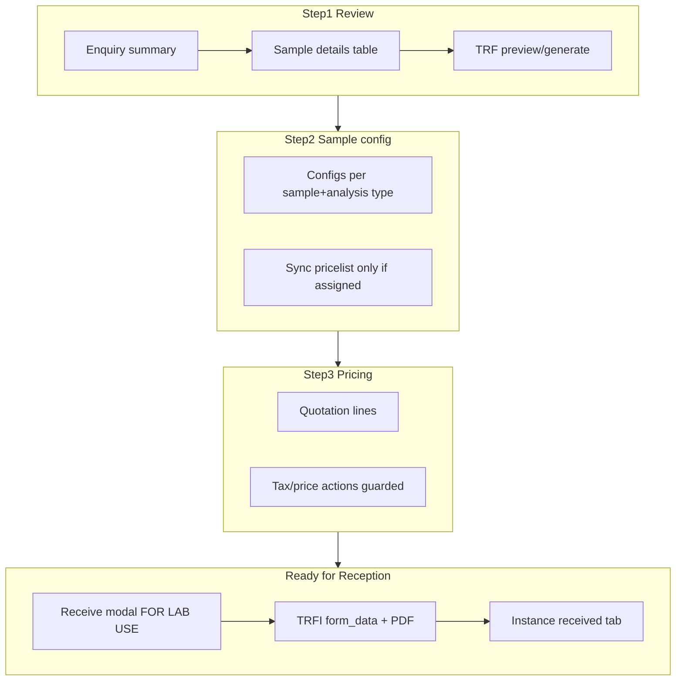

# Process Enquiry & Receive Modal UX Plan

## Context: what Steps 2 and 3 do today

### Step 2 — Sample configuration ([`process-enquiry-wizard.blade.php`](resources/views/livewire/sampleworkflow/process-enquiry-wizard.blade.php) + [`acceptance-sample-config-table.blade.php`](resources/views/livewire/partials/acceptance-sample-config-table.blade.php))

**Purpose:** Turn the enquiry/TRF into structured **sample configs** that drive quotation lines. Each card is one **(sample type + analysis type)** bucket.

| UI element | What it does |
|------------|----------------|
| **Sync from contract pricelist** | Calls [`ProcessEnquiryWizard::syncFromContractPricelist()`](app/Livewire/Sampleworkflow/ProcessEnquiryWizard.php) → [`CommercialEnquiryConfigSyncService::mergePricelistIntoSampleConfigs()`](app/Services/Commercial/CommercialEnquiryConfigSyncService.php). Merges TRF/enquiry lines with pricelist parameters, dedupes by `(sample_type, analysis_type, element)`, rebuilds config cards. |
| **Add configuration** | Adds an empty config card (from [`ManagesSampleConfigurationWizard`](app/Livewire/Sampleworkflow/Concerns/ManagesSampleConfigurationWizard.php)). |
| **Sample type / Analysis type** | Defines the bucket; loads analysis types and parameters from customer pricing catalog. |
| **Condition of sample** | Maps to `sample_condition_id` on config (to be **hidden in Process Enquiry only**). |
| **Main standard** | Optional standard for the config group. |
| **No. of samples** | Drives how many **sample instance** rows appear (customer sample ID + marking). |
| **Parameters** | Checkboxes for which analytes/tests are in scope for this bucket. |
| **Sample instances** | Per-physical-sample **Customer sample ID** and **Sample marking** fields. |
| **Select all** | Selects all pricelist parameters for the current analysis type. |
| **Back** | Returns to Step 1 without losing modal state. |
| **Continue to pricing** | Validates configs → [`expandConfigsToLines`](app/Services/Sampleworkflow/AcceptanceFormSampleConfigService.php) → builds quotation lines → opens Step 3. |

**Hint text meaning:** *"Each sample type and analysis type combination is configured independently…"* — Staff group tests by matrix (e.g. Food + Cooked/Heat Treated). **No. of samples** controls how many labelled physical samples (IDs/markings) exist under that group before the job is created at Request Review.

### Step 3 — Parameters & pricing ([`process-enquiry-wizard.blade.php`](resources/views/livewire/sampleworkflow/process-enquiry-wizard.blade.php))

**Purpose:** Edit the **quotation snapshot** (prices, qty, tax, subcontract) before sending to customer.

| UI element | What it does |
|------------|----------------|
| **Currency / VAT regime** | From quotation header + active [`TaxRegime`](app/TaxRegime.php). |
| **Apply tax from pricelist** | [`applyTaxFromPricelist()`](app/Livewire/Sampleworkflow/ProcessEnquiryWizard.php) — sets line `tax` from VAT-flagged pricelist items. |
| **Add line** | Opens pricelist parameter picker; appends row; re-enriches LOQ/MU. |
| **LOQ / MU%** | Read-only lab metrics from [`UncertaintyBudgetResolver`](app/Services/Lab/UncertaintyBudgetResolver.php). |
| **Amount / Samples / Tax %** | Editable quotation fields; `updatedLines()` persists to `quotation_details`. |
| **Subcontract** | Flags line for subcontract on PDF/acceptance. |
| **$ (reset price)** | [`resetLinePriceFromPricelist($index)`](app/Livewire/Sampleworkflow/ProcessEnquiryWizard.php) — should reset unit price from pricelist (currently silent when no price found). |
| **Trash** | Removes line. |
| **Generate PDF** | Quotation PDF via [`AmSpecQuotationPdfService`](app/Services/Commercial/AmSpecQuotationPdfService.php). |
| **Preview quotation** | Opens stored quotation PDF. |
| **Send to customer** | Email/portal; sets enquiry to Quotation Sent. |
| **Back** | Returns to Step 2. |

---

## Root cause: “no pricelist” actions still mutate data

[`AcceptanceFormPricingService::resolvePricelist()`](app/Services/Sampleworkflow/AcceptanceFormPricingService.php) **falls back to the first active lab pricelist** when the customer has no `pricelist_customers` row:

```187:203:app/Services/Sampleworkflow/AcceptanceFormPricingService.php
return Pricelist::where('active', 1)->orderBy('id')->first();
```

So **Sync from contract pricelist** can pull unrelated items and create a new **Configuration** card; **Apply tax** / **$** may use wrong catalog or return `0` with no message.

### Fix

1. Add **`hasCustomerAssignedPricelist(string $customerId): bool`** — true only when `PricelistCustomer` exists for that customer.
2. Add **`resolveCustomerAssignedPricelist(?string $customerId): ?Pricelist`** — returns assigned pricelist or **null** (no global fallback) for Process Enquiry pricing actions.
3. Guard in [`ProcessEnquiryWizard`](app/Livewire/Sampleworkflow/ProcessEnquiryWizard.php):
   - `syncFromContractPricelist()` — if no assigned pricelist: `setStatus('error', '…')` and **return without changing** `sampleConfigs`.
   - `applyTaxFromPricelist()` — same guard.
   - `resetLinePriceFromPricelist()` — same guard; on success show success toast.
4. Update [`CommercialEnquiryConfigSyncService`](app/Services/Commercial/CommercialEnquiryConfigSyncService.php) to accept an optional `?Pricelist` or use assigned-only resolver so sync never uses the global fallback.
5. Optionally use assigned-only pricelist in [`QuotationFromEnquiryService::applyTaxFromPricelist`](app/Services/Commercial/QuotationFromEnquiryService.php) when called from the wizard (keep fallback for other flows if needed).

---

## Step 2: remove Condition of sample (Process Enquiry only)

The config table partial is shared; Process Enquiry is the only consumer of sample config now (accept wizard removed that step).

- Add `public bool $showSampleConditionOnConfig = true` on the trait or only on [`ProcessEnquiryWizard`](app/Livewire/Sampleworkflow/ProcessEnquiryWizard.php) set to **`false`** in `openWizard()`.
- In [`acceptance-sample-config-table.blade.php`](resources/views/livewire/partials/acceptance-sample-config-table.blade.php), hide the **Condition of sample** column when `$showSampleConditionOnConfig === false`.
- Stop reading/writing `sample_condition_id` in Process Enquiry path only (validation in [`AcceptanceFormSampleConfigService`](app/Services/Sampleworkflow/AcceptanceFormSampleConfigService.php) should remain tolerant if field absent).

---

## Step 1: review screen changes

File: [`process-enquiry-wizard.blade.php`](resources/views/livewire/sampleworkflow/process-enquiry-wizard.blade.php) + [`ProcessEnquiryWizard.php`](app/Livewire/Sampleworkflow/ProcessEnquiryWizard.php)

| Request | Change |
|---------|--------|
| Remove **Sample collection data** | Delete the `@if(count($collectionDataRows))` block (lines 69–81). |
| Remove **Staff commercial notes** | Remove textarea; stop persisting `enquiryNotes` in `saveReviewAndContinue()` (or only persist if non-empty and needed elsewhere—prefer remove from UI). |
| Rename **Tests / parameters** → **Test category** | Update table header (line 95) and fallback section title (line 115). Optionally align [`EnquiryReviewDisplayService`](app/Services/Commercial/EnquiryReviewDisplayService.php) if labels are built there. |
| **Generate & view TRF** on Step 1 | Load `test_request_form_instance_id` from enquiry (already eager-loaded). Add properties `trfInstanceId`, `trfPdfReady`. Methods: `generateTrfPdf()` → [`TestRequestFormPdfService::generateAndStore`](app/Services/Sampleworkflow/TestRequestFormPdfService.php); links to existing routes `test-request-form.preview` / `test-request-form.pdf` ([`routes/web.php`](routes/web.php)). Show buttons only when TRFI exists. |

---

## Physical check-in: FOR LAB USE ONLY → TRFI

User confirmed: **Receive / check-in modal** on **Ready for Reception** tab ([`ReceiveSampleRequest`](app/Livewire/Sampleworkflow/ReceiveSampleRequest.php)), not Accept Sample wizard.

TRF field names (from [`TestRequestForm`](app/Models/TestRequestForm.php)):
- `lab_received_datetime`
- `lab_received_by`
- `lab_sample_condition` (`Acceptable` / `Not Acceptable`)

### Implementation

1. **UI** — When `$this->isPhysicalCheckIn`, show a **FOR LAB USE ONLY** section in [`receive-sample-request.blade.php`](resources/views/livewire/sampleworkflow/receive-sample-request.blade.php) (mirror walk-in TRF fields; reuse [`test-request-field-render`](resources/views/livewire/sampleworkflow/test-request-field-render.blade.php) or inline the three fields).
2. **State** — Extend `formData` on open: prefill via existing [`prepareLabUseFields()`](app/Livewire/Sampleworkflow/ReceiveSampleRequest.php) (datetime = now, received by = current user).
3. **Validation** — Require the three fields on physical check-in (or datetime + received_by required, condition required).
4. **Persist** — In `confirmPhysicalCheckIn()` after successful `receiveInstance`:
   - Resolve linked [`TestRequestFormInstance`](app/Models/TestRequestFormInstance.php) from `SubmissionFormInstance.testRequestFormInstance`.
   - Merge `lab_*` keys into `trfi.form_data` (preserve existing keys).
   - Save TRFI; call `TestRequestFormPdfService::generateAndStore()` (same pattern as walk-in submit).
5. **Service** — Small helper e.g. `TrfLabUseFieldsService::mergeIntoTrfi(TestRequestFormInstance $trfi, array $labFields): void` to keep Livewire thin.

---

## Tests

- **Unit:** `hasCustomerAssignedPricelist` / assigned-only resolver (no fallback).
- **Feature:** `syncFromContractPricelist` does not change `sampleConfigs` when customer has no assignment.
- **Feature:** `applyTaxFromPricelist` / `resetLinePriceFromPricelist` return error status without mutation.
- **Feature:** Physical check-in merges `lab_*` into TRFI `form_data` ([`ReceiveSampleRequestTest`](tests/Feature/SampleWorkflow/ReceiveSampleRequestTest.php) extension).

Tests not run by agent (dev DB rule); user runs `php artisan test --filter=ReceiveSampleRequestTest` etc.

---

## Flow diagram (after changes)


