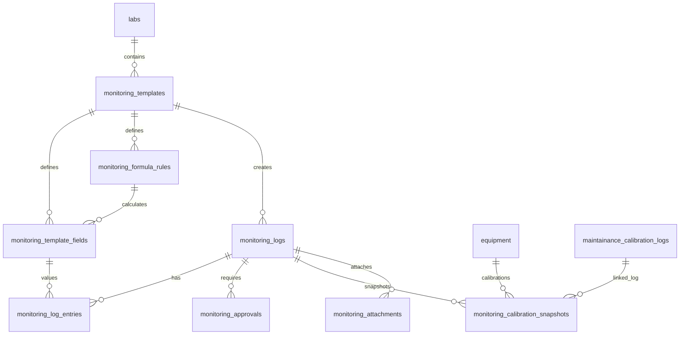
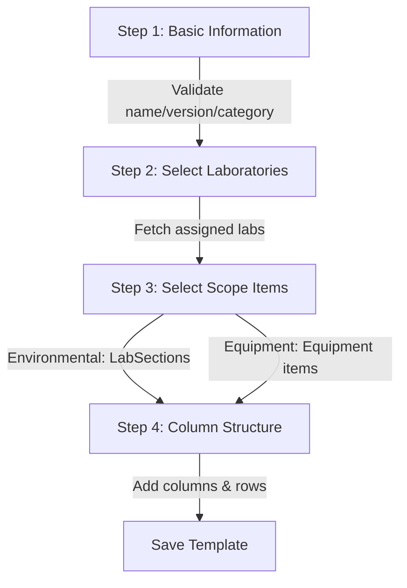
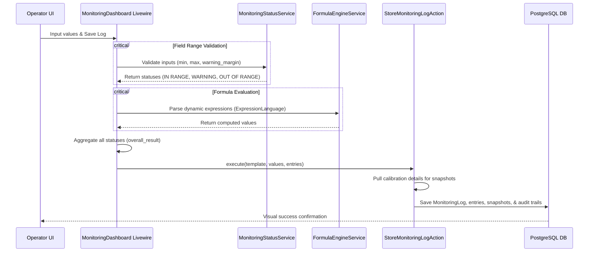

# Equipment & Environmental Monitoring Templating Engine

## 1. Executive Summary & Architectural Overview

The **Equipment & Environmental Monitoring Templating Engine** is a robust, dynamic, and audit-ready framework designed to manage and execute daily environmental checks (such as temperature, humidity, cleanroom pressure) and equipment performance logs (e.g. daily balance verifications, pH meter calibrations) within Polucon's laboratory ecosystem.

Historically, standard LIMS systems utilize rigid database structures where changing a parameter (like adding a warning threshold or modifying a calculation formula) results in database schema migrations or overwriting historical run definitions. The Polucon monitoring engine solves this by establishing a **fully decoupled, versioned, and metadata-driven schema architecture**.

### Core Architecture Principles
1. **Historical Integrity**: A monitoring template is versioned. Old logs remain linked to the exact structure, formula rules, and parameters in place at the time of execution.
2. **Decoupled Formula Engine**: Calculations (e.g., subtracting correction factors from dry temperatures, calculating standard deviations) are not hardcoded but written as dynamic expressions evaluated safely at run time.
3. **Automated Calibration Snapshotting**: At the moment a monitoring log is saved for any equipment, the active calibration parameters (uncertainty of measure, correction factors, certificate details) are permanently snapshotted into a separate table, preventing historical drift when new calibrations are added.
4. **Multi-Stage Workflow Approvals**: Captures granular digital signatures and multi-stage peer reviews to meet GLP, ISO 17025, and FDA 21 CFR Part 11 requirements.

---

## 2. Database Schema & Entity-Relationship Details

The module operates across **10 customized PostgreSQL tables**, all standardized on **UUID primary keys** for maximum distributed scalability and audit integrity. Below is a detailed view of these tables:



### Table 1: `monitoring_templates`
Stores versioned templates defining the name, scope, category, and metadata of the monitoring logs.
- `id` (UUID, Primary Key)
- `name` (VARCHAR): The template's name, e.g. "Daily Autoclave Run Log".
- `document_control_number` (VARCHAR, Nullable): Quality management reference number (e.g. MON-EQ-04).
- `version` (INT, Default `1`): Monotonically increasing version number.
- `effective_date` (DATE, Nullable)
- `review_date` (DATE, Nullable): Target date for quality review.
- `department` (VARCHAR, Nullable)
- `monitoring_category` (VARCHAR, Default `environmental`): Scope of monitoring, constrained to `environmental` or `equipment`.
- `approval_workflow` (JSON, Nullable): Steps, roles, and sequences required for log approval.
- `status` (VARCHAR, Default `draft`): Draft, active, or archived status.
- `is_active` (BOOLEAN, Default `true`)
- `lab_id` (UUID, Nullable, Index): Foreign key to `labs`. Null indicates a global template.
- `parent_template_id` (UUID, Nullable, Index): Self-referential FK. Links version upgrades to their parent.
- `company_id` (UUID, Nullable, Index)
- `created_by` / `updated_by` (UUID, Nullable, Index): Tracking users.
- `timestamps`

### Table 2: `monitoring_formula_rules`
Defines mathematical calculations, inputs, and validation conditions.
- `id` (UUID, Primary Key)
- `template_id` (UUID, FK to `monitoring_templates`, Cascade Delete): Links rules to templates.
- `name` (VARCHAR): Friendly name of the calculated field.
- `output_key` (VARCHAR): Slug representing this rule's output, allowing subsequent rules to use its value.
- `expression` (TEXT): The mathematical/logic expression (e.g. `(am_temp + pm_temp) / 2`).
- `pass_condition_expression` (TEXT, Nullable): Logical validation expression (e.g. `result >= 15 && result <= 25`).
- `meta` (JSON, Nullable)
- `is_active` (BOOLEAN, Default `true`)
- `company_id` (UUID, Nullable, Index)

### Table 3: `monitoring_template_fields`
Specifies individual fields and input parameters within a template.
- `id` (UUID, Primary Key)
- `template_id` (UUID, FK to `monitoring_templates`, Cascade Delete)
- `formula_rule_id` (UUID, FK to `monitoring_formula_rules`, Null on Delete): Links calculated outputs.
- `field_key` (VARCHAR): Alphanumeric identifier used in execution payloads and formula references.
- `label` (VARCHAR): Human-readable UI label.
- `field_type` (VARCHAR, Default `text`): Controls rendering (`text`, `number`, `textarea`, `dropdown`, `checkbox`, `date`, `datetime`, `formula`).
- `is_required` (BOOLEAN, Default `false`)
- `is_readonly` (BOOLEAN, Default `false`): True for dynamic formula-filled fields.
- `sort_order` (INT, Default `0`)
- `field_config` (JSON, Nullable): Holds ranges (`min`, `max`, `warning_margin`), lists of options, default values, and unit details.
- *Unique Constraint*: `['template_id', 'field_key']` (ensures uniqueness of key references inside one template).

### Table 4: `monitoring_variables`
Holds query-based dynamic parameters or organizational global constants.
- `id` (UUID, Primary Key)
- `name` (VARCHAR): Display name.
- `slug` (VARCHAR, Unique): Variable key reference.
- `variable_type` (VARCHAR, Default `constant`): Constant, SQL Query, or Class Method.
- `value` (JSON, Nullable)
- `query_builder` (JSON, Nullable): Instructions for executing database lookups.
- `allowed_tables` (JSON, Nullable): Restricts security contexts.
- `description` (TEXT, Nullable)
- `is_active` (BOOLEAN, Default `true`)
- `company_id` (UUID, Nullable, Index)

### Table 5: `monitoring_logs`
Tracks execution instances of daily logs.
- `id` (UUID, Primary Key)
- `template_id` (UUID, FK to `monitoring_templates`, Restrict on Delete)
- `template_version` (INT, Default `1`)
- `lab_id` (UUID, Nullable, FK to `labs`)
- `equipment_id` (UUID, Nullable, FK to `equipment`): Links equipment templates to a specific physical unit.
- `log_date` (DATE, Index): The actual date monitored.
- `monitoring_scope` (VARCHAR, Default `environmental`): Scope of log.
- `status` (VARCHAR, Default `pending`): pending, completed, or failed.
- `overall_result` (VARCHAR, Nullable): Summarized state (`IN RANGE`, `WARNING`, `OUT OF RANGE`, `CRITICAL`).
- `deviation_triggered` (BOOLEAN, Default `false`): Set to `true` when out-of-range limits are hit.
- `payload` (JSON, Nullable): Full raw key-value submission snapshot.
- `executed_by` / `approved_by` (UUID, FK to `users`)
- `executed_at` / `approved_at` (TIMESTAMP)
- `signature_payload` (JSON, Nullable): Base64 signature vectors or cryptographic hash tokens.
- `company_id` (UUID, Nullable, Index)
- *Composite Index*: `['monitoring_scope', 'status', 'log_date']` (optimizes daily dashboard metrics).

### Table 6: `monitoring_log_entries`
Stores isolated key-value outputs for every field/formula execution instance.
- `id` (UUID, Primary Key)
- `log_id` (UUID, FK to `monitoring_logs`, Cascade Delete)
- `template_field_id` (UUID, Nullable, FK to `monitoring_template_fields`, Null on Delete)
- `field_key` (VARCHAR)
- `field_label` (VARCHAR)
- `raw_value` (TEXT, Nullable): Value entered by the user.
- `computed_value` (TEXT, Nullable): Evaluated output if a formula field.
- `status` (VARCHAR, Nullable): Evaluation state (`IN RANGE`, `WARNING`, `OUT OF RANGE`, `PASS`, `FAIL`).
- `pass` (BOOLEAN, Nullable): Boolean indicator of compliance.
- `meta` (JSON, Nullable)

### Table 7: `monitoring_approvals`
Tracks signatures and approvals across multiple stages of log validation.
- `id` (UUID, Primary Key)
- `log_id` (UUID, FK to `monitoring_logs`, Cascade Delete)
- `workflow_stage` (INT, Default `1`): Approver hierarchy order.
- `approver_id` (UUID, Nullable, FK to `users`)
- `status` (VARCHAR, Default `pending`): pending, approved, or rejected.
- `signed_at` (TIMESTAMP, Nullable)
- `signature_reason` (VARCHAR, Nullable): ISO 17025 verification text (e.g. "Reviewed raw readings and confirmed calibration factors").
- `password_confirmed` (BOOLEAN, Default `false`)
- `signature_payload` (JSON, Nullable)

### Table 8: `monitoring_calibration_snapshots`
Permanent snapshot of active equipment calibration when monitoring takes place.
- `id` (UUID, Primary Key)
- `log_id` (UUID, FK to `monitoring_logs`, Cascade Delete)
- `equipment_id` (UUID, FK to `equipment`, Cascade Delete)
- `calibration_log_id` (UUID, Nullable, FK to `maintainance_calibration_logs`, Null on Delete)
- `correction_factor` (DECIMAL(12,6), Nullable)
- `uncertainty_of_measure` (DECIMAL(12,6), Nullable)
- `calibration_date` (DATE, Nullable)
- `calibration_certificate` (VARCHAR, Nullable)
- `standard_used` (VARCHAR, Nullable)
- `snapshot_payload` (JSON, Nullable)

### Table 9: `monitoring_attachments`
Allows uploading compliance attachments (e.g., raw printouts, strip charts) to a log.
- `id` (UUID, Primary Key)
- `log_id` (UUID, FK to `monitoring_logs`, Cascade Delete)
- `file_name` (VARCHAR)
- `file_path` (VARCHAR)
- `mime_type` (VARCHAR, Nullable)
- `file_size` (BIGINT, Nullable)
- `uploaded_by` (UUID, Nullable, FK to `users`)

### Table 10: `monitoring_audit_trails`
Secures historical mutations on all monitoring assets.
- `id` (UUID, Primary Key)
- `auditable_type` (VARCHAR)
- `auditable_id` (UUID, Index)
- `action` (VARCHAR(32)): created, updated, or deleted.
- `old_values` (JSON, Nullable)
- `new_values` (JSON, Nullable)
- `user_id` (UUID, Nullable, FK to `users`)
- `created_at` (TIMESTAMP, Default `CURRENT_TIMESTAMP`)

---

## 3. The Templating Engine Flow

The template engine is structured as a **multi-step wizard** managed by the `CreateMonitoringTemplate.php` Livewire component.



### Step 1: Basic Information
Users set up naming conventions, document control numbers, versions, effective dates, and pick the **Monitoring Category** (`environmental` vs. `equipment`).

### Step 2: Select Laboratories
Selects target laboratories where the template is active. Managed dynamically based on the current user's laboratory assignments.

### Step 3: Select Scope Items
- **Environmental**: Loads all active `LabSections` belonging to selected labs that are flagged with `does_environmental_analysis = true`.
- **Equipment**: Loads all active `Equipment` belonging to selected labs that are flagged with `requires_daily_log = true`.

### Step 4: Column & Row Structure
Defines the visual matrix of the daily log sheet. 
- A user creates **Columns** (representing times of day, e.g. "Morning Check (AM)", "Afternoon Check (PM)").
- Within each column, users add **Field Rows** (representing individual checklist items, e.g. "Initial Value", "Final Value").

---

## 4. The Evaluation & Log Execution Engine

When a laboratory operator executes a daily log, the system loads the template's structure and computes values dynamically.



### 1. Dynamic Formula Evaluation (`FormulaEngineService`)
Calculated values are evaluated on-the-fly using the Symfony `ExpressionLanguage` parser. This runs mathematical formulas in a sandbox, preventing raw PHP evaluation exploits.
- **Safe Evaluation**: Evaluates expressions using `evaluateSafe()`. It supports variables referencing user-entered values.
- **Output-Key Piping**: Formula rules specify an `output_key`. If subsequent formulas require that value, the calculated result is piped straight into the variable map.

### 2. Range Validation & Status Determination (`MonitoringStatusService`)
For numeric inputs, the engine validates boundaries:
- **`IN RANGE`**: The input resides between `min` and `max`.
- **`WARNING`**: The input is within range but sits close to the boundary (specifically within `warning_margin`).
- **`OUT OF RANGE`**: The input falls outside the safe bounds, triggering failure status.
- **Aggregation**: The status engine aggregates individual field statuses into a single log-level output (`IN RANGE` -> `WARNING` -> `OUT OF RANGE` -> `CRITICAL`). If any field is `OUT OF RANGE`, the overall result is marked as `OUT OF RANGE` and `deviation_triggered` is set to `true`.

### 3. Calibration Snapshotting & Auditing
Upon execution:
- **`CalibrationSnapshotService`**: Grabs the active calibration certificate number, date, correction factors, and uncertainty from `MaintainanceCalibrationLog`.
- **`StoreMonitoringLogAction`**: Inserts everything inside a single database transaction, saving the log, individual entry rows, the calibration snapshot, and the `MonitoringAuditTrail` log.

---

## 5. Implementation Completeness Inventory

Below is the definitive analysis of what has been fully written and what is currently a stub/unimplemented.

### A. Fully Implemented Features

1. **Database Schema & Migrations** (`2026_05_10_200000_create_monitoring_module_tables.php`):
   - All 10 tables are completely migrated in the database with strict relational cascades, indexing, and data types (e.g., standard decimals, JSON columns, auto-indexes).
2. **Robust Model Layer**:
   - Every database table has its corresponding Eloquent model under `App\Models\Monitoring\`, fully configured with proper casts (`array`, `datetime`, `boolean`, `date`), relational methods, and Laravel UUID concerns (`HasUuids`).
3. **Sandbox Calculation Engine** (`FormulaEngineService.php`):
   - Dynamic math calculations are processed using a fully secure Symfony `ExpressionLanguage` container. Output variables can be piped from one formula into another.
4. **Boundary Range Checks** (`MonitoringStatusService.php`):
   - Safe ranges, warnings, and error margins are successfully calculated and aggregated dynamically.
5. **Transactional Saving Workflow** (`StoreMonitoringLogAction.php`):
   - Logs are persisted in clean database transactions. Generates isolated log entries, hooks calibration metadata snapshots, and updates audit records.
6. **Calibration Snapshots** (`CalibrationSnapshotService.php` & `CalibrationSnapshotData.php`):
   - Automatically pulls the active certificate, uncertainty ranges, and correction factors from `MaintainanceCalibrationLog` and screenshots them onto the log database record.
7. **Basic Dashboard Controller & Views** (`MonitoringDashboard.php` & `monitoring-dashboard.blade.php`):
   - Operators can filter by assigned lab, view daily metrics (Due, Completed, Pending, Failed), delete templates, clear logs, and execute active templates in modal prompts.

---

### B. Gaps & Stubbed Features

While the backend services, schemas, and models are highly advanced, **the template builder UI is incomplete, creating a mismatch between captured configurations and generated records**.

| Feature Area | Sub-Feature | Implementation Status | Technical Gap / Stub Details |
|--------------|-------------|-----------------------|-----------------------------|
| **Template Creation** | Field Creation & Column Generation | **UNIMPLEMENTED (CRITICAL)** | In `CreateMonitoringTemplate.php` line 281-290, step 4 captures the column and row structure inside `$columnStructure`. However, `saveTemplate()` only writes to `MonitoringTemplate` but **completely discards the column structure metadata**. It does not generate `MonitoringTemplateField` rows! Thus, any newly created template has **zero fields** and cannot be executed. |
| **Template Creation** | Multi-Lab Association | **STUBBED** | The UI in Step 2 allows multiple lab IDs to be selected, but the `monitoring_templates` table only supports a single `lab_id` column. The model defaults to grabbing the first lab (`$this->selectedLabIds[0]`) and discards the rest. |
| **Formula Configuration** | Formula Rules UI | **UNIMPLEMENTED** | While the `FormulaEngineService` is complete, there is **no UI** inside the template wizard to input or attach formulas (`monitoring_formula_rules`) to the fields. |
| **Variables Engine** | Variable Binding | **STUBBED** | The `MonitoringVariable` table and model are ready, but there is no mechanism or UI in the wizard to bind variables to template fields or queries. |
| **Signatures & Approvals** | Multi-Stage Signing Flow | **STUBBED** | The `MonitoringApproval` model is complete and ready, but there is no UI, view controller, or signing prompt for supervisors to review and approve logs. |
| **Attachments** | Upload Printouts / Files | **UNIMPLEMENTED** | The database table `monitoring_attachments` is created, but no file uploader is provided in the template execution modal. |
| **Schedules** | Automated Daily Logs | **STUBBED** | Daily checklist due states are calculated on-the-fly (`$this->templatesDueToday`). There is no cron scheduler or daemon worker generating actual logs, sending warnings for overdue items, or dispatching failed-range emails. |

---

## 6. Troubleshooting & Developer Guidelines

### 1. Programmatic Template Construction
Since the template wizard does not write fields to the database, developers must seed fields and formula rules directly via migration seeders or tinker. Below is the standard recipe to build a functional template:

```php
use App\Models\Monitoring\MonitoringTemplate;
use App\Models\Monitoring\MonitoringTemplateField;
use App\Models\Monitoring\MonitoringFormulaRule;

DB::transaction(function () {
    // 1. Create Template
    $template = MonitoringTemplate::create([
        'name' => 'Incubator Temperature Log',
        'monitoring_category' => 'environmental',
        'status' => 'active',
        'lab_id' => 'your-lab-uuid-here',
        'is_active' => true
    ]);

    // 2. Create Formula Rule (Optional)
    $formula = MonitoringFormulaRule::create([
        'template_id' => $template->id,
        'name' => 'Average Temperature',
        'output_key' => 'avg_temp',
        'expression' => '(temp_am + temp_pm) / 2',
        'pass_condition_expression' => 'result >= 35.0 && result <= 37.0'
    ]);

    // 3. Create Input Fields
    MonitoringTemplateField::create([
        'template_id' => $template->id,
        'field_key' => 'temp_am',
        'label' => 'Temperature AM',
        'field_type' => 'number',
        'is_required' => true,
        'sort_order' => 1,
        'field_config' => ['min' => 35.0, 'max' => 37.0, 'warning_margin' => 0.2]
    ]);

    MonitoringTemplateField::create([
        'template_id' => $template->id,
        'field_key' => 'temp_pm',
        'label' => 'Temperature PM',
        'field_type' => 'number',
        'is_required' => true,
        'sort_order' => 2,
        'field_config' => ['min' => 35.0, 'max' => 37.0, 'warning_margin' => 0.2]
    ]);

    // 4. Link Formula Field
    MonitoringTemplateField::create([
        'template_id' => $template->id,
        'formula_rule_id' => $formula->id,
        'field_key' => 'avg_temp',
        'label' => 'Average Daily Temp',
        'field_type' => 'formula',
        'is_readonly' => true,
        'sort_order' => 3
    ]);
});
```

### 2. Manual Verification & Testing
To manually test range check status calculations or formula outputs, developers can run queries in `php artisan tinker`:

```php
// Test Range Check
$statusService = app(App\Services\Monitoring\MonitoringStatusService::class);
echo $statusService->statusFromRange(36.9, 35.0, 37.0, 0.2); 
// Output: "WARNING"

// Test Formula Calculations
$formulaService = app(App\Services\Monitoring\FormulaEngineService::class);
echo $formulaService->evaluateSafe('(am + pm) / 2', ['am' => 35.2, 'pm' => 36.8]);
// Output: 36.0
```
