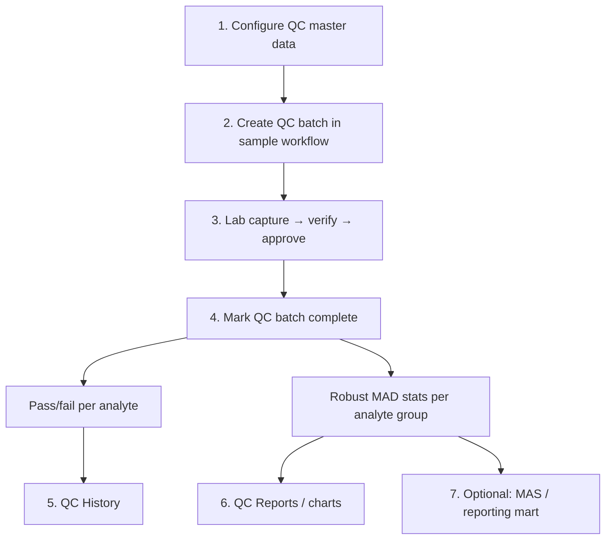
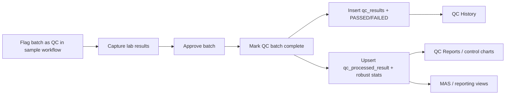

# QC Module — Analysis & Assessment

**Date:** 2026-07-14  
**Scope:** Lab LIMS quality-control workflow (not manufacturing/inventory “inspection”)  
**Focus:** How it works today, gaps, improvements, and overall assessment

---

## Latest engineering consolidation (2026-07-14)

Implemented:

- **Single write path:** `approve_batch` no longer inserts into `qc_results`; only `QcBatchCompletionService::completeBatch` (via Mark Complete) writes QC results.
- **Shared services:** `App\Services\Qc\{QcStatisticsService,QcPassFailEvaluator,QcBatchCompletionService}` — MAD stats + pass/fail + batch completion.
- **Bug fixes:** `deleteQcStandard` redirect; tolerance high band uses `tolerance_2`; History filters on `status_code` (`PASSED`/`FAILED`).
- **Module route cleanup:** QualityControl module no longer registers duplicate unguarded `/qualitycontrol` web routes.

---

## How the QC workflow should work (end-to-end)

This is the **intended** lab QC loop after the 2026-07-14 consolidation. Operators and implementers should treat this as the source of truth for “what happens when.”

### Overview



**Golden rule:** Laboratory approval does **not** write `qc_results`. Only **Mark As Complete** (`QcBatchCompletionService`) creates QC result rows, assigns `PASSED`/`FAILED`, computes robust stats, and sets the batch to `Completed`.

### Roles & permissions

| Who | Needs | Does |
|-----|--------|------|
| Lab analyst / verifier | Normal lab workflow perms | Capture and verify results on the QC batch |
| Lab approver | `laboratory.components.approve for analysis.edit` | Approves the batch (lab stage only) |
| QC operator | `laboratory.components.qc sample.edit` | Marks QC batch complete |
| QC reviewer / config | `laboratory.components.qc sample.view` (+ edit for config writes) | Configures types/schemes/standards; reviews History & Reports |

Configured **QC Approvers** (`qc_approvers_config`) are master data for future formal release. They are **not** enforced as a Gate when marking complete today.

---

### Step 0 — Prerequisites (must exist before a batch)

Do this in **QC Configurations** (`qc_configuration_index` → Livewire `ConfigurationsPage` / `StandardAnalytesPage`):

1. **QC Schemes** — Active schemes the lab uses to classify QC work (accreditation / method family labels).
2. **QC Types** — Active types with clear flags:
   - `has_standards` — operators should assign a main standard on samples
   - `use_existing_sample` — repeat/duplicate workflow (pick a prior completed sample)
   - `has_configured_samples` / `is_active` as needed
3. **QC Standards** — Rows with `is_qc_standard = 1`, linked to a QC type and one or more schemes (`qc_scheme_ids`).
4. **Standard analytes** — For each standard × analyte: expected value and tolerances so **low/high** bands are correct:
   - Absolute mode → `low = tolerance_1`, `high = tolerance_2`
   - Relative mode → `low = expected − tolerance_1`, `high = expected + tolerance_2`
5. **System config** — Key `qc_percentage_config` = allowed % difference for **repeat** QC (e.g. `5` means ±5% of the previous result).
6. **Users** — At least one person with QC view/edit; analysis methods / sample types / analytes already exist in the lab catalogues.

Without (3)–(5), mark-complete will still run, but pass/fail often defaults to **PASSED** (no band / no usable previous result).

---

### Step 1 — Create the QC batch (sample workflow)

In sample workflow create/edit (`layouts/lab/sample-workflow/show.blade.php`):

1. Check **Is QC Batch?** (`is_qc_batch = 1`).
2. Choose **QC scheme** and **QC type**.
3. If the QC type has `use_existing_sample = 1`:
   - Select the prior sample/batch to repeat against (repeat path).
   - Capture will carry `repeat_captured_id` / previous result metadata used at completion.
4. Otherwise (CRM / blank / spike / standard path):
   - Add samples as usual for that lab matrix.
   - Assign each sample a **main standard** (`main_standard`) that matches a QC standard configured for the selected QC type.
5. Save; the batch proceeds through normal lab stages like any other batch, but flagged as QC.

**Expected outcome:** A `sample_headers` row with `is_qc_batch`, `qc_type_id`, `qc_scheme_id` (and optionally `repeat_sample_id`).

---

### Step 2 — Capture results (same as normal lab work)

1. Put the batch through **Samples In Lab** (or equivalent).
2. Capture numeric results per analyte / method / analysis type into `captured_results`.
3. Verification and other lab controls apply as usual.
4. Do **not** expect `qc_results` or QC History to populate yet.

**Expected outcome:** `captured_results` (and later lab `results` after processing) exist for the batch; QC tables still empty for this batch (or hold only older completed runs).

---

### Step 3 — Approve the batch (lab approval only)

1. A different user than the verifier approves (`approve_batch`).
2. For QC batches this only records approve user / date and advances the lab decision.
3. Success message should remind: mark the QC batch complete to record QC results.
4. **No** insert/update into `qc_results` at this step.

**Expected outcome:** Batch is lab-approved; still no canonical QC analytics until Step 4.

---

### Step 4 — Mark QC batch complete (canonical QC write)

UI: confirm modal → `POST` named route `mark-batch-complete`  
Permission: `laboratory.components.qc sample.edit`  
Code: `SampleWorkFlowController::markQCBatchComplete` → `QcBatchCompletionService::completeBatch`

Inside one DB transaction the system:

1. Loads the batch and all `captured_results` (with sample).
2. **Deletes** any existing `qc_results` for that `sample_header_id` (rebuild = single source of truth).
3. Reads `qc_percentage_config`.
4. For each captured result:
   - Finds or creates a `qc_processed_result` group keyed by  
     `analyte_id + analysis_type_id + sample_type_id + method_id`.
   - Evaluates status via `QcPassFailEvaluator`:
     - **Repeat** (`repeat_captured_id > 0`):  
       `PASSED` if current result is within ±`qc_percentage_config`% of the previous captured result; else `FAILED`.  
       Non-numeric pairs → `PASSED` (cannot evaluate).
     - **Standard path**:  
       Loads `StandardAnalytes` for sample `main_standard` + analyte.  
       `PASSED` if result ∈ `[low, high]`; else `FAILED`.  
       Missing standard / missing analyte band / non-numeric → `PASSED`.
   - Builds a `qc_results` row (`status_code`, remarks from capture, QC type/scheme, links to processed group, etc.) with a generated UUID.
5. Bulk-inserts all `qc_results`.
6. Runs `QcStatisticsService::processAnalyteGroups` on the distinct processed IDs:
   - Collects numeric results for the group
   - Median, MAD × **1.4826** → robust SD; CV = rSD / median (when median ≠ 0)
   - Writes `robust_mean`, `robust_median`, `robust_standard_deviation`, `robust_cv`, `robust_cv_percentage`
   - Sets linked `qc_results.is_qc_processed = 1`
7. Sets batch `status = 'Completed'`.

**Expected outcome:**

| Artefact | Content |
|----------|---------|
| `qc_results` | One row per captured analyte result with `PASSED`/`FAILED` |
| `qc_processed_result` | Updated robust stats for each analyte group (accumulates across historical QC completions that share the same key) |
| Batch | `Completed` |

**Re-running Mark Complete** on the same batch is safe: it deletes that batch’s prior `qc_results` and rebuilds from current captures. Stats groups persist and are recomputed from all results still linked to that group (including other batches).

---

### Step 5 — Review QC History

Menu: QC Workflow → History (`qcWorkflowIndex` → `HistoryPage`).

Operators should be able to:

1. Filter by date range, sample type, analysis type, QC type, scheme, analyte, and **status** (`PASSED` / `FAILED`).
2. Optionally group by parameter / sample / batch.
3. See `status_code` as the QC verdict (not free-text lab remarks alone).

Data preferably comes from `qc_results_view` when present (includes receipt date, analyst, etc.).

**Expected outcome:** Proof that each QC measurement passed or failed the rule set in Step 4.

---

### Step 6 — Review QC Reports / control charts

Menu: QC Reports (`qc-reports` → `ReportsPage` → chart on `ReportShowPage`).

1. List processed analyte groups with robust mean / median / SD / CV%.
2. Open a group to view result series vs mean ± SD style control bands (operational charting).
3. Use CV% / outliers as an early signal that a method or matrix is drifting.

**Awaiting Processing** (`ProcessingPage`) is a **fallback**: re-run `QcStatisticsService::processAllUnprocessed` for any rows left with `is_qc_processed = 0`. After a normal Mark Complete, this list should be empty.

---

### Step 7 — Optional analytics (outside core loop)

| Surface | When it matters |
|---------|-----------------|
| MAS Lab QC / QC dashboards | After reporting ETL populates mart views such as `v_qc_stability_metrics` |
| Documents QC stability board | If routed and mart data exists |
| Python AI QC models | Separate anomaly pipeline — not required for Steps 1–6 |

These must not be confused with Step 4’s operational MAD stats. Formal ISO 13528 Algorithm-A **release reports** remain unfinished product work, not part of the daily should-work loop.

---

### Decision table — what “good” looks like

| Situation | Correct system behaviour |
|-----------|---------------------------|
| CRM/spike QC with standard + analyte bands | Out-of-band numeric results → `FAILED` in History |
| Repeat QC with % config = 5 | Result more than 5% from previous → `FAILED` |
| Approve QC batch, never Mark Complete | No (new) `qc_results`; History unchanged for that run |
| Mark Complete twice after editing captures | Latest captures win; old batch QC rows replaced |
| Missing standard on standard-type QC | Status often `PASSED` — treat as a **configuration error**, not as evidence of control |
| User without `qc sample.edit` | Cannot Mark Complete |

---

### Actor checklist (happy path)

1. Admin configures schemes, types, standards, analytes, `qc_percentage_config`.
2. Reception/lab creates QC batch (flag + type + scheme + standard or repeat sample).
3. Analyst captures results; verifier verifies.
4. Approver approves (lab only).
5. QC user Marks Complete.
6. Reviewer opens History → confirms PASSED/FAILED; opens Reports → checks CV / chart.
7. If mart ETL is in use, MAS stability board reflects after sync.

Anything short of this sequence is incomplete QC for that batch.

---

## Executive summary

The QC module is a **lab quality-control LIMS feature**: flag sample batches as QC, capture results, evaluate pass/fail against standards or repeat tolerances, compute robust statistics (MAD × 1.4826), and review history/charts/dashboards.

Canonical production UI lives in **App Livewire** (`app/Livewire/Qc`) plus sample-workflow integration. A legacy **nwidart `Modules/QualityControl`** package still ships entities and unfinished release-report jobs, but it no longer registers duplicate web routes. The operational path (batch → mark complete → stats → history/reports) is the supported loop; formal release reports, Algorithm-A accreditation exports, policies, and deep test coverage remain open.

---

## 1. What the module is

This is **not** defect/manufacturing QC. It supports laboratory QC sample types such as blanks, spikes, CRMs, and repeats:

| Concept | Purpose |
|--------|---------|
| **QC type** | Mode of QC (blank, spike, CRM, etc.) with flags for standards / configured samples / reuse of existing sample |
| **QC scheme** | Labeling scheme (e.g. ISO-17025-style grouping) |
| **QC standard + analytes** | Expected values and low/high bands used for pass/fail |
| **QC batch** | A `sample_headers` row with `is_qc_batch = 1` plus `qc_type_id` / `qc_scheme_id` |
| **QC results** | Snapshots of captured results with `PASSED` / `FAILED` |
| **Processed results** | Aggregated robust mean/median/SD/CV per analyte × method × sample type × analysis type |
| **Approvers config** | List of users who *may* approve QC (not enforced via policies today) |

Adjacent (related but not the core module UI): MAS QC dashboards, documents QC-stability board, Python AI QC anomaly model, reporting-mart views (`v_qc_stability_metrics`).

---

## 2. Architecture (dual stack)

```
┌─────────────────────────────────────────────────────────────┐
│  ACTIVE PATH                                                 │
│  routes/web.php (/qualitycontrol)                            │
│  app/Http/Controllers/QcModule/*                             │
│  app/Livewire/Qc/*  + resources/views/layouts/qcmodule/*         │
│  app/Models/QcModule/*                                       │
│  SampleWorkFlowController::markQCBatchComplete               │
└─────────────────────────────────────────────────────────────┘
                              │
                              │ same tables
                              ▼
┌─────────────────────────────────────────────────────────────┐
│  LEGACY / PARTIAL                                            │
│  Modules/QualityControl (nwidart module, still enabled)      │
│  Entities, ComputeQcReportController, CreateQcResultsJob     │
│  Web routes no longer registered (App owns /qualitycontrol)  │
│  Release report job + QcReportHeader (unwired / unfinished)  │
└─────────────────────────────────────────────────────────────┘
```

Models for the same tables exist in two namespaces (`App\Models\QcModule\…` vs `Modules\QualityControl\Entities\…`). Livewire and the App controller use the App models; release-report scaffolding still references module entities.

For the **intended** day-to-day process, see **[How the QC workflow should work](#how-the-qc-workflow-should-work-end-to-end)** above. Section 3 below is a technical inventory of the current codebase.

---

## 3. How it currently works

### 3.1 Domain model

```
QcTypes ─────────┐
                 ├── Standards (is_qc_standard=1, qc_type_id, qc_scheme_ids CSV)
QcSchemes ───────┘         │
                           └── StandardAnalytes (expected_value, low/high, tolerances)

Approvers (qc_approvers_config) → users (configuration only)

SampleHeader (is_qc_batch, qc_type_id, qc_scheme_id)
    └── CapturedResult / Result
            └── QcResults (per-result snapshot + PASSED/FAILED)
                    └── QCProcessedResults (group stats via analyte_processed_id)

QcReportHeader — intended “released report” aggregate (incomplete)
qc_results_view — SQL view for history / reporting
```

**Key tables:** `qc_types`, `qc_scheme`, `qc_approvers_config`, `qc_results`, `qc_processed_result`, `qc_report_header`, plus QC flags on `standards` / `standard_analytes` / `sample_headers`.

**Notable modeling choices:**

- `qc_scheme_ids` on standards is a **comma-separated string**, not a pivot table.
- Most Qc models are thin (`$guarded = ['id']`) with few Eloquent relationships; `QCProcessedResults` is the exception (method, sample type, analysis type, analyte, results).
- Schema has been UUID-migrated in places; older module migrations and `qc_report_header` still show legacy integer-era assumptions.

### 3.2 Primary user flow



1. **Create QC batch** — In sample workflow UI (`layouts/lab/sample-workflow/show.blade.php`): check “Is QC Batch?”, choose QC type/scheme; optionally reuse an existing sample when the type has `use_existing_sample`.
2. **Normal lab pipeline** — Samples through capture → verification → approval.
3. **On approve** (`SampleWorkFlowController::approve_batch`) — Lab approval only. Does **not** write `qc_results` (single write path).
4. **Mark QC batch complete** (`markQCBatchComplete` → `QcBatchCompletionService`, permission `laboratory.components.qc sample.edit`):
   - Deletes existing `qc_results` for the batch
   - Upserts `QCProcessedResults` keyed by analyte + analysis type + sample type + method
   - Sets `PASSED`/`FAILED` via `QcPassFailEvaluator`
   - Inserts `qc_results`, then auto-runs MAD robust stats via `QcStatisticsService` and marks processed
   - Sets batch `status = 'Completed'`
5. **Review**
   - **QC History** — `HistoryPage` (filters by `status_code`; prefers `qc_results_view` when present)
   - **Awaiting Processing** — `ProcessingPage` (fallback for leftover `is_qc_processed = 0`)
   - **QC Reports** — `ReportsPage` / `ReportShowPage` (Levey-Jennings-style mean±SD bands)
6. **Configuration** — `ConfigurationsPage` / `StandardAnalytesPage`: types, schemes, standards, analytes, approvers (Livewire with validation)

### 3.3 Pass / fail rules

Implemented in `QcPassFailEvaluator` (invoked from `QcBatchCompletionService`):

| Case | Rule |
|------|------|
| **Repeat sample** (`repeat_captured_id > 0`) | Compare new vs previous within ± `%` from `SystemConfiguration` key `qc_percentage_config` |
| **Otherwise** | Compare numeric result to `StandardAnalytes.low` / `high` for the sample’s `main_standard` + analyte |

If there is no usable standard analyte band (and it is not a repeat), the result defaults to **PASSED**.

### 3.4 Statistics

| Approach | Where | Method | Status |
|----------|--------|--------|--------|
| **Operational** | `QcStatisticsService` (batch complete, controller `processResults`, Livewire `ProcessingPage`) | Median + MAD × 1.4826 → robust SD / CV (float inputs) | **Canonical** production path |
| **“Release report” / Algorithm A** | `ComputeReleaseQCReportJob`, module `ComputeQcReportController` | Iterative Huber-style (ISO 13528–inspired) | Unwired / buggy |
| **Reporting mart** | `QcDashboardService` | Reads precomputed `v_qc_stability_metrics` (described as ISO 13528) | Separate ETL path |

### 3.5 Permissions & menu

From lab module permissions / sidebar:

- `laboratory.components.qc sample.view` — enter QC area
- `laboratory.components.qc sample.edit` — mark batch complete (and related edit actions)

Approvers table is **configuration only**; there is no Gate/Policy that requires a configured approver for QC report release or batch completion.

### 3.6 Routes (active)

Prefix `/qualitycontrol` with `can:laboratory.components.qc sample.view` (`routes/web.php` ~1801–1839):

| Role | Route / action |
|------|----------------|
| Config shells | `qc_index`, `qc_configuration_index`, standard show |
| Config CRUD (also duplicated in Livewire) | create/delete types, standards, analytes, schemes, approvers |
| Workflow | `qcWorkflowIndex`, Ajax helpers for standards / analysis types / type config |
| Complete batch | `POST …/mark/qc/batch/complete` → `markQCBatchComplete` |
| Process leftovers | `process-qc-results`, `showUnProcessed` |
| Reports | `qc-reports`, `qc-result-show` |
| Stub | `generateQCReport` → redirect only |
| Orphan GET | `markQcSampleComplete` → sets status `QC Approved` (no clear UI usage) |

MAS: `/qc`, `/lab/qc` Livewire dashboards.

Module web routes for `/qualitycontrol` are **no longer registered** (App `routes/web.php` is authoritative).

---

## 4. File map (practical)

### Active

| Area | Location |
|------|----------|
| Orchestration | `app/Services/Qc/QcBatchCompletionService.php`, `QcPassFailEvaluator.php`, `QcStatisticsService.php` |
| Controllers | `SampleWorkFlowController` (`markQCBatchComplete`, lab-only `approve_batch`); `QcModule\QualityControlController` |
| Livewire | `app/Livewire/Qc/{ConfigurationsPage,HistoryPage,ProcessingPage,ReportsPage,ReportShowPage,StandardAnalytesPage}.php` |
| Models | `app/Models/QcModule/**` |
| Views | `resources/views/layouts/qcmodule/**`, `resources/views/livewire/qc/**` |
| Dashboards | `app/Services/Dashboards/QcDashboardService.php`, `app/Livewire/Mas/{Qc,LabQc}.php` |
| Routes | `routes/web.php` (QC block) |

### Legacy / incomplete

| Area | Location |
|------|----------|
| Module package | `Modules/QualityControl/**` |
| Release job | `app/Jobs/QcModule/ComputeReleaseQCReportJob.php` |
| Empty command | `app/Console/Commands/CreateQcProcessedResultTable.php` |
| Module job | `Modules/QualityControl/Jobs/QcData/CreateQcResultsJob.php` |
| AI (adjacent) | `python/ai_service/models/qc_model.py`, `python/py_pipeline/transformers/ai/qc_feature_transformer.py` |

---

## 5. What is missing

| Gap | Notes |
|-----|--------|
| **Formal QC report release** | `ReleaseQCReportController` creates a header but does not dispatch the job; **no route** registered. Job does not `$header->save()` and assigns whole arrays to scalar columns (`cv_star`, `std_star`, `statistical_population`). |
| **Working `generateQCReport`** | Redirects to history only. |
| **Policies / fine-grained auth** | No QC policies; approvers unused for authorization. |
| **Form Requests** | Mutations trust raw request input (App controller path). Livewire config has validation; controller CRUD largely does not. |
| **Relational scheme linking** | CSV `qc_scheme_ids` instead of pivot. |
| **Consistent statistics** | Ops MAD vs unfinished Algorithm A vs mart ISO views — no single source of truth. |
| **API** | Module API route is an auth echo stub. |
| **Meaningful tests** | Essentially only `tests/Unit/Standards/QcSchemeNamesAttributeTest.php`. Module test dirs are empty. |
| **Seeders** | Module seeder empty; app has workflow/analytics seeders for scenarios, not a clean module bootstrap. |
| **Clean migration off module** | Dual models/routes/views still present. |
| **Documents QC stability route** | Controller/view exist; routing unclear/orphaned relative to main `routes/` QC group. |
| **Standard linkage on processed rows** | `QCProcessedResults::create` omits `standard_id` / `standard_value_id` even if schema allows them. |

---

## 6. What needs improvement

### High priority

1. **Finish or delete the dual stack**  
   Pick App Livewire + App models as canonical. Remove or quarantine module routes that duplicate `/qualitycontrol` without `can:` middleware. Delete or merge dead release-report code if product will not ship it.

2. **Extract QC domain services**  
   Move pass/fail, robust stats, and batch completion out of `SampleWorkFlowController` (≈400 lines of QC logic embedded in a huge controller). One `QcBatchCompletionService` / `QcStatisticsService` would kill the current triple copy of MAD logic (controller, autoProcess, Livewire).

3. **Fix known bugs**
   - `deleteQcStandard`: `redirect()->back()-with(...)` (binary `-`, broken PHP) in App (and module) controller.
   - Non-absolute high band in App controller uses `tolerance_1` twice instead of `tolerance_2` (Livewire standard-analyte page appears to have corrected this — keep one path).
   - History Pass/Fail filter may look for remark `PASS`/`FAIL` while data stores `status_code` `PASSED`/`FAILED`.
   - `processResults` integer cast of results before CV calculation.

4. **Authorization & validation**  
   Form Requests for remaining controller mutations; optional policy tying batch complete / report release to configured Approvers if that is a real business rule.

5. **Clarify product semantics**  
   Approve-batch snapshot vs mark-complete rebuild can leave duplicate/conflicting notions of “what is a QC result.” Document or unify: ideally one write path into `qc_results`.

### Medium priority

6. **Normalize data model** — Pivot for schemes; Eloquent relations on QcTypes/Standards/QcResults; populate standard FKs on processed results.
7. **Align stats story** — Decide: MAD for ops control charts, Algorithm A for accreditation releases, mart for dashboards — and document when each applies; implement release path only if required for ISO 17025 evidence.
8. **UI debt** — “Awaiting Processing” is largely redundant after auto-process; either make it exception-only (failed/partial) or remove. Tighten naming (`Approvvers`, typos like `recomendation` / `seond_guide`).
9. **Performance** — Approvers accessors doing `User::find()`; history capped/filter-heavy queries; avoid N+1 on reports (`getresultsarr()` side queries).

### Lower priority

10. **API / events** — If external systems need QC KPIs, define a real API resource rather than the stub.
11. **Observability** — Auditing exists on some models; add structured logging around batch complete failures and out-of-control CV.
12. **AI bridge** — Clarify how Python QC anomaly features relate (or not) to PHP `PASSED`/`FAILED` and control charts so operators are not looking at two unrelated “QC” stories.

---

## 7. General thoughts

### Strengths

- The **core lab loop is real and usable**: flag QC batch → capture → mark complete → history + charts + config in modern Livewire shells.
- Pass/fail for standards and repeats is understandable and tied to existing lab concepts (`Standards`, `CapturedResult`, sample workflow).
- Recent Livewire work (configurations with validation, processing/history/reports) is a clear upgrade over the module’s Blade/JS-era UIs.
- Reporting mart + MAS dashboards show ambition beyond page-level CRUD — toward stability monitoring.

### Weaknesses

- The module feels like a **half-finished migration**: new UI bolted onto old tables while legacy package, release jobs, and duplicate routes linger.
- **Business rules live in the wrong place** (fat controller, copy-pasted math), which makes correctness of CV and pass/fail hard to trust or change safely.
- **“Release report” / Algorithm A** looks like accreditation theater that never landed — dangerous if auditors assume it exists.
- **Almost no automated tests** around the most consequential lab-quality code in the app.
- Naming and permission surface are coarse; “QC Approvers” config without enforcement will confuse operators.

### Bottom line

Treat today’s QC module as an **operational control-chart + batch pass/fail tool that works**, not as a complete ISO-style QC LIMS with formal report release and enforceable approval. The highest-value next step is consolidation (one stack, one stats service, one write path into `qc_results`) plus fixing the known broken controller paths — before investing further in Algorithm-A release reports or AI QC overlays.

---

## 8. Suggested roadmap (opinionated)

| Phase | Goal |
|-------|------|
| **A — Stabilize** | Fix `deleteQcStandard` / tolerance / filter bugs; remove or protect module duplicate routes; document pass/fail + MAD as the official behavior |
| **B — Consolidate** | Service extraction; deprecate module controllers/views; single Livewire-backed config CRUD; drop dead `generateQCReport` / empty command or implement |
| **C — Product complete (if needed)** | Formal release report with real stats persistence + approver Gate; scheme pivot; feature tests for mark-complete happy/fail paths (SQLite-isolated suite) |
| **D — Analytics** | Single definition of CV thresholds shared by Livewire charts, mart, and AI; wire documents QC stability into a clear route |

---

## Appendix — Quick reference commands / entry URLs

| What | Where |
|------|--------|
| QC configurations | Named route `qc_configuration_index` |
| QC history | `qcWorkflowIndex` |
| Awaiting processing | `showUnProcessed` |
| QC reports | `qc-reports` |
| Mark batch complete | `mark-batch-complete` (POST, edit permission) |
| Permission gate | `laboratory.components.qc sample.view` / `.edit` |

---

*This document reflects codebase inspection as of 2026-07-14. It is an engineering assessment, not audit or accreditation evidence.*
