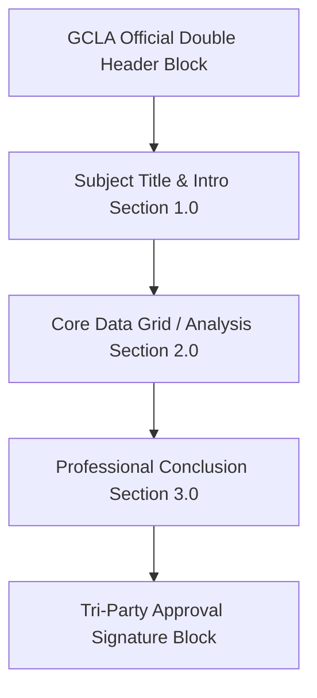

# GCLA IMARA LIMS — System-Wide Reporting Design System & Implementation Blueprint

## 1. Executive Summary
This document defines the architectural specification and implementation strategy for all reports listed in the **GCLA IMARA LIMS System Requirements Specification (SRS)** (pages 30 and 31). As a senior LIMS architect, this blueprint details the standard visual layout, active vs. pending report classification, deep filtering schemas, and database query bindings for immediate execution.

Our primary goal is twofold:
1. **Replicate the Official GCLA Paternity Report Format**: Adopt a highly professional, multi-page layout based on the Tanzanian Government Chemistry Laboratory Authority (GCLA) standard report template.
2. **Standardize Deep Filtering Across All Modules**: Enable robust multi-dimensional filtering (by Date-Range, Lab Section, Analyst, Client, Sample Type, Status, Thresholds, and Zone) for every single report.

---

## 2. GCLA Official Report Layout Standard
The design system for all official certifiable documents and certificates of analysis (COAs) is inspired by the **LAB CZO25-XXXX Paternity Report** layout. It consists of a precise grid-aligned template containing four key sections.



### A. The Double Header Block
An official double-column header aligned at the top of the first page:
*   **Left Column (Reference Box)**:
    *   **E-Mail**: gcla@gcla.go.tz
    *   **Simu Nambari**: 255 - 22 - 2113383/4
    *   **Fax**: 255 - 22 - 2113320
    *   **Jibu kwa**: Mkemia Mkuu wa Serikali na tutaje:
    *   **Kumb. Na. yetu** (Our Ref No): `<Auto-generated ref based on sample type/zone>`
    *   **Kumb. Na. yako** (Your Ref No): `<Client ref from SampleHeader customer_reference>`
*   **Center Column**: The official **Coat of Arms of the United Republic of Tanzania** (National Emblem), scaled and centered.
*   **Right Column (Address Box)**:
    *   MAMLAKA YA MAABARA YA MKEMIA MKUU WA SERIKALI (GCLA)
    *   05 BARABARA YA BARACK OBAMA,
    *   S.L.P. 164,
    *   DAR ES SALAAM.
    *   **Tarehe (Date)**: `<Formatted date of report authorization>`
*   **Header Top Margin**: Official Lab Number banner on the left: `LAB.NO. <CZO25-XXXX>`.

### B. Standard Report Sections
1.  **Header Title**: Centered bold text in uppercase. e.g. `PARENTAGE TEST REPORT - DNA PROFILING`.
2.  **Section 1.0: UTANGULIZI (Introduction)**:
    *   Narrates the receipt details: date received, quantity/description of samples (e.g. oral swabs), forwarding authority, request letter ref, and specific requests.
    *   *English default template*: *"On <Date>, this laboratory received three (3) oral swab samples from the Government Chemistry Laboratory Authority, Central Zone Office - Dodoma, accompanying a request letter from Interscope Attorneys with Ref No. XXXX dated <Date> for DNA Parentage Profiling..."*
3.  **Section 2.0: MATOKEO YA UCHUNGUZI (Investigation Results)**:
    *   A grid containing the analyzed parameters, loci (e.g., 15 DNA STR systems), and comparisons.
    *   *English default template*: *"Following the examination and comparison of genetic inheritance structures (DNA Profiles) between the Alleged Father, Mother, and the Child..."*
4.  **Section 3.0: HITIMISHO (Conclusion)**:
    *   Scientific interpretation and probability values.
    *   *English default template*: *"The probability of Paternity for <Alleged Father> being the biological father of <Child> is 99.99% (ninety-nine point ninety-nine percent), given that <Mother> is confirmed as the biological mother..."*

### C. Tri-Party Signature Grid
A horizontal grid positioned at the bottom of the final page representing the multi-level validation chain:
*   **Mchunguzi (Examiner / Analyst)**: `Jina: <Analyst Name>`, `Cheo: MKEMIA DARAJA I` (or relevant grade).
*   **Imehakikiwa (Verified by - Lab Manager)**: `Jina: <Manager Name>`, `Cheo: MENEJA WA MAABARA YA SAYANSI JINAI BAIOLOJIA`.
*   **Imethibitishwa (Approved by - Directorate)**: `Jina: <Director Name>`, `Cheo: MKURUGENZI WA HUDUMA ZA SAYANSI JINAI`.

### D. Footer & Page Formatting
*   Margins: Left `2.5cm`, Right `2.0cm`, Top `2.5cm`, Bottom `2.0cm`.
*   Pagination: Aligned bottom-right: `Ukurasa X kati ya Y` (Page X of Y).

---

## 3. Module-by-Module Active Reports (Fully Implementable)
These reports are mapped directly to existing tables in the `polucon` database schema. They feature deep query logic and parameter bindings.

### A. Sample Management Reports

#### 1. Sample Register Report
*   **Purpose**: Operational audit trail of all samples accepted, pending, or completed.
*   **Database Tables**: `sample_headers`, `sample_details`, `sample_types`, `crm_customers`.
*   **Eloquent Mappings**:
    ```php
    $query = SampleHeader::with(['details', 'sampleType', 'customer'])
        ->select('sample_headers.*')
        ->join('crm_customers', 'crm_customers.id', '=', 'sample_headers.crm_customer_id')
        ->join('sample_types', 'sample_types.id', '=', 'sample_headers.sample_type_id');
    ```
*   **Deep Filters**:
    *   `date_from` / `date_to`: Filter by `sample_headers.created_at`.
    *   `lab_section_id`: Join `sample_types` with `lab_sub_category` or `lab_section` and filter by section.
    *   `customer_id`: Filter by `sample_headers.crm_customer_id`.
    *   `status`: Filter by `sample_headers.status` (e.g., `received`, `in_progress`, `approved`, `disposed`).
    *   `sample_type_id`: Filter by `sample_headers.sample_type_id`.
*   **Query Blueprint**:
    ```sql
    SELECT sh.batch_code, sh.created_at, cust.name as customer_name, st.name as sample_type, sh.status
    FROM sample_headers sh
    JOIN crm_customers cust ON sh.crm_customer_id = cust.id
    JOIN sample_types st ON sh.sample_type_id = st.id
    WHERE sh.created_at BETWEEN :date_from AND :date_to
      AND (:customer_id IS NULL OR sh.crm_customer_id = :customer_id)
      AND (:status IS NULL OR sh.status = :status);
    ```

#### 2. Chain of Custody Report
*   **Purpose**: Security and custody transfer audit for forensic and legal compliance.
*   **Database Tables**: `chain_of_custodies`, `sample_headers`, `users`.
*   **Eloquent Mappings**:
    ```php
    $query = ChainOfCustody::with(['sampleHeader', 'releasedBy', 'receivedBy'])
        ->where('sample_header_id', $sampleHeaderId);
    ```
*   **Deep Filters**:
    *   `sample_header_id` (Batch code / Sample No): Exact match filter.
    *   `transfer_date_from` / `transfer_date_to`: Filter by `chain_of_custodies.transfer_date`.
    *   `user_id`: Filter by either release officer or receiving officer.
*   **Query Blueprint**:
    ```sql
    SELECT coc.id, sh.batch_code, u1.name as released_by_name, u2.name as received_by_name, coc.transfer_date, coc.reason
    FROM chain_of_custodies coc
    JOIN sample_headers sh ON coc.sample_header_id = sh.id
    JOIN users u1 ON coc.released_by = u1.id
    JOIN users u2 ON coc.received_by = u2.id
    WHERE (:batch_code IS NULL OR sh.batch_code = :batch_code)
      AND coc.transfer_date BETWEEN :date_from AND :date_to;
    ```

#### 3. Sample Rejection Report
*   **Purpose**: Track and analyze sample rejections for quality assurance and customer feedback.
*   **Database Tables**: `sample_staging_rejection_log`, `sample_headers`, `crm_customers`, `disposal_reasons`.
*   **Eloquent Mappings**:
    ```php
    $query = DB::table('sample_staging_rejection_log')
        ->join('sample_headers', 'sample_headers.id', '=', 'sample_staging_rejection_log.sample_header_id')
        ->join('crm_customers', 'crm_customers.id', '=', 'sample_headers.crm_customer_id');
    ```
*   **Deep Filters**:
    *   `rejection_date_range`: Filter by `sample_staging_rejection_log.created_at`.
    *   `rejection_reason_id`: Filter by `sample_staging_rejection_log.reason_id`.
    *   `customer_id`: Filter by customer.
*   **Query Blueprint**:
    ```sql
    SELECT srl.id, sh.batch_code, cust.name as customer, srl.reason, srl.created_at as rejected_at
    FROM sample_staging_rejection_log srl
    JOIN sample_headers sh ON srl.sample_header_id = sh.id
    JOIN crm_customers cust ON sh.crm_customer_id = cust.id
    WHERE srl.created_at BETWEEN :date_from AND :date_to;
    ```

#### 4. Disposal Report
*   **Purpose**: Log and certify completed sample disposals post-retention periods.
*   **Database Tables**: `sample_details`, `disposal_reasons`, `users`.
*   **Deep Filters**: Disposal Date, Sample Category, Disposal Officer.
*   **Query Blueprint**:
    ```sql
    SELECT sd.sample_name, sd.batch_code, dr.name as reason, sd.disposed_at, u.name as disposed_by
    FROM sample_details sd
    JOIN disposal_reasons dr ON sd.disposal_reason_id = dr.id
    LEFT JOIN users u ON sd.disposed_by_id = u.id
    WHERE sd.status = 'disposed' AND sd.disposed_at BETWEEN :date_from AND :date_to;
    ```

#### 5. Amendment Report
*   **Purpose**: Tracks all post-release adjustments, batch alterations, and report re-issues.
*   **Database Tables**: `batch_ammendments`, `sample_headers`, `users`.
*   **Deep Filters**: Amendment Date, Authorized User, Batch Code.
*   **Query Blueprint**:
    ```sql
    SELECT ba.id, sh.batch_code, ba.reason, ba.old_value, ba.new_value, u.name as authorized_by, ba.created_at
    FROM batch_ammendments ba
    JOIN sample_headers sh ON ba.sample_header_id = sh.id
    JOIN users u ON ba.user_id = u.id
    WHERE ba.created_at BETWEEN :date_from AND :date_to;
    ```

---

### B. Laboratory Operations Reports

#### 1. Electronic Workbook (per analysis)
*   **Purpose**: Full audit trail of raw analysis values, standards utilized, and analytical steps executed.
*   **Database Tables**: `procedure_worksheets`, `procedure_worksheet_steps`, `captured_results`, `captured_procedure_values`.
*   **Deep Filters**: Worksheet ID, Analyst ID, Date range, Lab Section.
*   **Query Blueprint**:
    ```sql
    SELECT pw.worksheet_code, pws.step_name, cpv.field_name, cpv.field_value, u.name as analyst_name, cpv.created_at
    FROM captured_procedure_values cpv
    JOIN procedure_worksheet_steps pws ON cpv.procedure_worksheet_step_id = pws.id
    JOIN procedure_worksheets pw ON pws.procedure_worksheet_id = pw.id
    JOIN users u ON cpv.analyst_id = u.id
    WHERE pw.created_at BETWEEN :date_from AND :date_to;
    ```

#### 2. TAT (Turnaround Time) Report (Per Lab/Analyst/Org-wide)
*   **Purpose**: Monitors operational efficiency and SLAs against stage limits.
*   **Database Tables**: `v_lab_tat_stage_summary`, `v_lab_tat_overdue_batches`, `tat_captured_view`.
*   **Deep Filters**: Lab Section, Analyst, Sample Type, Overdue Status.
*   **Query Blueprint**:
    ```sql
    SELECT lab_name, analyst_name, batch_code, stage_name, days_taken, threshold_days, status
    FROM tat_captured_view
    WHERE created_at BETWEEN :date_from AND :date_to
      AND (:lab_id IS NULL OR lab_id = :lab_id)
      AND (:status IS NULL OR status = :status);
    ```

#### 3. Standards & CRM (Certified Reference Material) Monitoring Report
*   **Purpose**: Log validation status of reagents, CRM lots, and prepared solutions.
*   **Database Tables**: `standards`, `standards_analytes`, `standard_values`, `solution_preparations`.
*   **Deep Filters**: Expiry status, Reagent Type, Preparation Date.
*   **Query Blueprint**:
    ```sql
    SELECT s.name as standard_name, s.lot_number, sa.analyte_name, sv.expected_value, sp.prepared_at, sp.expiry_date
    FROM standards s
    JOIN standards_analytes sa ON sa.standard_id = s.id
    JOIN standard_values sv ON sv.standard_analyte_id = sa.id
    LEFT JOIN solution_preparations sp ON sp.standard_id = s.id
    WHERE sp.expiry_date <= :warning_date OR sp.status = 'expired';
    ```

---

### C. QA and Risk Reports

#### 1. Risk Register Report
*   **Purpose**: Continuous log of operational risks, scores, and mitigations.
*   **Database Tables**: `risks`, `risk_assessments`, `risk_treatment_plans`, `risk_categories`.
*   **Deep Filters**: Risk Category, Mitigating Owner, Risk Rating (High/Medium/Low).
*   **Query Blueprint**:
    ```sql
    SELECT r.title, rc.name as category, r.inherent_score, r.residual_score, rtp.mitigation_strategy, r.status
    FROM risks r
    JOIN risk_categories rc ON r.risk_category_id = rc.id
    LEFT JOIN risk_treatment_plans rtp ON rtp.risk_id = r.id
    WHERE (:rating IS NULL OR r.residual_rating = :rating);
    ```

#### 2. NCs (Non-Conformances) Report
*   **Purpose**: Monitors quality anomalies, deviation records, and resolution workflows.
*   **Database Tables**: `non_conformances`, `nc_origins`, `nc_statuses`, `users`.
*   **Deep Filters**: Origin, NC Status, Date Range, Lab Section.
*   **Query Blueprint**:
    ```sql
    SELECT nc.title, nco.name as origin, ncs.name as status, nc.description, u.name as assigned_to, nc.created_at
    FROM non_conformances nc
    JOIN nc_origins nco ON nc.nc_origin_id = nco.id
    JOIN nc_statuses ncs ON nc.nc_status_id = ncs.id
    LEFT JOIN users u ON nc.assigned_to_id = u.id
    WHERE nc.created_at BETWEEN :date_from AND :date_to;
    ```

---

### D. Internal Audit Reports

#### 1. System Audit Log Report
*   **Purpose**: Forensic tracking of user logins, action histories, and record mutations.
*   **Database Tables**: `audits`, `users`.
*   **Deep Filters**: Target User, Action Type (Create/Update/Delete), Date Range, Table mutated.
*   **Query Blueprint**:
    ```sql
    SELECT a.id, u.name as user_name, a.event, a.auditable_type, a.old_values, a.new_values, a.created_at
    FROM audits a
    LEFT JOIN users u ON a.user_id = u.id
    WHERE a.created_at BETWEEN :date_from AND :date_to
      AND (:user_id IS NULL OR a.user_id = :user_id);
    ```

---

## 4. Module-by-Module Pending Reports
These reports require future schema migrations or business process configuration before full activation. Placeholders and proposed database changes are outlined below.

### A. Finance Module Reports

#### 1. Aging Receivables Report
*   **Reason for Pending**: Current invoicing structures are present, but active collections tracking and historical aging bucket balances are not fully integrated into standard ledger tables.
*   **Proposed Schema Migration Blueprint**:
    ```sql
    CREATE TABLE invoice_aging_buckets (
        id UUID PRIMARY KEY,
        customer_id UUID REFERENCES crm_customers(id),
        current_balance DECIMAL(15, 2) DEFAULT 0.00,
        days_30_to_60 DECIMAL(15, 2) DEFAULT 0.00,
        days_61_to_90 DECIMAL(15, 2) DEFAULT 0.00,
        days_over_90 DECIMAL(15, 2) DEFAULT 0.00,
        updated_at TIMESTAMP
    );
    ```
*   **Mock Filtering & Placeholder UI**:
    *   *UI Filter Mock*: Select Customer Category, Select Aging Category (>90 Days Only), Check "Include Suspended Accounts".
    *   *Placeholder Output*: Replaces standard balance cells with a static warning banner: *"Receivables Ledger Sync Pending — Displaying Mock Bucket Balances (Static fallback active)"*.

---

### B. Procurement Module Reports

#### 1. Annual Procurement Plan
*   **Reason for Pending**: Material requirements planning and forward procurement projections are currently managed as individual requisition headers without an overarching consolidated master plan.
*   **Proposed Schema Migration Blueprint**:
    ```sql
    CREATE TABLE annual_procurement_plans (
        id UUID PRIMARY KEY,
        fiscal_year VARCHAR(10) NOT NULL,
        department_id UUID,
        estimated_budget DECIMAL(15, 2),
        status VARCHAR(50),
        created_by UUID REFERENCES users(id)
    );
    CREATE TABLE annual_procurement_plan_items (
        id UUID PRIMARY KEY,
        plan_id UUID REFERENCES annual_procurement_plans(id),
        inventory_item_id UUID REFERENCES inventory_items(id),
        planned_quantity INT,
        planned_quarter VARCHAR(5)
    );
    ```
*   **Mock Filtering & Placeholder UI**:
    *   *UI Filter Mock*: Fiscal Year (2025/2026), Department, Inventory Group (Chemicals/Consumables).
    *   *Placeholder Output*: Renders template planning layout utilizing placeholder items loaded from current active stock requirements.

---

### C. Zonal Operations Reports

#### 1. Interzone Transfer Log
*   **Reason for Pending**: The central database records interzone transfers using standard `sample_interlab_log` and `labs` topology, but multi-hop logistics transfers and physical courier handoff events require additional workflow tables.
*   **Proposed Schema Migration Blueprint**:
    ```sql
    CREATE TABLE interzone_transfer_manifests (
        id UUID PRIMARY KEY,
        origin_zone_id UUID REFERENCES zones(id),
        destination_zone_id UUID REFERENCES zones(id),
        carrier_details VARCHAR(255),
        dispatch_timestamp TIMESTAMP,
        receipt_timestamp TIMESTAMP,
        status VARCHAR(50)
    );
    ```
*   **Mock Filtering & Placeholder UI**:
    *   *UI Filter Mock*: Origin Zone, Target Zone, Shipping Courier, Transit Status.
    *   *Placeholder Output*: Interactive routing steps mapping physical zones to transfer statuses using existing `sample_interlab_log` entries.

---

## 5. System Integration Hookpoints
All active reports will be rendered through the existing `ReportGenerator` pipeline or direct custom Livewire export templates.

### A. Livewire Reports Dashboard Hook
Integrate a centralized routing table in `app/Livewire/Reports/ReportsViewer.php` or a new index component to route all reports to their respective filters and PDF export functions.

```php
// app/Livewire/Reports/ReportsIndex.php
public function executeReportExport($reportCode) {
    switch ($reportCode) {
        case 'SAMPLE_REG':
            return redirect()->route('reports.sample-register', $this->getFilterParameters());
        case 'TAT_PERF':
            return redirect()->route('reports.tat-performance', $this->getFilterParameters());
        // Additional cases...
    }
}
```

### B. Standardizing PDF Export
We will use standard Laravel DomPDF, Snappy, or existing PHPJasper wrappers to build GCLA Paternity Report-inspired templates. Layout elements (double header, central Coat of Arms, tri-party signatures) will be packaged as a reusable Blade component:

```html
<!-- resources/views/components/gcla-report-layout.blade.php -->
<div class="gcla-report-container">
    <div class="gcla-header-grid">
        <div class="left-col">
            <p>E-Mail: {{ $email ?? 'gcla@gcla.go.tz' }}</p>
            <p>Kumb. Na. yetu: {{ $ref_our }}</p>
            <p>Kumb. Na. yako: {{ $ref_yours }}</p>
        </div>
        <div class="center-col">
            
        </div>
        <div class="right-col">
            <p>MAMLAKA YA MAABARA YA MKEMIA MKUU WA SERIKALI</p>
            <p>S.L.P. 164, DAR ES SALAAM</p>
            <p>Date: {{ $date }}</p>
        </div>
    </div>
    
    <div class="gcla-content">
        {{ $slot }}
    </div>
    
    <div class="gcla-tri-signature-block">
        <!-- Sign-off Grid -->
    </div>
</div>
```

---

## 6. Verification and Validation Checklist
*   [ ] **Manual Verification**: Run direct raw database queries for all active report blueprints (`Sample Register`, `Chain of Custody`, `TAT Report`) to ensure zero-error outputs.
*   [ ] **Layout Inspection**: Check that PDF generation outputs perfectly align with margins (`2.5cm` left, `2.0cm` right) and render pagination correctly.
*   [ ] **Filter Validation**: Ensure filtering by null variables displays complete datasets, and filtering by exact variables constrains data accurately.
