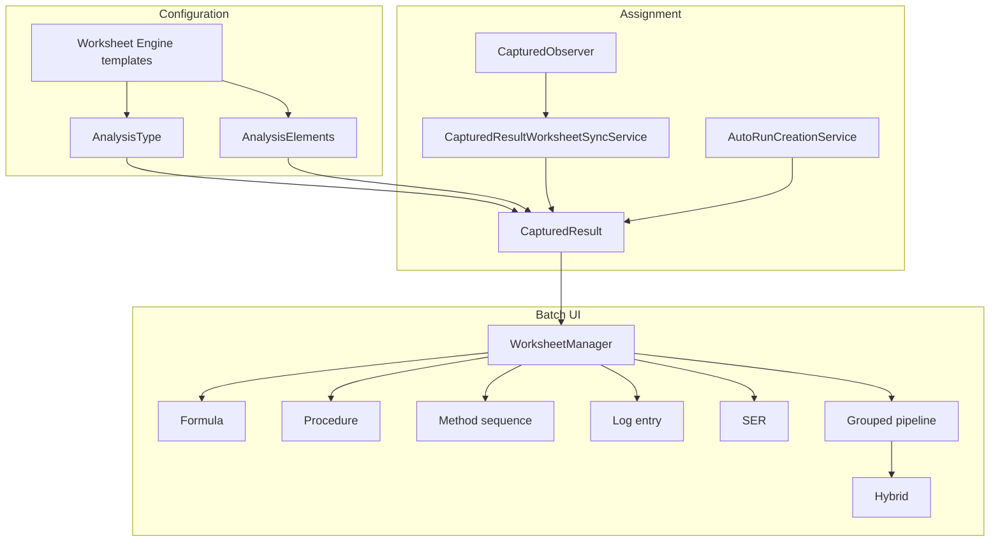

# Worksheets — End-to-End Guide

This document explains how every worksheet type in Polucon works: configuration, assignment onto samples, runtime capture, posting, and how the pieces connect.

There is **no single `Worksheet` model**. “Worksheets” is a family of engines that share:

1. An admin hub (**Worksheet Engine** at `/formulars`)
2. A batch capture UI (`/sample-workflow/batch/{batch}/worksheets`)
3. Assignment onto `CapturedResult` rows via analysis type / analysis element config

Frontend is **Blade + Livewire** (method sequences also use jQuery). There is no Inertia/Vue worksheet UI and no worksheet API routes.

---

## Table of contents

1. [Mental model](#1-mental-model)
2. [Worksheet types at a glance](#2-worksheet-types-at-a-glance)
3. [Configuration (admin)](#3-configuration-admin)
4. [Assignment onto work](#4-assignment-onto-work)
5. [Batch capture shell](#5-batch-capture-shell)
6. [Formula worksheets](#6-formula-worksheets)
7. [Procedure worksheets](#7-procedure-worksheets)
8. [Method sequences](#8-method-sequences)
9. [Log entry worksheets](#9-log-entry-worksheets)
10. [SER worksheets](#10-ser-worksheets)
11. [Grouped pipelines](#11-grouped-pipelines)
12. [Hybrid worksheets](#12-hybrid-worksheets)
13. [Permissions and lab sections](#13-permissions-and-lab-sections)
14. [Case file review integration](#14-case-file-review-integration)
15. [Key file index](#15-key-file-index)
16. [Quirks and gotchas](#16-quirks-and-gotchas)

---

## 1. Mental model



### Two layers

| Layer | What it is | Where |
|-------|------------|--------|
| **Templates** | Reusable worksheet definitions (steps, columns, stages, document control) | `/formulars`, `/method-sequences`, `/stage-headers` |
| **Runtime instances** | Per-batch / per-sample captured data | Batch worksheets page + related tables |

### How a worksheet “attaches” to a sample

1. Lab configures an **analysis type** and its **elements** (analytes).
2. When a sample is registered and `CapturedResult` rows are created, `CapturedObserver` copies worksheet FKs/flags onto each result via `CapturedResultWorksheetSyncService`.
3. Optionally, `AutoRunCreationService` pre-creates formula rows, method-sequence runs, and SER headers.
4. The batch worksheets page discovers which engines apply by querying that batch’s `CapturedResult` rows (scoped by lab-section visibility).

---

## 2. Worksheet types at a glance

| Type | Purpose | Bound on | Runtime UI |
|------|---------|----------|------------|
| **Formula** | Calculated results (inputs → derived → lookups → final) | Element: `formular_id` when `result_is_calculated` | `FormulaWorksheet` |
| **Procedure** | Structured capture (config fields, steps, test kits) → PDF | Type and/or element: `procedure_worksheet_id` | `ProcedureWorksheetManager` |
| **Method sequence** | Multi-day stage tracking (equipment, media, controls, results) | Element: `stage_header_id` / `method_sequence_id` | jQuery UI in worksheet manager |
| **Log entry** | Dynamic tabular log driven by a row driver | Element: `log_entry_worksheet_id` | `LogEntryWorksheetManager` |
| **SER** | Capture for “no result capture” analyses | Result flag: `has_no_result_capture` | `SerWorksheet` |
| **Grouped pipeline** | Ordered multi-stage wizard of other worksheets + final results capture | Type: `grouped_worksheet_holder_id` | `GroupedWorksheetWizard` |
| **Hybrid** | Mixed blocks (references or inline formula/procedure/sequence) | Type: `hybrid_worksheet_id` | `HybridWorksheetRunner` |

### Mutual exclusivity on analysis type

In `AnalysisTypeManager`:

- You may set **either** a single procedure worksheet **or** a grouped/hybrid pipeline — not both.
- Grouped holder and hybrid worksheet are also mutually exclusive (pick one).

Element-level worksheets (formula, log entry, method sequence, procedure override) can still apply alongside type-level config where the sync service allows it.

---

## 3. Configuration (admin)

### Worksheet Engine hub

**URL:** `/formulars` (`formulars.index`)  
**View:** `resources/views/formulars/index.blade.php`

Modules linked from the hub:

| Module | Route prefix | Controller shell |
|--------|--------------|------------------|
| Formulas | `formulars.*` | `Formulars\FormulaController` |
| Procedures | `formulars.procedures.*` | `Procedures\ProcedureWorksheetController` |
| Grouped pipelines | `formulars.grouped-worksheets.*` | `GroupedWorksheets\GroupedWorksheetHolderController` |
| Hybrid | `formulars.hybrid-worksheets.*` | `HybridWorksheets\HybridWorksheetController` |
| Log entry | `formulars.log-entry-worksheets.*` | `LogEntryWorksheets\LogEntryWorksheetController` |
| Method sequences | `method-sequences.*` | `MethodSequences\MethodSequenceController` |
| Stage headers | `stage-headers.*` | `StageHeaderController` |
| SER steps | Lab Livewire admin | `SerWorksheetStepsManager` |

Middleware on engine routes is typically `auth` only. Batch worksheets require `can:laboratory.components.all samples.view`.

### Where to assign templates

| Binding | Fields | Managed in |
|---------|--------|------------|
| **Analysis type** | `procedure_worksheet_id`, `grouped_worksheet_holder_id`, `hybrid_worksheet_id` | `AnalysisTypeManager` |
| **Analysis element** | `formular_id` (+ `result_is_calculated`), `procedure_worksheet_id`, `log_entry_worksheet_id`, `has_method_sequence`, `method_sequence_id`, `stage_header_id` | `ElementManager` |

### Sync onto existing work

`SyncWorksheetsModal` (`app/Livewire/Analysis/SyncWorksheetsModal.php`) can backfill worksheet FKs onto existing `CapturedResult` rows for selected batches/statuses without recreating samples. It uses `CapturedResultWorksheetSyncService::syncMany()`.

---

## 4. Assignment onto work

### Sync service

**File:** `app/Services/Analysis/CapturedResultWorksheetSyncService.php`

Called from `CapturedObserver` on create (and related update paths). Copies:

| From | Onto `CapturedResult` |
|------|------------------------|
| Element `formular_id` (if `result_is_calculated`) | `formular_id` |
| Element method sequence / stage header | `method_sequence_id`, `stage_header_id` |
| Element or type procedure | `procedure_worksheet_id`, `has_procedure_worksheet`; may set `result = 'No attachment'` if empty |
| Type grouped holder | `grouped_worksheet_holder_id`, `has_grouped_worksheet` |
| Type hybrid | `hybrid_worksheet_id`, `has_hybrid_worksheet` |
| Element log entry | `log_entry_worksheet_id`, `has_log_entry_worksheet` |

Procedure ID resolution: **element first**, then analysis type.

### Auto-run creation

**File:** `app/Services/Worksheets/AutoRunCreationService.php`  
Triggered after sample registration/assignment (`createRunsForBatch`).

For eligible captured results it:

1. **Method sequences** — creates (or extends) a pending `MethodSequenceRun`, links samples, pre-creates stage data placeholders.
2. **Formulas** — creates `SampleCapturedWorksheetFormula` plus empty step/mandatory data rows.
3. **SER** — creates `SerHeaderWorksheetSampleRelation` and step rows from active `SerWorksheetStep` templates.

It does **not** auto-create procedure captures, log-entry instances, or grouped runs (those are created when the user opens the corresponding UI).

---

## 5. Batch capture shell

### Entry point

| Item | Value |
|------|--------|
| Route | `GET /sample-workflow/batch/{batch}/worksheets` → `batch-worksheets` |
| Controller | `WorksheetsController` |
| View | `resources/views/worksheets/index.blade.php` |
| Livewire root | `Worksheets\WorksheetManager` |

### Tab discovery

Tabs are **data-driven**. Empty engines are hidden.

| Tab key | Shown when |
|---------|------------|
| `grouped-pipelines` | Batch has grouped holders via assignment service |
| `formulas` | Captured results with `formular_id` |
| `method-sequences` | Stage headers linked to this batch’s results |
| `log-entry` | Captured results with `log_entry_worksheet_id` |
| `procedures` | Captured results with `procedure_worksheet_id` |
| `ser` | Any results with `has_no_result_capture` |

Query string:

- `?tab=` — active tab
- `?pipeline=` — grouped holder ID
- `?formula=` — formula ID

Default tab = first available in the order above.

### Lab-section scoping

All tab loaders use `LabSectionResultAccess::scopeVisibleCapturedResults()` so users only see results their lab section can view. Editing is stricter (see [§13](#13-permissions-and-lab-sections)).

---

## 6. Formula worksheets

### Purpose

Compute a final numeric (or symbol-prefixed) result from ordered steps, then **post** that value onto `CapturedResult`.

### Template model

| Model | Role |
|-------|------|
| `Formula` | Named worksheet; soft-deletes; `is_active` |
| `FormulaVersion` | Versioned definition; one `activeVersion` |
| `FormulaStep` | Ordered steps with `variable_name`, `step_type`, expressions |
| `FormulaMandatoryField` | Header-level required fields |
| `LookupTable` / `LookupTableEntry` | Lookup data for lookup steps |
| `GlobalVariable` | Shared constants across formulas |

**Admin UI:** Formula manager, step editor, standalone executor, history, globals, lookups under `/formulars`.

### Step types

Defined on `FormulaStep`:

| `step_type` | Behavior |
|-------------|----------|
| `input` | User-entered value |
| `derived` | Expression (Symfony ExpressionLanguage) over prior variables |
| `lookup` | Lookup table resolution |
| `parameter_result` | Pulls from related parameter / result context |
| `static_text` | Display only |
| `checkbox` | Checkbox options (often shared across samples) |
| `custom_table` | Dynamic table with row drivers |
| `pcr_plate_map` | PCR plate map UI (often shared) |

`FormulaEvaluator` (`app/Services/Formulars/FormulaEvaluator.php`) executes calculable steps in order. The **final result** is the last calculable step’s value.

### Runtime model

| Model / table | Role |
|---------------|------|
| `SampleCapturedWorksheetFormula` | One capture row per captured result (typically) |
| `SampleWorksheetFormularStepData` | Per-step values |
| `SampleWorksheetFormularMandatoryData` | Mandatory field values |
| `WorksheetExecution` | Standalone execute/history (Worksheet Engine, not batch) |

### Capture UI

**Livewire:** `app/Livewire/Worksheets/FormulaWorksheet.php`

Key flows:

1. **Mount** — load captured results for this batch + formula; load or create worksheet formula rows.
2. **Save** — `saveWorksheet($capturedResultId)` / `saveWorksheetLevel()` persist step data; recalculate via `calculateFormulaResult`.
3. **Shared vs per-sample** — some steps (checkboxes, PCR maps) can be shared at worksheet level.
4. **Post** — `postResults()`:
   - Requires lab-section edit rights for all visible results
   - Requires `startAnalysisDate` / `endAnalysisDate`
   - Writes `CapturedResult.result`, `result_reporting_symbol`, analyst
   - Parses reporting symbols `<=`, `>=`, `<`, `>` from `final_result`
   - Updates `SampleAnalysisDates` (JSON per lab section)
   - Marks worksheet formula as posted (`posted_at`, `posted_by_user_id`)

There is **no approve/reject** on formula worksheets — only save vs post.

Standalone path: `WorksheetExecutor` + `WorksheetService` → `worksheet_executions` for testing formulas outside a batch.

---

## 7. Procedure worksheets

### Purpose

Structured laboratory procedure capture (config header fields, ordered steps/groups, optional test kits). Used heavily for documentation; PDF is generated and attached at **sample approval** time.

### Template model

| Model | Role |
|-------|------|
| `ProcedureWorksheet` | Template (`name`, document control, `config_fields_placement`) |
| `ProcedureWorksheetStep` / `ProcedureWorksheetStepGroup` | Steps and grouping |
| `ProcedureWorksheetStepAnalyst` | Analysts per step |
| `ProcedureConfigField` / `ProcedureConfigFieldSection` | Header config fields |
| `ProcedureTestKitColumn` / rows / values | Test kit grid |
| Custom table models | Dynamic tables on steps |

**Step `value_type`s** include: `text`, `number`, `time`, `datetime`, `date`, `method_select`, `equipment_select`, `custom_select`, `custom_table`, `static_text`. Flags include `is_result_step` and equipment logbook integration.

### Runtime capture

**Livewire:** `app/Livewire/Worksheets/ProcedureWorksheetManager.php`

Persists into:

- `CapturedProcedureValue`
- `CapturedProcedureConfigValue`
- Test-kit value tables
- `SampleProcedureStepTableInstance` (custom tables)

Notable behaviors:

- Multi-sample selection: saving can **copy** the first sample’s scalar/config values onto other selected samples.
- Equipment / measurand overrides can write back into **template** step defaults (template mutation quirk).
- Analysts are stored per step and do not rewrite template defaults the same way.

### PDF

| Piece | Role |
|-------|------|
| Preview route | `batch-worksheets.procedure-preview` (temporary design preview) |
| Service | `ProcedureWorksheetPdfService` |
| Production attach | During sample approval in `SampleWorkFlowController` — one PDF per `(procedure_worksheet_id, analyte_id)` via `generateAndAttach`, stored as batch attachment |

PDF is **not** generated on every save; it is approval-time (plus the preview route).

---

## 8. Method sequences

### Purpose

Track multi-day / multi-stage laboratory work: start/end stages, equipment and media usage, controls, and sample results — then post results onto captured results.

### Configuration

Two related concepts:

1. **Method sequence** (`MethodSequence` + versions + stages) — timed stage definitions under `/method-sequences`.
2. **Stage header** (`StageHeader` + test stages) — analysis-facing wrapper (method, analyte, sample type, days). Bound on analysis elements via `stage_header_id` / `method_sequence_id`.

### Runtime model (`app/Models/Worksheets/`)

| Model | Role |
|-------|------|
| `MethodSequenceRun` | A run on a batch for a sequence (`pending` / in progress / …) |
| `MethodSequenceRunSample` | Links captured results / samples into a run |
| `MethodSequenceRunStageData` | Per-stage timing/status for a run |
| `MethodSequenceStageEquipmentUsage` | Equipment used |
| `MethodSequenceStageMediaUsage` | Media used |
| `MethodSequenceStageControlUsage` / `…ControlResult` | Controls |
| `MethodSequenceStageSampleResult` | Staged sample results before post |

### Runtime UI

Primarily **jQuery + Blade**, not Livewire:

- Partials: `resources/views/worksheets/partials/method-sequences-jquery*.blade.php`
- JS: `public/js/method-sequences.js`
- AJAX endpoints on `SampleWorkFlowController` (`method-sequences.*` routes)

Typical flow:

1. Auto-create or manually create a run.
2. Start / update / end stages (`tracks/{track}/start|end|update`).
3. Save staged results (`save-results`, `update-result`).
4. Post to captured results (`postMethodSequenceResults`).
5. Optional Excel import of post-results sheet.

`TrackSampleResultObserver` participates in staging before post.

`WorksheetManager` dispatches `init-method-sequences` when the method-sequences tab is selected so jQuery can initialize.

---

## 9. Log entry worksheets

### Purpose

A configurable **grid log**: rows are generated from a driver; columns are input, derived, or dataset-backed. One instance per (batch, worksheet).

### Template

| Field | Meaning |
|-------|---------|
| `row_driver` | What generates rows |
| `row_driver_filters` | Optional filters |
| `mandatory_fields_placement` | Where mandatory fields appear |
| `allow_manual_rows` | User can add extra rows |

**Row drivers** (`LogEntryRowDriver`):

| Driver | Rows |
|--------|------|
| `sample_header` | One row per batch |
| `sample_detail` | One row per sample |
| `captured_result` | One row per test / captured result |
| `method` | One row per distinct method |

**Column types** (`LogEntryColumnType`): `input`, `derived`, `dataset`.

Services under `app/Services/LogEntryWorksheets/`:

- `LogEntryRowGeneratorService` — create rows from driver
- `LogEntryColumnEvaluator` — derived expressions
- `LogEntryDatasetResolverService` — dataset dropdowns
- `LogEntryMandatoryFieldOptionsResolver` — mandatory field options
- `LogEntryRowContextBuilder` — context for evaluation

### Runtime

| Model | Role |
|-------|------|
| `SampleLogEntryWorksheetInstance` | Instance; `status` draft / posted |
| `…Row`, `…CellValue`, `…MandatoryData` | Grid data |

**Livewire:** `LogEntryWorksheetManager`

- Autosave cells; re-evaluate derived columns
- `saveWorksheet()` → draft persist
- `postWorksheet()` → `validateBeforePost()` (required mandatory + required inputs) then `status = posted`

---

## 10. SER worksheets

### Purpose

Worksheets for analyses flagged **no result capture** (`CapturedResult.has_no_result_capture`). Used when the lab still needs structured SER-style documentation without posting a numeric analyte result the usual way.

### Template

`SerWorksheetStep` — global active steps with default measurand / equipment / analyst.

Admin: `SerWorksheetStepsManager` / `SerWorksheetStepsController`.

### Runtime

| Model | Role |
|-------|------|
| `SerHeaderWorksheetSampleRelation` | One header per sample (+ analysis type) |
| `SerStepWorksheetSampleRelation` | Step rows under header |
| `SerTestkitWorksheetSampleRelation` | Test kit rows |

**Livewire:** `SerWorksheet`

- Grouped in the batch UI by analysis type (`groupedNoCaptureSamples`)
- `createRun` / `save` persist header + steps + test kits
- Auto-created by `AutoRunCreationService::processSerWorksheets` when samples are registered

---

## 11. Grouped pipelines

### Purpose

An ordered **wizard** that walks a batch through multiple worksheet stages, then a final **Results capture** stage that posts parameter values for all samples.

### Template

| Model | Role |
|-------|------|
| `GroupedWorksheetHolder` | Named pipeline |
| `GroupedWorksheetItem` | Ordered stage pointing at another worksheet |

**Item types** (`GroupedWorksheetItemType`):

| Value | Embeds |
|-------|--------|
| `formula` | Formula worksheet |
| `procedure` | Procedure worksheet |
| `stage_header` | Method sequence / stage header UI |
| `hybrid_worksheet` | Hybrid runner |
| `log_entry_worksheet` | Log entry manager |
| `results_capture` | Virtual final stage (not stored as a real item row) |

Admin: `GroupedWorksheetHolderManager` + `GroupedWorksheetItemEditor`.

### Virtual results capture

`GroupedWorksheetPipelineStages` appends a virtual stage with fixed ID:

`00000000-0000-4000-8000-000000000001`

It is always last, always required, and cannot be skipped. UI: `GroupedResultsCapture`.

### Runtime run model

| Model | Role |
|-------|------|
| `GroupedWorksheetRun` | One run per (batch, holder); status `in_progress` / `completed` / `cancelled` |
| `GroupedWorksheetRunItem` | Per configured item: `pending` / `in_progress` / `completed` / `skipped` |
| `GroupedWorksheetResultsCaptureDraft` / sample drafts / posts | Final matrix draft and post records |

**Services:**

- `GroupedWorksheetAssignmentService` — which holders apply to a batch
- `GroupedWorksheetRunService` — find/create run, complete/skip stage
- `GroupedResultsCaptureService` — draft matrix → post
- `GroupedWorksheetReferenceValidator` — ensure referenced worksheets exist
- `GroupedWorksheetCapturePreviewService` — preview helpers

### Wizard UI

**Livewire:** `GroupedWorksheetWizard`

- `mount` → find or create run
- Embeds the matching engine for the current stage
- `completeStage` / `skipStage` (optional stages only) / `goToStage`
- On last (virtual) stage, `GroupedResultsCapture` posts results

Hybrid stages listen for completion events (`groupedStageCompleted`) when nested hybrid finishes its last block.

---

## 12. Hybrid worksheets

### Purpose

A single versioned worksheet composed of **blocks** that either **reference** existing formula/procedure/stage-header templates or define **inline** steps/stages.

### Template

| Model | Role |
|-------|------|
| `HybridWorksheet` | Named hybrid |
| `HybridWorksheetVersion` | Version; has `approved_by` / `approved_at` columns (limited UI surface) |
| `HybridWorksheetBlock` | Ordered blocks |
| `HybridFormulaStep` / `HybridProcedureStep` / `HybridSequenceStage` | Inline definitions |

**Block types** (`HybridWorksheetBlockType`):

| Type | Kind |
|------|------|
| `formula_reference` / `procedure_reference` / `stage_header_reference` | Reuse existing templates |
| `formula_inline` / `procedure_inline` / `sequence_inline` | Steps/stages stored on the hybrid version |

### Runtime

**Livewire:** `HybridWorksheetRunner`

- Walks blocks in order
- Reference blocks embed the corresponding capture components
- Inline blocks use hybrid-specific step tables
- Does not itself implement formula/procedure persistence — nested components do
- On last block, may dispatch `groupedStageCompleted` when used inside a grouped pipeline

Admin: `HybridWorksheetManager` + `HybridWorksheetBlockEditor` (activate versions; full approval workflow is schema-ready but not a rich product surface).

---

## 13. Permissions and lab sections

| Concern | Behavior |
|---------|----------|
| Route access (batch worksheets) | `can:laboratory.components.all samples.view` |
| Worksheet Engine admin | `auth` |
| View results in tabs | `LabSectionResultAccess::scopeVisibleCapturedResults` |
| Edit / save / post | User must have lab-section assignment matching the result’s `lab_section_id` |
| Method sequence stage edit | `canEditStageHeaderResults` with batch sample IDs |

There are **no** dedicated worksheet Policies or Form Request classes; validation lives inline in Livewire components and controllers.

---

## 14. Case file review integration

**Config:** `config/case_file_review.php`

Worksheet data can prefill case file review forms:

- `require_posted_or_completed` (default `false`) — when true, only posted formulas / completed grouped stages are used
- Stage label keywords map pipeline stage names → case file sections (screening, extraction, PCR, etc.)
- Mandatory field and formula step **aliases** map worksheet field names → case file columns

This is a read/prefill bridge, not part of the capture UI itself.

---

## 15. Key file index

### Runtime Livewire

| Component | Path |
|-----------|------|
| Shell | `app/Livewire/Worksheets/WorksheetManager.php` |
| Formula | `app/Livewire/Worksheets/FormulaWorksheet.php` |
| Procedure | `app/Livewire/Worksheets/ProcedureWorksheetManager.php` |
| Log entry | `app/Livewire/Worksheets/LogEntryWorksheetManager.php` |
| SER | `app/Livewire/Worksheets/SerWorksheet.php` |
| Grouped wizard | `app/Livewire/Worksheets/GroupedWorksheetWizard.php` |
| Hybrid | `app/Livewire/Worksheets/HybridWorksheetRunner.php` |
| Results capture | `app/Livewire/Worksheets/GroupedResultsCapture.php` |

### Assignment / automation

| Piece | Path |
|-------|------|
| Sync | `app/Services/Analysis/CapturedResultWorksheetSyncService.php` |
| Observer | `app/Observers/CapturedObserver.php` |
| Auto runs | `app/Services/Worksheets/AutoRunCreationService.php` |
| Sync modal | `app/Livewire/Analysis/SyncWorksheetsModal.php` |
| Lab access | `app/Services/Sampleworkflow/LabSectionResultAccess.php` |

### Formula engine

| Piece | Path |
|-------|------|
| Evaluator | `app/Services/Formulars/FormulaEvaluator.php` |
| Worksheet service | `app/Services/Formulars/WorksheetService.php` |
| Lookup | `app/Services/Formulars/LookupService.php` |

### Grouped / log entry services

Under `app/Services/GroupedWorksheets/` and `app/Services/LogEntryWorksheets/` (see sections above).

### Routes

- Batch: `routes/web.php` (~593–622) — worksheets + method-sequence AJAX
- Engine: `routes/web.php` (~2199–2254) — `formulars.*`, `method-sequences.*`, `stage-headers`

### Views

- Batch shell: `resources/views/worksheets/index.blade.php`
- Engine hub: `resources/views/formulars/index.blade.php`
- Livewire views: `resources/views/livewire/worksheets/*`
- Procedure print: `resources/views/procedure-worksheets/print/`, `resources/views/worksheets/print/`

### Enums

- `app/Enums/GroupedWorksheetItemType.php`
- `app/Enums/HybridWorksheetBlockType.php`
- `app/Enums/GroupedWorksheetRunStatus.php`
- `app/Enums/GroupedWorksheetRunItemStatus.php`
- `app/Enums/LogEntryWorksheet/LogEntryColumnType.php`
- `app/Enums/LogEntryWorksheet/LogEntryRowDriver.php`

---

## 16. Quirks and gotchas

1. **Naming:** DB/code often use `formular` / `formulars` / `formular_id` even though the product says “formula”.
2. **Not one domain object** — six-plus engines share a hub and batch tab UI.
3. **Tabs hide empty engines** — if a formula is configured but no captured result has `formular_id` yet, the Formulas tab will not appear.
4. **Procedure PDF is approval-time**, not save-time (except the preview route).
5. **Procedure save can mutate template defaults** for equipment/measurands.
6. **Grouped “Results capture” is virtual** — not a real `grouped_worksheet_items` row; fixed UUID in code.
7. **Auto-run does not cover** procedures, log entries, or grouped runs — only formulas, method sequences, and SER.
8. **Hybrid runner delegates saves** to nested components; completing a hybrid block ≠ posting captured results unless that nested engine posts.
9. **Formula post** updates `posted_at` in a way that may not cover every per-sample row if multiple rows share the same batch+formula lookup pattern — worth verifying if debugging “not posted” state.
10. **`worksheet_external_samples`** exists as a stub table (UUID + timestamps) with little product use.
11. **Method sequences are still jQuery-heavy** inside an otherwise Livewire worksheet manager.
12. **Auditing:** most worksheet models use OwenIt Auditable.
13. **No Form Requests / Policies / API** for worksheets — expect validation and auth checks inside Livewire/controllers.
14. **Analysis type exclusivity:** procedure XOR grouped XOR hybrid at the type level; element-level formula/log/sequence can still apply.

---

## Lifecycle cheat sheet

```text
Admin configures templates in Worksheet Engine
        ↓
Assign on Analysis Type and/or Analysis Elements
        ↓
Sample registration → CapturedResult created
        ↓
CapturedObserver → CapturedResultWorksheetSyncService
        ↓
AutoRunCreationService (formula rows / MS runs / SER headers)
        ↓
Open batch → /sample-workflow/batch/{id}/worksheets
        ↓
WorksheetManager shows only relevant tabs
        ↓
User fills engine UI → save (draft) → post / complete stage
        ↓
Results land on CapturedResult (and/or PDFs / case file prefill)
```

When debugging “why isn’t this worksheet showing?”, check in order:

1. Is the template assigned on the analysis type or element?
2. Did sync copy FKs onto `CapturedResult` for this batch?
3. Is the template `is_active`?
4. Does lab-section access hide the rows?
5. For grouped/hybrid: is the mutually exclusive type binding set correctly?
