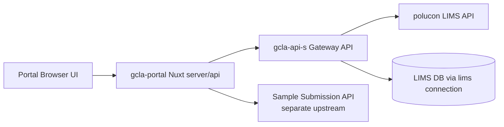
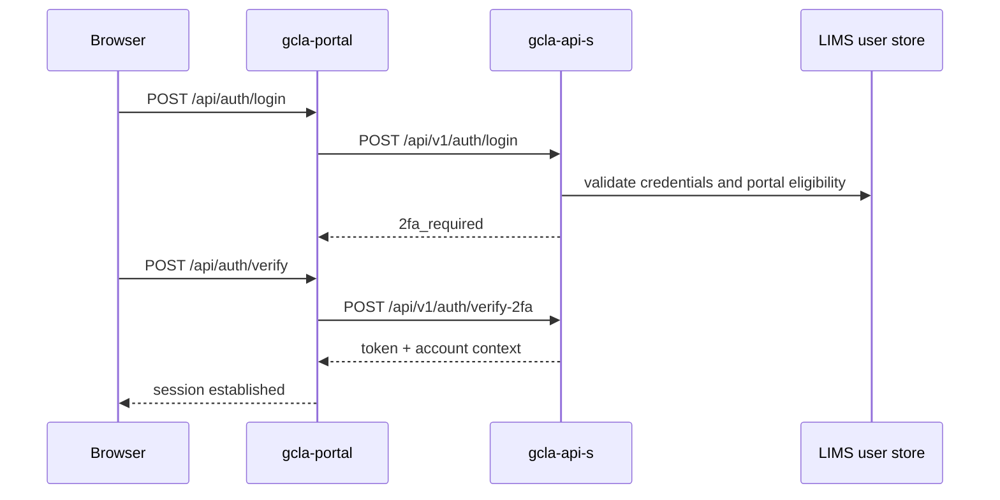
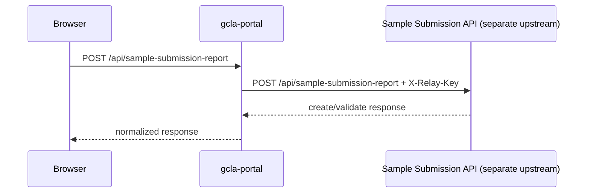

# Customer Portal -> Gateway API -> LIMS Integration (3-App Architecture)

This document describes how the three applications connect in practice:

1. gcla-portal (Nuxt customer portal)
2. gcla-api-s (gateway/customer API)
3. polucon (LIMS backend)

It is based on inspected route/controller/service code from all three repositories.

---

## 1. High-level Architecture

Key points:

- Most portal business traffic is: portal -> gateway -> lims.
- One special relay path bypasses normal gateway portal routes: `/api/sample-submission-report`.
- Gateway uses both:
  - HTTP passthrough to LIMS internal API routes
  - direct LIMS DB-backed models on configured `lims` connection

---

## 2. App Responsibilities

### 2.1 gcla-portal (Nuxt)

Role:

- Browser-facing app and BFF-style server proxy (`server/api/*`).
- Stores/uses session token.
- Forwards bearer-authenticated requests to gateway APIs.
- Builds special relay payload for sample submission report endpoint.

Primary downstream targets:

- `/api/v1/auth/*`
- `/api/v1/portal/*`
- special relay upstream `/api/sample-submission-report`

Relevant implementation references:

- `server/utils/backend.ts`
- `server/api/auth/*.ts`
- `server/api/portal/**/*.ts`
- `server/api/sample-submission-report.post.ts`

### 2.2 gcla-api-s (Gateway)

Role:

- Portal auth API surface (`/api/v1/auth/*`).
- Customer-scoped portal API surface (`/api/v1/portal/*`).
- Proxies many domains to LIMS via `LimsPortalHttpClient`.
- Handles selected domain logic directly against LIMS DB models.

Security model:

- Public routes: selected auth/public-reference endpoints.
- Protected routes: Sanctum + session touch middleware.

Relevant implementation references:

- `routes/api.php`
- `config/lims_portal.php`
- `app/Services/Lims/PortalSubmissions/LimsPortalHttpClient.php`
- `app/Services/Lims/PortalSubmissions/PortalSubmissionContext.php`

### 2.3 polucon (LIMS)

Role:

- Hosts internal gateway-facing routes:
  - `/api/v1/portal/submissions/*`
  - `/api/v1/dashboard/*`
  - `/api/v1/portal/{customer_id}/*` for CRM/billing domains
- Enforces service-key auth and customer scoping.

Relevant implementation references:

- `routes/api/portal_submissions.php`
- `routes/api/dashboard.php`
- `routes/api/portal_crm.php`
- `app/Http/Middleware/AuthenticatePortalGateway.php`

---

## 3. End-to-End Flows

### 3.1 Authentication

Notes:

- Gateway validates active client user and linked CRM contact policy before session issuance.
- Portal stores token in server session and uses it for proxied calls.

### 3.2 Portal Business APIs

Standard path:

1. Browser calls portal app route (`/api/portal/...`)
2. Portal server reads session token
3. Portal forwards to gateway (`/api/v1/portal/...`)
4. Gateway authorizes request
5. Gateway serves directly or proxies to LIMS
6. Response returns back to browser via portal

### 3.3 Gateway -> LIMS HTTP Contract

Gateway HTTP client sends:

- `Authorization: Bearer {LIMS_PORTAL_API_KEY}`
- `X-Portal-Gateway-Key: {LIMS_PORTAL_API_KEY}`
- `X-CRM-Customer-Id: {portal_account.crm_customer_id}`
- `X-Portal-Account-Id: {portal_account.id}`

Configured by:

- `config/lims_portal.php`
- env vars `LIMS_PORTAL_API_BASE_URL`, `LIMS_PORTAL_API_KEY`, etc.

LIMS verifies via middleware:

- `portal.gateway` (`AuthenticatePortalGateway`)

### 3.4 Submission Forms / Instances

- Gateway form controllers call LIMS submission endpoints through `SubmissionFormInstanceService` + `LimsPortalSubmissionsClient`.
- Draft/submit support both JSON and multipart.
- Gateway maps fields/files to LIMS schema before forwarding.

Key references:

- `app/Domains/CustomerPortal/Forms/Http/Controllers/PortalFormInstancesController.php`
- `app/Services/Lims/PortalSubmissions/SubmissionFormInstanceService.php`

### 3.5 Dashboard / CRM / Invoices / Feedback / Complaints

- Gateway uses scoped proxy services to call LIMS dashboard and CRM prefixes.
- Route customer IDs are checked against authenticated portal customer scope.
- Some response shaping is done in gateway (example: notification merge behavior in dashboard service).

Key references:

- `app/Services/Lims/PortalDashboard/CustomerDashboardService.php`
- `app/Services/Lims/PortalCrm/PortalComplaintProxyService.php`
- `app/Domains/CustomerPortal/Http/Concerns/ResolvesPortalCustomerScope.php`

### 3.6 Submission Requests Domain

- Gateway exposes `/api/v1/portal/submission-requests/*`.
- Create endpoint is explicitly deprecated (HTTP 410) in favor of TRF form instances.
- List/show/update/submit/quotation routes are customer-scoped and operate through LIMS-domain models.

Key reference:

- `app/Domains/CustomerPortal/SubmissionRequests/Http/Controllers/SubmissionRequestsController.php`

### 3.7 Special Sample Submission Relay

Important distinction:

- This is implemented in portal server code (`server/api/sample-submission-report.post.ts`).
- It is separate from regular gateway business flow under `/api/v1/portal/*`.

---

## 4. Endpoint Ownership Matrix

| Public route family | Owned by | Typical downstream |
|---|---|---|
| `/api/auth/*` (portal app routes) | gcla-portal | gcla-api-s `/api/v1/auth/*` |
| `/api/portal/*` (portal app routes) | gcla-portal | gcla-api-s `/api/v1/portal/*` |
| `/api/v1/auth/*` | gcla-api-s | auth services + LIMS-backed user policy |
| `/api/v1/portal/*` | gcla-api-s | mixed: direct handling + LIMS proxy |
| `/api/v1/public/reference/*` | gcla-api-s | gateway reference endpoints |
| `/api/v1/portal/submissions/*` | polucon | native LIMS submission APIs |
| `/api/v1/dashboard/*` | polucon | native LIMS dashboard APIs |
| `/api/v1/portal/{customer_id}/*` | polucon | native LIMS CRM/billing APIs |
| `/api/sample-submission-report` (portal app route) | gcla-portal | separate sample-submission upstream |

---

## 5. Security and Scope Boundaries

### 5.1 Browser -> Portal

- Browser does not own customer scope headers.
- Browser uses portal session-backed access.

### 5.2 Portal -> Gateway

- Bearer token from portal session is forwarded.

### 5.3 Gateway -> LIMS

- Service-key trust (`LIMS_PORTAL_API_KEY` <-> `PORTAL_GATEWAY_API_KEY`).
- Gateway injects customer/account scope headers.

### 5.4 LIMS enforcement

- Rejects invalid service keys.
- Enforces customer scoping from headers + route constraints.

---

## 6. Required Cross-App Configuration

### 6.1 gcla-portal

- `NUXT_BACKEND_URL`
- `NUXT_PUBLIC_BACKEND_URL`
- `NUXT_AUTH_API_URL`
- `NUXT_PUBLIC_SAMPLE_SUBMISSION_API_URL`
- `NUXT_PORTAL_RELAY_KEY`
- `NUXT_SESSION_PASSWORD`

### 6.2 gcla-api-s

- `LIMS_PORTAL_API_BASE_URL`
- `LIMS_PORTAL_API_KEY`
- `LIMS_PORTAL_API_PREFIX`
- `LIMS_PORTAL_DASHBOARD_PREFIX`
- `LIMS_PORTAL_CRM_PREFIX`
- `LIMS_DB_*` (for direct LIMS model access)
- `PORTAL_RELAY_SHARED_KEY`

### 6.3 polucon

- `PORTAL_GATEWAY_API_KEY` (must match gateway key)

---

## 7. Practical Integration Rules

1. Frontend should call only portal app APIs, not LIMS URLs directly.
2. Keep sample-submission relay contract separate from normal submission-requests contract.
3. Use TRF submission forms for new submission creation flows.
4. Never trust client-provided customer scope values; derive from authenticated session.
5. Rotate and align gateway<->lims service keys together.

---

## 8. Known Architectural Characteristics

- Hybrid gateway pattern is intentional:
  - passthrough for many modules
  - direct LIMS DB model access for selected modules
- Submission request create endpoint is decommissioned in gateway path.
- Route maintenance should watch for duplicate route block definitions in gateway `routes/api.php`.
