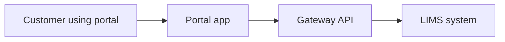

# Customer Portal, Gateway, and LIMS: Plain Language Guide

This guide explains, in simple terms, how the 3 systems work together:

1. kenya-dairy-portal (the customer website)
2. kenya-dairy-api-s (the middle service, also called gateway)
3. kenya-dairy (the main LIMS system)

If you are not technical, this is the important idea:

- Customers use the portal.
- The portal sends requests to the gateway.
- The gateway sends requests to LIMS.
- LIMS is the final source of truth for most business data.

---

## 1. Simple Picture

There is one special path:

- Some sample-submission traffic goes from the portal to a separate sample-submission service.
- That path does not use the normal gateway business flow.

---

## 2. What Each System Does

## 2.1 Portal (kenya-dairy-portal)

What users see and interact with.

Main jobs:

- Shows pages and forms to customers.
- Keeps customer login session.
- Sends customer actions to the gateway.

In plain words:

- The portal is the front desk.

## 2.2 Gateway (kenya-dairy-api-s)

The middle layer between portal and LIMS.

Main jobs:

- Handles login-related APIs.
- Checks if a customer is allowed to do an action.
- Passes many requests to LIMS.
- For a few areas, reads LIMS data directly through its LIMS database connection.

In plain words:

- The gateway is the security guard and traffic controller.

## 2.3 LIMS (kenya-dairy)

The main backend system.

Main jobs:

- Stores and processes core laboratory/business records.
- Provides internal APIs used by the gateway.
- Enforces strict service-to-service security and customer scope rules.

In plain words:

- LIMS is the main office where official records live.

---

## 3. What Happens During Common User Actions

## 3.1 Login

1. Customer enters email/password in portal.
2. Portal sends login request to gateway.
3. Gateway validates user and sends verification code (2FA).
4. Customer enters code.
5. Portal sends code to gateway.
6. Gateway returns access token/session info.
7. Portal stores session and user is logged in.

## 3.2 Viewing Lists (dashboard, complaints, forms, invoices)

1. Customer opens a page in portal.
2. Portal calls gateway endpoint.
3. Gateway checks customer identity and permissions.
4. Gateway fetches data from LIMS (or LIMS-connected models).
5. Data returns to portal and is shown to customer.

## 3.3 Submitting Forms

1. Customer fills and saves a form in portal.
2. Portal sends the request to gateway.
3. Gateway maps and validates data.
4. Gateway forwards to LIMS submission endpoints.
5. LIMS stores/updates the submission.
6. Final status returns back to customer in portal.

---

## 4. The One Special Flow (Important)

Most business requests follow this route:

- Portal -> Gateway -> LIMS

But one route is different:

- `/api/sample-submission-report`

That one is relayed by the portal to a separate sample-submission upstream service.

Why this matters:

- If this flow fails, troubleshooting may be different from normal portal pages.

---

## 5. Who Owns Which Endpoints

Use this to know where to investigate when something breaks.

| API family | Owner | Usually forwards to |
|---|---|---|
| `/api/auth/*` (portal side) | Portal | Gateway auth endpoints |
| `/api/portal/*` (portal side) | Portal | Gateway portal endpoints |
| `/api/v1/auth/*` | Gateway | Gateway auth services |
| `/api/v1/portal/*` | Gateway | LIMS and/or LIMS-connected logic |
| `/api/v1/portal/submissions/*` | LIMS | Native LIMS submission processing |
| `/api/v1/dashboard/*` | LIMS | Native LIMS dashboard processing |
| `/api/sample-submission-report` | Portal relay | Separate sample-submission service |

---

## 6. Security Rules in Plain Language

1. Customers only talk to the portal.
2. Portal calls gateway using customer session/token.
3. Gateway calls LIMS using system-to-system keys.
4. Gateway tells LIMS which customer the request belongs to.
5. LIMS rejects requests with wrong or missing service keys/scope.

Practical meaning:

- Customers cannot choose another customer's data by changing URLs.
- Internal keys between gateway and LIMS must match exactly.

---

## 7. Configuration Checklist (Operations)

For the systems to communicate, these settings must be correct.

Portal needs:

- `NUXT_BACKEND_URL`
- `NUXT_PUBLIC_BACKEND_URL`
- `NUXT_AUTH_API_URL`
- `NUXT_PUBLIC_SAMPLE_SUBMISSION_API_URL`
- `NUXT_PORTAL_RELAY_KEY`
- `NUXT_SESSION_PASSWORD`

Gateway needs:

- `LIMS_PORTAL_API_BASE_URL`
- `LIMS_PORTAL_API_KEY`
- `LIMS_PORTAL_API_PREFIX`
- `LIMS_PORTAL_DASHBOARD_PREFIX`
- `LIMS_PORTAL_CRM_PREFIX`
- `LIMS_DB_*`
- `PORTAL_RELAY_SHARED_KEY`

LIMS needs:

- `PORTAL_GATEWAY_API_KEY` (must be the same value as gateway `LIMS_PORTAL_API_KEY`)

---

## 8. Fast Troubleshooting Guide

If login fails:

- Check gateway auth endpoints and 2FA flow.
- Check portal auth API URL settings.

If portal page loads but shows no data:

- Check gateway token/session validation.
- Check customer scope checks.
- Check gateway-to-LIMS key match.

If submission form fails:

- Check whether it is normal form flow (Portal -> Gateway -> LIMS)
- Or special relay flow (`/api/sample-submission-report`)
- Then troubleshoot the correct downstream service.

If some customers see access denied unexpectedly:

- Check customer/contact linkage and scope enforcement in gateway/LIMS.

---

## 9. Business-Safe Rules to Keep

1. Do not call LIMS directly from browser apps.
2. Keep the special sample-submission relay separate from normal submission flows.
3. Use submission forms (TRF path) for new creation flows.
4. Never trust customer ID coming from user input alone.
5. Rotate gateway-LIMS keys together and verify both sides after changes.

---

## 10. One-Line Summary

The portal is the customer-facing front door, the gateway is the controlled middle layer, and LIMS is the main backend that owns core records.
