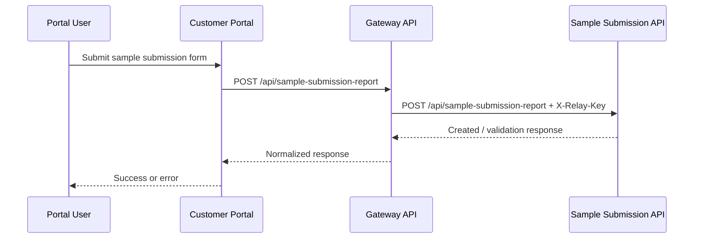

# Customer Portal ↔ LIMS API Guide

This document maps the API surface used by the customer portal to talk to the gateway API and, through it, to the LIMS backend.

It focuses on the integration boundaries that matter to portal consumers:

- how authentication works
- which endpoints are portal-scoped and customer-scoped
- which routes proxy into LIMS data and workflows
- where the portal uses a separate relay service for sample submission

The most important architectural rule is simple:

- the customer portal does not talk directly to the LIMS database
- the portal talks to the gateway API
- the gateway talks to the LIMS through API routes and internal services

---

## 1. Base URLs and transport

### 1.1 Portal to gateway

The portal uses the gateway API under these route groups:

- `/api/v1/auth`
- `/api/v1/portal`
- `/api/v1/public/reference`

Requests use JSON unless the endpoint is explicitly multipart, such as complaint attachments.

### 1.2 Auth relay for portal login

Some portal auth flows are forwarded to a separate auth API base URL, which is distinct from the main LIMS/CRM backend.

From the portal code, the auth base URL is resolved in this order:

1. server-only auth override
2. public sample submission API URL
3. fallback to the main backend URL

That means login, 2FA, resend, and related onboarding flows may be served from a different upstream than the main portal business APIs.

### 1.3 Sample submission relay

There is also a dedicated portal relay endpoint for sample submission reporting:

- portal endpoint: `/api/sample-submission-report`
- upstream endpoint: `/api/sample-submission-report`
- upstream host: the sample submission API base URL
- required header: `X-Relay-Key`

This relay is separate from the normal `/api/v1/portal/submission-requests` flow.

---

## 2. Authentication model

### 2.1 Token-based session access

Protected portal routes require a bearer token:

- `Authorization: Bearer <token>`

The gateway applies session middleware so the current portal session stays fresh when requests are made.

### 2.2 Portal scoping

Most business endpoints are scoped to the authenticated portal customer.

The portal user context usually carries:

- `crm_customer_id`
- optionally `crm_contact_id`

The backend uses that customer context to filter all customer-visible data.

### 2.3 Public auth and reference endpoints

The following are public or pre-auth:

- `POST /api/v1/auth/login`
- `POST /api/v1/auth/verify-2fa`
- `POST /api/v1/auth/resend-2fa`
- `POST /api/v1/auth/reset-password`
- `POST /api/v1/auth/access-requests`
- `POST /api/v1/auth/access-invites`
- `GET /api/v1/auth/access-invites/validate`
- `GET /api/v1/public/reference/zones`
- `GET /api/v1/public/reference/laboratories`
- `GET /api/v1/public/reference/access-request-categories`

Everything else in `/api/v1/portal` requires authentication.

---

## 3. High-level endpoint map

| Domain | Portal route group | Purpose |
|---|---|---|
| Auth | `/api/v1/auth` | Login, 2FA, reset password, invite completion, session management |
| Public reference | `/api/v1/public/reference` | Pre-login lookup data |
| Portal profile | `/api/v1/portal/me`, `/api/v1/portal/customer` | Current user and customer profile updates |
| Reference catalog | `/api/v1/portal/reference/*` | Lookup data for forms and pickers |
| CRM setup | `/api/v1/portal/company-units`, `company-sub-units`, `areas`, `sample-points`, `contacts`, `zones` | Customer-owned master data |
| Complaints | `/api/v1/portal/complaints` | Complaint intake and follow-up |
| Batches and samples | `/api/v1/portal/batches` | Batch tracking and sample rows |
| Submission requests | `/api/v1/portal/submission-requests` | Portal submission workflow and supporting documents |
| Dashboard and forms | `/api/v1/portal/dashboard`, `form-instances`, `submission-forms` | Home screen, form builder, and instance management |
| Acceptance forms | `/api/v1/portal/acceptance-forms` | Form signing and notification read state |
| Feedback and invoices | `/api/v1/portal/feedback`, `/api/v1/portal/invoices` | Customer communication and billing |
| Special relay | `/api/sample-submission-report` | Separate submission relay into the sample submission service |

---

## 4. Authentication flows

### 4.1 Login and 2FA

Routes:

- `POST /api/v1/auth/login`
- `POST /api/v1/auth/verify-2fa`
- `POST /api/v1/auth/resend-2fa`

Notes:

- login is rate-limited
- 2FA verification and resend are also rate-limited
- successful login establishes the bearer token used by later portal calls

### 4.2 Password reset and access onboarding

Routes:

- `POST /api/v1/auth/reset-password`
- `POST /api/v1/auth/access-requests`
- `GET /api/v1/auth/access-requests`
- `GET /api/v1/auth/access-requests/{accessRequest}`
- `PATCH /api/v1/auth/access-requests/{accessRequest}/approve`
- `PATCH /api/v1/auth/access-requests/{accessRequest}/reject`
- `POST /api/v1/auth/access-invites`
- `GET /api/v1/auth/access-invites/validate`
- `POST /api/v1/auth/access-invites/complete`

Use cases:

- request access to the portal
- approve or reject access requests
- complete invite-based onboarding

### 4.3 Authenticated session

Routes:

- `GET /api/v1/auth/me`
- `POST /api/v1/auth/logout`

These routes return or end the current session context and are only available after authentication.

---

## 5. Customer profile and reference data

### 5.1 Current portal user

- `GET /api/v1/portal/me`

Returns the authenticated portal account profile, including customer context.

### 5.2 Customer profile update

- `PATCH /api/v1/portal/customer`

Used to update customer-level details that the portal is allowed to manage.

### 5.3 Lookup and catalog endpoints

The reference catalog is the primary way the portal loads dropdown values before rendering forms.

Key routes:

- `GET /api/v1/portal/reference/catalog`
- `GET /api/v1/portal/reference/company-units`
- `GET /api/v1/portal/reference/company-sub-units`
- `GET /api/v1/portal/reference/areas`
- `GET /api/v1/portal/reference/crm-areas`
- `GET /api/v1/portal/reference/sample-points`
- `GET /api/v1/portal/reference/contacts`
- `GET /api/v1/portal/reference/designations`
- `GET /api/v1/portal/reference/zones`
- `GET /api/v1/portal/reference/countries`
- `GET /api/v1/portal/reference/account-settings`
- `GET /api/v1/portal/reference/sample-types`
- `GET /api/v1/portal/reference/matrices`
- `GET /api/v1/portal/reference/parameters`
- `GET /api/v1/portal/reference/{resource}`

These endpoints power the portal forms, especially submission requests, sample workflows, and CRM setup pages.

---

## 6. CRM setup endpoints

These routes let the customer portal manage customer-owned structure and lookup data.

### 6.1 Company units and sub-units

- `POST /api/v1/portal/company-units`
- `PATCH /api/v1/portal/company-units/{unit}`
- `DELETE /api/v1/portal/company-units/{unit}`
- `POST /api/v1/portal/company-sub-units`
- `PATCH /api/v1/portal/company-sub-units/{subUnit}`
- `DELETE /api/v1/portal/company-sub-units/{subUnit}`

### 6.2 Areas and sample points

- `POST /api/v1/portal/areas`
- `PATCH /api/v1/portal/areas/{area}`
- `DELETE /api/v1/portal/areas/{area}`
- `POST /api/v1/portal/sample-points`
- `PATCH /api/v1/portal/sample-points/{samplePoint}`
- `DELETE /api/v1/portal/sample-points/{samplePoint}`

### 6.3 Contacts and zones

- `POST /api/v1/portal/contacts`
- `PATCH /api/v1/portal/contacts/{contact}`
- `DELETE /api/v1/portal/contacts/{contact}`
- `PATCH /api/v1/portal/zones/{zone}`

These are the main customer-maintenance APIs used by the portal configuration screens.

---

## 7. Complaints workflow

### 7.1 Complaint routes

- `GET /api/v1/portal/complaints/types`
- `GET /api/v1/portal/complaints`
- `POST /api/v1/portal/complaints`
- `GET /api/v1/portal/complaints/{complaint}`
- `PATCH /api/v1/portal/complaints/{complaint}`
- `POST /api/v1/portal/complaints/{complaint}/notes`
- `POST /api/v1/portal/complaints/{complaint}/attachments`

### 7.2 What the portal can do

- create a complaint
- track its stage and status
- add follow-up notes
- upload attachments

### 7.3 What the CRM/LIMS controls

- stage movement
- approval and closure state
- internal resolution details

### 7.4 Payload notes

Complaint create requests usually include:

- description
- priority
- type
- date
- mode of delivery
- optional lab-related fields

Notes and attachments are created as portal follow-ups and are normally stored as internal items unless explicitly marked otherwise by the upstream rules.

---

## 8. Batches and samples

### 8.1 Routes

- `GET /api/v1/portal/batches/statuses`
- `GET /api/v1/portal/batches`
- `GET /api/v1/portal/batches/{batch}`
- `GET /api/v1/portal/batches/{batch}/samples`
- `POST /api/v1/portal/batches/{batch}/samples`
- `PATCH /api/v1/portal/batches/{batch}/samples/{sample}`

### 8.2 Behavior

- batches are customer-scoped
- sample rows belong to a batch
- the portal can read batch status and tracking stage
- the portal can create or update sample rows only when the batch is in an editable state

### 8.3 Common sample payload fields

- sample code
- analysis type IDs
- sample condition ID
- barcode
- comments
- GPS
- photo URL
- sample point ID
- company product ID

This area is the closest thing the portal has to direct LIMS sample management.

---

## 9. Submission requests and supporting documents

This is the most important portal-to-LIMS workflow in the gateway.

### 9.1 Routes

- `GET /api/v1/portal/supporting-document-templates`
- `GET /api/v1/portal/submission-requests`
- `GET /api/v1/portal/submission-requests/all`
- `POST /api/v1/portal/submission-requests`
- `GET /api/v1/portal/submission-requests/{submissionRequest}`
- `PATCH /api/v1/portal/submission-requests/{submissionRequest}`
- `POST /api/v1/portal/submission-requests/{submissionRequest}/submit`
- `POST /api/v1/portal/submission-requests/{submissionRequest}/accept-quotation`
- `POST /api/v1/portal/submission-requests/{submissionRequest}/quotation-feedback`
- `GET /api/v1/portal/submission-requests/{submissionRequest}/quotation`
- `GET /api/v1/portal/submission-requests/{submissionRequest}/quotation/pdf`
- `GET /api/v1/portal/submission-requests/{submissionRequest}/supporting-document-templates`
- `PUT /api/v1/portal/submission-requests/{submissionRequest}/supporting-document-templates`
- `GET /api/v1/portal/submission-requests/{submissionRequest}/supporting-documents`
- `POST /api/v1/portal/submission-requests/{submissionRequest}/supporting-documents`
- `GET /api/v1/portal/submission-requests/{submissionRequest}/supporting-documents/{instance}`
- `PUT /api/v1/portal/submission-requests/{submissionRequest}/supporting-documents/{instance}/draft`
- `POST /api/v1/portal/submission-requests/{submissionRequest}/supporting-documents/{instance}/submit`

### 9.2 Core business rule

The submission request is customer-scoped and starts as a draft.

Once submitted:

- the request becomes locked for normal editing
- quotation and supporting document flows take over

### 9.3 Supporting document model

The portal uses a three-part model:

- template: the document definition
- instance: one fill session for a template on a request
- values: stored answers for individual elements

The portal typically:

1. loads the published template catalog
2. attaches selected templates to the request
3. creates or reuses draft instances
4. saves draft values or submits them

### 9.4 Quotation flow

The submission request workflow also exposes quotation actions:

- customer accepts quotation
- customer sends quotation feedback
- customer downloads quotation PDF

This is one of the main LIMS-facing commercial workflows in the portal.

### 9.5 Important distinction: portal submission request vs sample-submission relay

Do not mix up these two flows:

- `/api/v1/portal/submission-requests` is the normal portal business API for customer-scoped submission requests
- `/api/sample-submission-report` is a separate relay into the sample submission service

They use different payload shapes and different upstream services.

---

## 10. Dashboard, feedback, invoices, and forms

### 10.1 Dashboard

- `GET /api/v1/portal/dashboard/{customerId}`
- `GET /api/v1/portal/dashboard/{customerId}/analytics`
- `GET /api/v1/portal/dashboard/{customerId}/notifications`
- `GET /api/v1/portal/dashboard/{customerId}/reports`
- `GET /api/v1/portal/dashboard/{customerId}/complaints`

These routes drive the portal home experience and are customer-scoped.

### 10.2 Feedback and invoices

- `GET /api/v1/portal/feedback/metrics`
- `GET /api/v1/portal/{customerId}/feedback`
- `POST /api/v1/portal/{customerId}/feedback`
- `POST /api/v1/portal/{customerId}/feedback/complete`
- `GET /api/v1/portal/{customerId}/invoices`
- `GET /api/v1/portal/{customerId}/invoices/{invoiceId}`
- `GET /api/v1/portal/{customerId}/pricelist`

### 10.3 Forms and form instances

- `GET /api/v1/portal/form-instances`
- `GET /api/v1/portal/form-instances/stats`
- `GET /api/v1/portal/form-instances/{instance}/commercial-status`
- `DELETE /api/v1/portal/form-instances/{instance}`
- `GET /api/v1/portal/submission-forms`
- `GET /api/v1/portal/submission-forms/{form}`
- `GET /api/v1/portal/submission-forms/{form}/schema`
- `GET /api/v1/portal/submission-forms/{form}/attachment-forms`
- `GET /api/v1/portal/submission-forms/{form}/instances`
- `POST /api/v1/portal/submission-forms/{form}/instances`
- `GET /api/v1/portal/submission-forms/{form}/instances/{instance}`
- `PUT /api/v1/portal/submission-forms/{form}/instances/{instance}/draft`
- `POST /api/v1/portal/submission-forms/{form}/instances/{instance}/submit`

### 10.4 Acceptance forms

- `GET /api/v1/portal/acceptance-forms`
- `GET /api/v1/portal/acceptance-forms/{acceptanceForm}`
- `POST /api/v1/portal/acceptance-forms/{acceptanceForm}/sign`
- `POST /api/v1/portal/notifications/{notification}/read`

These are used where the portal must sign, acknowledge, or track downstream workflow items.

---

## 11. Special relay: sample submission report

### 11.1 Endpoint

- portal endpoint: `POST /api/sample-submission-report`

This endpoint is not part of `/api/v1/portal`.

It is a dedicated relay for the sample submission service and uses the portal user session to inject customer context.

### 11.2 Required upstream contract

The portal forwards a payload containing:

- `customer_context`
- `contact_person`
- `case_information`
- `suspects`
- `exhibits`
- `request.requested_analyses`
- `submitted_by`

It also sends:

- `X-Relay-Key` in the request headers

### 11.3 Payload shape

The relay schema is forensic/case oriented, for example:

- submitting agency and officer details
- case number and offence
- seizure location
- suspects and exhibits
- requested analyses

This schema is different from the standard portal submission request schema used under `/api/v1/portal/submission-requests`.

### 11.4 Sequence

---

## 12. Common response and error patterns

### 12.1 Success responses

- list endpoints usually return paginated collections
- detail endpoints usually return a resource object
- create endpoints usually return `201 Created`

### 12.2 Common errors

- `401 Unauthorized` - missing or invalid bearer token
- `403 Forbidden` - customer context missing or not allowed
- `404 Not Found` - resource not in the current customer scope
- `409 Conflict` - workflow state prevents the action
- `422 Unprocessable Entity` - validation failed
- `429 Too Many Requests` - rate-limited auth and onboarding flows

### 12.3 Practical response rules

- use `per_page` for list pagination where supported
- most lookup endpoints are read-heavy and should be cached client-side when possible
- upload endpoints may require multipart form data instead of JSON

---

## 13. Environment variables that matter

These values control how the portal reaches the gateway and relay services:

- `NUXT_BACKEND_URL`
- `NUXT_PUBLIC_BACKEND_URL`
- `NUXT_AUTH_API_URL`
- `NUXT_PUBLIC_SAMPLE_SUBMISSION_API_URL`
- `NUXT_PORTAL_RELAY_KEY`

If auth or relay traffic breaks, these are the first settings to verify.

---

## 14. Recommended reading order

If you need the full workflow details, read these areas in order:

1. authentication and session management
2. portal reference data
3. submission requests and supporting documents
4. complaints and batches/samples
5. the sample submission relay

That sequence matches the way the portal itself loads and uses the APIs.
