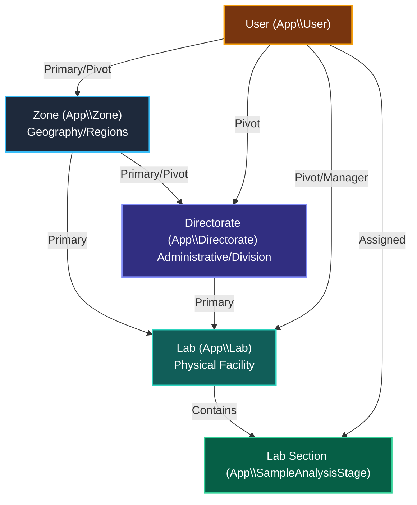

# Database Encryption and Organizational Relations Guide

This document provides a highly detailed technical reference of the encryption boundaries and organizational relationships inside the LIMS database. It describes which fields are encrypted, hashed, or stored in plain text for the core system entities and outlines their structural relationships to **Zones**, **Directorates**, and **Labs**.

---

## 1. Executive Summary & Encryption Technology

The system implements a robust security posture by separating static template definitions (stored in plain text to allow fast searching, sorting, and database indexing) from highly sensitive transactional/PII data (which is fully encrypted or hashed).

### Core Data Security Mechanisms

| Mechanism | Technology | Reversible? | Purpose |
|---|---|---|---|
| **Field Encryption** | Laravel's native `encrypted` cast (AES-256-CBC via `APP_KEY`) | **Yes** (Decrypted at runtime) | Personally Identifiable Information (PII), raw laboratory measurements, contact details, physical coordinates, and worksheet steps. |
| **Secure One-Way Hashing** | Bcrypt (via `Hash::make()` / `bcrypt()`) | **No** (Irreversible) | User passwords, approval tokens, andTOTP recovery hashes. |
| **Plain Text Storage** | Native Database Column Types | **N/A** | UUID keys, template metadata (e.g. Sample/Analysis Type setup, parameter codes), currency/pricing rules, and administrative logs. |

> [!WARNING]
> **Encryption Key dependency:** Decryption of `encrypted` fields relies entirely on the `APP_KEY` defined in the `.env` file. If this key is rotated or lost without a corresponding data re-encryption migration, all encrypted data will become permanently unreadable and trigger `DecryptException` failures.

---

## 2. Organizational Framework: Zones, Directorates, and Labs

The LIMS operates on a three-tier hierarchy representing the geographical and administrative division of labor. These entities govern physical routing, inventory tracking, security boundaries, and staff roles.

### The Three Tiers

1. **Zone (`App\Zone`)**: Represents the top-level regional/geographical entity (e.g., Headquarters, Western Zone, Lake Zone).
2. **Directorate (`App\Directorate`)**: Represents an organizational division (e.g., Directorate of Laboratory Services, Directorate of Regulatory Affairs) operating within or across Zones.
3. **Lab (`App\Lab`)**: Represents the physical laboratory facility (e.g., Food Chemistry Lab, Microbiology Lab) where testing occurs. Each lab belongs to a single Directorate and a primary Zone.

---

## 3. Detailed Entity Reference

The following sections analyze each of the nine requested system entities, mapping their encryption schema and detailing their architectural relationships to Zones, Directorates, and Labs.

---

### A. Users (`App\User`)

The `User` model manages both internal personnel (analysts, managers, heads) and external customer portal accounts. To ensure privacy compliance (GDPR/Data Protection Acts), all personal data is encrypted, while login and lookup keys remain in plain text.

#### Database Field Classification
| Field Name | Type / Cast | Reversible? | Description |
|---|---|---|---|
| `first_name` | `encrypted` | ✅ Yes | User's given name |
| `middle_name` | `encrypted` | ✅ Yes | User's middle name (optional) |
| `last_name` | `encrypted` | ✅ Yes | User's surname/family name |
| `phone` | `encrypted` | ✅ Yes | Primary telephone number |
| `gender` | `encrypted` | ✅ Yes | Gender |
| `designation` | `encrypted` | ✅ Yes | Organizational job title |
| `date_of_birth` | `encrypted` | ✅ Yes | Date of birth (Highly sensitive PII) |
| `id_number` | `encrypted` | ✅ Yes | National ID or passport number |
| `two_factor_secret`| `encrypted` | ✅ Yes | TOTP shared secret key (base32) |
| `two_factor_recovery_codes` | `encrypted` | ✅ Yes (Contains bcrypt hashes) | Doubly-protected array of single-use recovery code hashes |
| `password` | `bcrypt` hash | ❌ No | Irreversible password hash used for authentication |
| `id` | `UUID` (Plain) | — | Primary Key |
| `name` | Plain Text | — | Username / Login identifier |
| `email` | Plain Text | — | User's email address (unencrypted to enable quick lookup during login) |
| `active` | Boolean (Plain) | — | Active status indicator |
| `company_id`, `department_id`, `location_id` | UUID (Plain) | — | Structural relations |

#### Relation to Zones, Labs, and Directorates
- **Zones**: Users have a primary `zone_id` (direct relationship) and can be assigned to multiple geographical zones via the many-to-many pivot table `user_zone_relation` (`assignedZones()`). Users can also be designated as a Zone's Section Head (`zones.section_head_user_id`).
- **Directorates**: Users are mapped to administrative divisions via the `user_directorate_relation` pivot table. They can serve as a Directorate Head (`directorates.head_id`) or Section Head (`directorates.section_head_user_id`).
- **Labs**: Users are assigned to physical testing environments via the `user_lab_relation` pivot table. They can be designated as a Lab Manager (`labs.manager_id`), Lab Section Head (`labs.section_head_user_id`), or a default operator for specific parameters.

---

### B. Equipment (`App\Models\Equipments\Equipment`)

Represents laboratory instruments and machinery used for testing, calibration, and environmental monitoring. 

#### Database Field Classification
> [!NOTE]
> **No field encryption is applied to equipment records.** Since equipment data does not contain sensitive personal or laboratory measurement data, it is kept entirely in plain text to allow fast searching, filtering, calibration/maintenance calculations, and audit log tracking.

| Field Name | Type / Cast | Reversible? | Description |
|---|---|---|---|
| `id` | `UUID` (Plain) | — | Primary Key |
| `name` | Plain Text | — | Name of the equipment |
| `equipment_number` | Plain Text | — | Asset registration or tag number |
| `description` | Plain Text | — | Detailed description of the instrument |
| `make`, `model`, `serial_number`, `barcode_number`, `manufacturer` | Plain Text | — | Manufacturer specifications and identifying numbers |
| `status`, `condition` | Plain Text | — | Current state (e.g., active, out of service) and condition |
| `assigned_department` | UUID (Plain) | — | Mapped to `inventory_departments` |
| `assigned_employee_id` | UUID (Plain) | — | Personnel currently assigned to the instrument |
| `requires_daily_log` | Boolean (Plain) | — | Flag triggering daily temperature or environmental logs |
| `daily_log_expected_min`, `daily_log_expected_max`, `daily_log_tolerance` | Float / Int (Plain) | — | Calibration boundaries for environmental checks |

#### Relation to Zones, Labs, and Directorates
- **Labs**: Equipment is physically localized to a Lab through `asset_location_id`. Additionally, instruments are assigned to specific laboratory parameters via the `analyte_equipment` pivot table, matching them directly to the Labs qualified to run those tests.
- **Directorates**: Linked indirectly through `assigned_department` (departments belong to organizational divisions) and `assigned_employee_id` (the user assigned to run/maintain the machine belongs to specific directorates).
- **Zones**: Linked indirectly through `company_id` and the assigned employee's regional zone records.

---

### C. Inventory (`InventoryCategories`, `InventorySubCategories`, `InventoryItem`)

Manages stock items, chemical reagents, and lab supplies required for analytical workflows.

#### Database Field Classification
> [!NOTE]
> **No field encryption is applied to stock or inventory definitions.** All inventory fields are saved in plain text to enable automatic calculations of lead times, safety stocks, expiry date tracking, and automated reorder alerts.

| Model / Table | Plain Text / Raw Fields | Description |
|---|---|---|
| **InventoryCategories** | `id` (UUID), `name`, `active` | Broad stock categories (e.g., Reagents, Glassware) |
| **InventorySubCategories** | `id` (UUID), `name`, `inventory_category_id` (UUID), `unit_type`, `manufacturer`, `annual_consumption`, `internal_lead_time`, `external_lead_time`, `safety_stock`, `reorder_level` | Specific items (e.g., Hydrochloric Acid 37%, Pipettes) and stock computation variables |
| **InventoryItem** | `id` (UUID), `inventory_category_id` (UUID), `inventory_sub_category_id` (UUID), `inventory_store_id` (UUID), `inventory_store_slot_id` (UUID), `inventory_department_id` (UUID), `stock_in`, `stock_out`, `expiry` (Date), `created_by` (User UUID), `received_by` (User UUID) | Physical batches of supplies, including quantities, physical store location, and expiration dates |

#### Relation to Zones, Labs, and Directorates
- **Labs**: Items physically reside in specific stores and slots mapped to lab sections. Stock allocation is governed by cost centers mapped to stores via `StoreToCostCenter`, which determines localized stock availability for laboratory request entities.
- **Directorates**: Linked through the `inventory_department_id` (which maps stock to organizational departments operating under Directorates).
- **Zones**: Managed regionally; inventory stores are linked to geographical locations, and personnel managing the inventory (`created_by`, `received_by`) are assigned to specific zones.

---

### D. Sample Types, Analysis Types, and Parameters (Analytes)

This structure forms the **Master Analytical Template** of the LIMS. It defines which matrices can be tested, what parameters are measured, and what equipment/methods are used.

#### Database Field Classification
> [!IMPORTANT]
> **Templates vs. Results:** The structural templates (Sample Types, Analysis Types, Analytes, and Analysis Elements) are **completely unencrypted** in plain text. This is a critical design choice so that users can query the service list, match pricelist items, and route samples. 
> 
> However, the **actual laboratory results** generated when these templates are filled are **fully encrypted** (e.g. in `captured_results`, `results`, and `submission_form_instance_values`).

| Model / Table | Plain Text / Raw Fields | Description |
|---|---|---|
| **SampleType** | `id` (UUID), `name`, `code`, `description`, `sample_type_category` (UUID), `active`, `is_results_attachable` | High-level sample matrix definition (e.g., Potable Water, Soil, Fertilizer) |
| **AnalysisType** | `id` (UUID), `name`, `code`, `description`, `sample_type_id` (UUID), `lab_id` (UUID), `active`, `procedure_worksheet_id` | Groups of tests performed on a sample type (e.g., Heavy Metals Analysis, Microbiological Screen) |
| **AnalysisElements** | `id` (UUID), `analysis_type_id` (UUID), `analyte_id` (UUID), `method` (UUID), `equipment_id` (UUID), `operator_id` (User UUID), `reporting_unit`, `decimal_places`, `lod`, `hod`, `active`, `lab_section_id` (UUID) | The specific parameter configuration inside a group, assigning the method, default equipment, and default operator |
| **Analyte** | `id` (UUID), `code`, `name`, `common_name`, `decimal_places`, `reporting_symbol`, `reporting_unit`, `active` | Global parameter dictionary (e.g., Lead, E. Coli, pH) |

#### Relation to Zones, Labs, and Directorates
- **Labs**: 
  - `AnalysisType` has a direct `lab_id` foreign key and a many-to-many relationship `labs()` via `analysis_type_lab_relation` to dictate which physical lab facility runs the test.
  - `AnalysisElements` has a `lab_section_id` (representing the physical section/stage, `SampleAnalysisStage`) linking specific parameters to sections of a lab. It also maps parameter testing to a specific operator (User) and instrument (Equipment) in that lab.
  - `SampleType` is linked to lab sections via `sample_to_sample_analysis_stages` (`sampleAnalysisStages()`).
- **Directorates**: Labs belong to Directorates. All sample types and analysis parameters operate under the administrative oversight of the Directorate of Laboratory Services.
- **Zones**: Since labs are geographically distributed across zones, the template routing engine uses these relationships to determine if a sample can be analyzed locally or must be transferred to a lab in another zone (e.g., HQ Zone).

---

### E. Customers (`CRMCustomer`, `CustomerContact`)

Stores information about LIMS clients, their billing addresses, and their personnel.

#### Database Field Classification
To comply with strict data protection guidelines regarding client and business data, all direct identifiers (except organization name) are encrypted at the application level.

| Model / Table | Field Name | Type / Cast | Reversible? | Description |
|---|---|---|---|
| **CRMCustomer** | `code` | `encrypted` | ✅ Yes | Customer account code |
| | `postal_address` | `encrypted` | ✅ Yes | Postal / mailing address |
| | `physical_address`| `encrypted` | ✅ Yes | Physical address |
| | `email` | `encrypted` | ✅ Yes | Organization primary email |
| | `telephone1`, `telephone2` | `encrypted` | ✅ Yes | Primary and secondary phone numbers |
| | `name` | Plain Text | — | Customer organization name (Kept unencrypted to allow searching/sorting) |
| | `id` | `UUID` (Plain) | — | Primary Key |
| | `is_internal` | Boolean (Plain)| — | Identifies internal vs. external client |
| **CustomerContact**| `job_occupation` | `encrypted` | ✅ Yes | Position of the contact person |
| | `unit_name` | `encrypted` | ✅ Yes | Mapped department / unit name |
| | `email` | `encrypted` | ✅ Yes | Individual email address |
| | `telephone`, `mobile` | `encrypted` | ✅ Yes | Individual contact numbers |
| | `name` | Plain Text | — | Contact person's name (Unencrypted for lists) |
| | `id` | `UUID` (Plain) | — | Primary Key |
| | `crm_customer_id` | UUID (Plain) | — | Foreign key mapping to `CRMCustomer` |

#### Relation to Zones, Labs, and Directorates
- **Zones**: Customers submit samples to specific regional labs. Portal users representing customer contacts are registered as `User` records with the `is_client = 1` flag and are assigned to a primary regional `zone_id`.
- **Labs & Directorates**: Customers have no direct physical lab relationships, but their sample submissions (`SampleHeader`) are received and processed by Labs operating within specific Directorates.

---

### F. Departments (`InventoryDepartment`)

Represents administrative and structural divisions within the organization.

#### Database Field Classification
> [!NOTE]
> **No field encryption is applied to department names or structural metadata.**

| Field Name | Type / Cast | Reversible? | Description |
|---|---|---|---|
| `id` | `UUID` (Plain) | — | Primary Key |
| `name` | Plain Text | — | Name of the department (e.g. Microbiology, Procurement) |
| `module` | Plain Text | — | Department type (e.g. 'organizational', 'inventory') |
| `active` | Boolean (Plain) | — | Status flag |
| `company_id`, `location_id` | UUID (Plain) | — | Mapped locations and parent entities |
| `department_head_id` | UUID (Plain) | — | User serving as the department supervisor |

#### Relation to Zones, Labs, and Directorates
- **Labs**: Departments represent the operational divisions of the LIMS. Staff assigned to a physical lab are also associated with their respective administrative departments.
- **Directorates**: Departments operate directly under Directorates (e.g. the department head reports to the Directorate Head).
- **Zones**: Tied to physical inventory locations (`location_id`) which exist within specific geographical Zones.

---

### G. Roles (`App\Models\Auth\Role`)

Manages security groups and access controls using Spatie’s permission system.

#### Database Field Classification
> [!NOTE]
> **No encryption is applied to roles or permissions.** All authorization tokens and rules are plain text.

| Field Name | Type / Cast | Description |
|---|---|---|
| `id` | `UUID` (Plain) | Primary Key |
| `name` | Plain Text | Name of the role (e.g. "Lab Manager", "Can Verify Samples") |
| `guard_name` | Plain Text | Active application guard (defaults to "web") |

#### Relation to Zones, Labs, and Directorates
- Roles are global permission templates. However, the LIMS application code limits the scope of these roles to the physical/geographical assignments of the user. For instance, a user carrying the "Lab Manager" role is authorized to perform manager actions **only** within the physical **Labs** mapped to their profile via `user_lab_relation`.

---

### H. Labs (`App\Lab`)

Represents the physical testing facilities in the system.

#### Database Field Classification
> [!NOTE]
> **No field encryption is applied to lab facility metadata.**

| Field Name | Type / Cast | Reversible? | Description |
|---|---|---|---|
| `id` | `UUID` (Plain) | — | Primary Key |
| `code`, `name` | Plain Text | — | Lab code (e.g., MIC) and descriptive name |
| `address`, `location`, `fax`, `email`, `website` | Plain Text | — | Contact and physical detail fields |
| `is_external`, `active` | Boolean (Plain) | — | Flags for status and external contracting |
| `directorate_id` | UUID (Plain) | — | Direct relation to the parent **Directorate** |
| `zone_id` | UUID (Plain) | — | Direct relation to the parent **Zone** |
| `manager_id` | UUID (Plain) | — | User assigned as the facility Manager |
| `section_head_user_id`| UUID (Plain) | — | User serving as the Lab Section Head |
| `analyst_ids` | Array / JSON (Plain)| — | List of analyst user UUIDs assigned to the lab |

#### Relation to Zones, Labs, and Directorates
- **The Core Junction:** The `Lab` model is the primary linking model of the system.
  - It belongs to a single **Zone** (`zone_id`) — resolving its geographical region.
  - It belongs to a single **Directorate** (`directorate_id`) — resolving its administrative structure.
  - It contains multiple `LabSection` entities representing testing stages.
  - It aggregates the assigned personnel (Manager, Section Head, and Analysts).

---

### I. Pricelist (`Pricelist`, `PricelistItem`, `PricelistCustomer`)

Manages customer-specific, standard, or master billing rules for laboratory services.

#### Database Field Classification
> [!NOTE]
> **No encryption is applied to pricing files or cost entries.** All amounts are plain float numbers to ensure rapid calculation of invoice totals, VAT, and customer discounts.

| Model / Table | Plain Text / Raw Fields | Description |
|---|---|---|
| **Pricelist** | `id` (UUID), `name`, `is_master` (Boolean), `active` (Boolean), `valid_till` (Date), `currency_id` (UUID) | Header of the pricelist defining validity and currency |
| **PricelistItem** | `id` (UUID), `pricelist_id` (UUID), `sample_type_id` (UUID), `analysis_id` (AnalysisType UUID), `analysis_element_id` (AnalysisElements UUID), `cost_price` (Float), `selling_price` (Float), `vat` (Boolean), `active` (Boolean) | Line items mapping cost and selling prices to specific Sample Types, Analysis Types, or individual parameters |
| **PricelistCustomer** | `id` (UUID), `pricelist_id` (UUID), `crm_customer_id` (CRMCustomer UUID), `active` (Boolean) | Pivot mapping assigning custom pricelists to specific clients |

#### Relation to Zones, Labs, and Directorates
- **Labs**: Mapped directly to service delivery. Each `PricelistItem` prices a specific `analysis_id` (Analysis Type), which runs in designated physical **Labs**.
- **Zones & Directorates**: Price lists are assigned to customers by billing teams operating within specific regional **Zones**, and financial reports are rolled up through the **Directorates** supervising those labs.

---

## 4. Key Takeaways and Architectural Rationale

1. **Searchability vs. Security**: Organizational structures (Zones, Directorates, Labs), item lists (Inventory, Equipment), and templates (Sample/Analysis Types, Analytes) are **not encrypted**. This keeps the database indexable and allows fast auto-completes, filters, and standard reporting.
2. **PII and Results Protection**: Any data containing human personal identifiers (User PII, Customer PII) or confidential scientific output (captured results, final published results, worksheet formula values) is **fully encrypted** using AES-256-CBC.
3. **Double Isolation of 2FA**: Two-factor secrets are encrypted before entry, and recovery codes are individual Bcrypt hashes wrapped inside an AES-256-CBC encrypted column cast, preventing complete exposure even if the database is dumped.
