# Database Entity Relationship Diagram (ERD)

> **Audience:** This document is designed for both **technical developers** and **non-technical stakeholders**.  
> Each module begins with a plain-English explanation of what the data represents, followed by a detailed technical ERD diagram and column-level descriptions.

## Table of Contents

1. [System & Authentication](#1-system--authentication)
2. [AI Intelligence](#2-ai-intelligence)
3. [CRM — Customer Relationship Management](#3-crm--customer-relationship-management)
4. [Sample Management — LIMS Core](#4-sample-management--lims-core)
5. [Laboratory, Analysis & Methods](#5-laboratory-analysis--methods)
6. [Results & Quality Control](#6-results--quality-control)
7. [Equipment & Maintenance](#7-equipment--maintenance)
8. [Inventory & Procurement](#8-inventory--procurement)
9. [Suppliers](#9-suppliers)
10. [Finance & Invoicing](#10-finance--invoicing)
11. [Personnel & HR](#11-personnel--hr)
12. [Quality, Compliance & Audits](#12-quality-compliance--audits)
13. [Risk Management](#13-risk-management)
14. [Document Management](#14-document-management)
15. [Tickets & Support](#15-tickets--support)
16. [Submission Forms](#16-submission-forms)
17. [Notifications & System Utilities](#17-notifications--system-utilities)

---

## How to Read This Document

| Symbol | Meaning |
|--------|---------|
| `PK` | Primary Key — uniquely identifies every record |
| `FK` | Foreign Key — links this field to another table |
| `uuid` | Universally Unique Identifier (string ID, e.g. `550e8400-e29b-41d4-a716-446655440000`) |
| `||--o{` | One-to-many relationship (one record links to many) |
| `||--||` | One-to-one relationship |
| `}o--o{` | Many-to-many relationship |

> **All primary keys are UUIDs** unless noted otherwise. All tables (unless noted) have `created_at` and `updated_at` timestamps automatically managed by the system.

---

---

# 1. System & Authentication

## Plain-English Overview

This is the **foundation of the entire platform**. It answers: *Who can log in? What are they allowed to do? Which company do they belong to?*

- **Companies** are the top-level tenant. Every piece of data belongs to a company.
- **Users** are people who log in. Each user belongs to a company, may have a physical location (zone), a department, a job designation, and can carry two-factor authentication.
- **Roles & Permissions** define what a user can see and do. The system supports both a custom roles model and Spatie (Laravel's standard permission library).
- **Audit Logs** track every change made to every record in the system — who changed what, when, and from where.
- **Languages** and **System Configurations** handle internationalisation and runtime configuration.

---

## ERD Diagram — Part A: Companies & Users

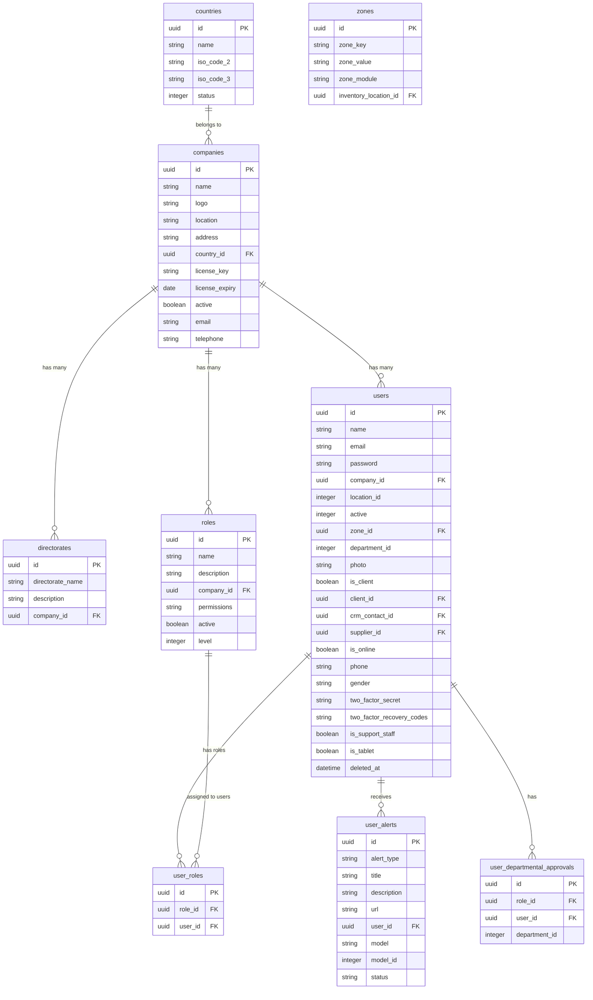

## ERD Diagram — Part B: Security & Access Control

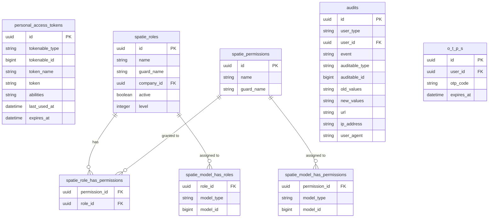

## ERD Diagram — Part C: System Configuration & Utilities

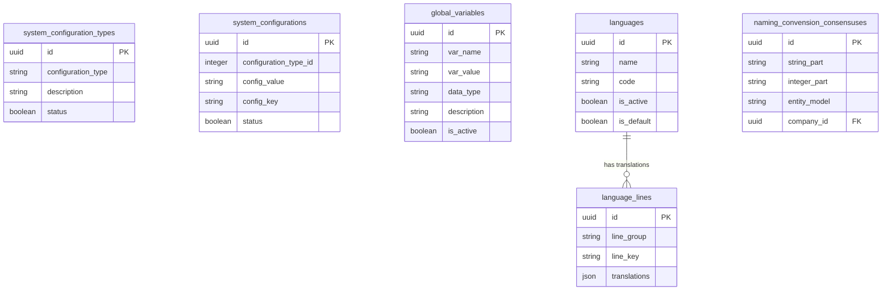

## Table Descriptions

### `companies`
The **top-level tenant record**. Every piece of data in the system ties back to a company. Stores branding (logo), contact info, licensing, and a link to the country where the company operates. The `active` flag controls whether the company can log in.

### `countries`
Reference table of countries. Used by `companies` for location, and by address forms across the system.

### `users`
Every person who logs into the system. Key fields:
- `email` / `password` — login credentials (password is bcrypt-hashed)
- `company_id` — which lab/company they belong to
- `zone_id` — their physical working zone
- `is_client` — marks external client users (linked to CRM customers)
- `two_factor_secret`, `two_factor_recovery_codes` — encrypted 2FA fields
- `electronic_signature` — whether the user has a digital signature configured
- `deleted_at` — soft delete; deactivated users are never permanently removed

### `roles`
Custom role definitions per company. The `permissions` field stores a serialised permission list. The `level` field manages role hierarchy (e.g. for approval workflows).

### `user_roles`
Junction table linking users to their roles (many-to-many).

### `user_alerts`
In-app notifications generated when system events occur (sample completed, approval needed, etc.).

### `user_departmental_approvals`
Maps which users/roles can approve requests on behalf of which departments. Used by procurement and HR workflows.

### `spatie_roles / spatie_permissions`
Laravel Spatie permission library tables. These provide fine-grained permission control at the model level, complementing the custom `roles` table.

### `audits`
A full **activity log** of every create/update/delete across all models. `old_values` and `new_values` store before/after snapshots for compliance and traceability.

### `personal_access_tokens`
API bearer tokens (Laravel Sanctum). Used by mobile/tablet clients and API integrations.

### `o_t_p_s`
One-time passwords for step-up authentication (e.g. approving sensitive actions).

### `system_configurations`
Key-value configuration store. Used to customise system behaviour per deployment (e.g. TAT thresholds, email settings).

### `global_variables`
Named, typed variables available to formula calculations across the lab system.

---

---

# 2. AI Intelligence

## Plain-English Overview

The AI module provides **intelligent assistance** embedded throughout the platform. Think of it as a smart assistant that lab staff can chat with, ask analytical questions, and request data insights. It tracks:
- **Model Registry** — which AI models are deployed (version, framework, performance metrics)
- **Conversations & Messages** — full chat history between users and the AI
- **Action Logs** — every AI-initiated action with a risk level and outcome
- **Analytics Logs** — performance monitoring (latency, token usage, accuracy)

---

## ERD Diagram

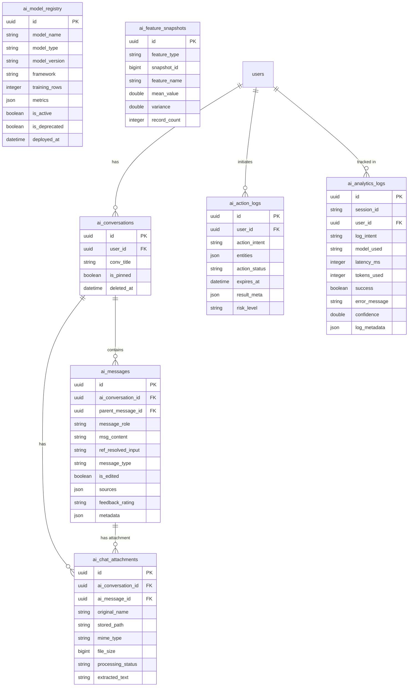

## Table Descriptions

### `ai_model_registry`
Catalogue of all AI models the platform can use. Tracks the model name, version, performance `metrics` (JSON), and whether it is currently `active` or has been `deprecated`. Allows safe model upgrades.

### `ai_feature_snapshots`
Statistical snapshots of data features used for model training and monitoring. Captures mean, variance, and record count — used to detect data drift.

### `ai_conversations`
Each conversation a user has with the AI assistant. Can be pinned for quick access. Soft-deleted so history is preserved.

### `ai_messages`
Individual messages within a conversation. The `role` field distinguishes between `user`, `assistant`, and `system` messages. Stores `feedback` (thumbs up/down) and source references for Retrieval-Augmented Generation (RAG).

### `ai_chat_attachments`
Files uploaded within an AI conversation (PDFs, images, spreadsheets). The system extracts text from them for context (`extracted_text`). Processing status tracks whether extraction completed.

### `ai_action_logs`
Records of **actions taken by the AI** (e.g. "create a sample", "assign a technician"). Includes a `risk_level` assessment and expiry for time-limited approvals. Critical for compliance and auditability.

### `ai_analytics_logs`
Performance monitoring for each AI request: response time (`latency_ms`), cost proxy (`tokens_used`), and success/failure tracking. Used to optimise model selection and detect degradation.

---

---

# 3. CRM — Customer Relationship Management

## Plain-English Overview

The CRM module manages **clients and their relationships** with the laboratory.

- **Customers** are organisations that send samples to the lab for testing.
- **Company Structure** (sections → units → sub-units) mirrors how a client organisation is structured — a hospital may have departments, wards, and units.
- **Contacts** are the people at each customer organisation who communicate with the lab (requesting tests, receiving results).
- **Sample Points & Areas** define *where* samples are collected on-site at a customer's premises.
- **Feedback & Ratings** allow the lab to record customer satisfaction after each engagement.
- **Qualifications** allow tracking whether a customer meets specific requirements (e.g. ISO accreditation).

---

## ERD Diagram

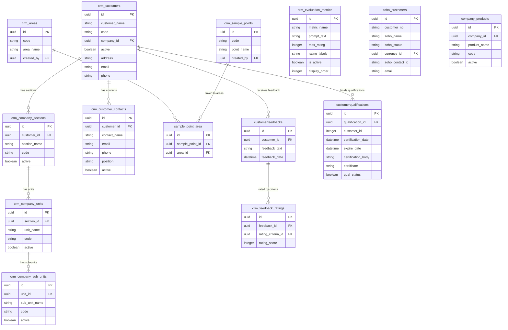

## Table Descriptions

### `crm_customers`
A **client organisation** that submits samples for testing. Each customer belongs to a lab company (`company_id`). The `code` is a unique customer reference number.

### `crm_company_sections` / `crm_company_units` / `crm_company_sub_units`
A three-level hierarchy mirroring the client's internal structure (e.g. **Section:** Clinical Labs → **Unit:** Microbiology → **Sub-unit:** Blood Culture). This allows sample results to be attributed to the correct part of a client organisation.

### `crm_customer_contacts`
Named individuals at the customer organisation. Stores contact info used for report delivery, invoicing, and sample collection coordination.

### `crm_areas`
Geographic or facility areas belonging to a customer (e.g. "North Wing", "Production Floor"). Used to group sample collection locations.

### `crm_sample_points`
Specific collection points within an area (e.g. "Tap 3", "Tank B outlet"). Each sample header is linked to a sample point.

### `sample_point_area`
Links sample points to geographic areas (many-to-many).

### `customerfeedbacks` / `crm_feedback_ratings`
Customer satisfaction questionnaires. Each feedback record is broken into individual ratings against defined `crm_evaluation_metrics` criteria (e.g. "Turnaround Time", "Report Clarity").

### `crm_evaluation_metrics`
The criteria used in customer satisfaction surveys. Configurable with `max_rating` and label definitions.

### `customerqualifications`
Records whether a customer holds a particular certification or qualification (with expiry tracking).

### `zoho_customers`
Synchronisation table for Zoho CRM integration. Stores Zoho's own customer IDs and status alongside local data.

### `company_products`
Products or services offered by the lab company to its customers.

---

---

# 4. Sample Management — LIMS Core

## Plain-English Overview

This is the **heart of the Laboratory Information Management System (LIMS)**. It tracks every sample from the moment it is registered through to final disposal.

- A **Sample Type** defines what kind of material can be tested (e.g. water, food, blood).
- A **Sample Header** is the record for a physical batch of samples received (the "job card").
- **Sample Details** are the individual sub-samples within a batch (e.g. multiple water containers from different taps).
- **Batches** group sample headers that are processed together through analysis.
- **Sample Analysis Stages** track the status of each analysis (e.g. "In Progress", "Results Captured", "Approved").
- **Staging tables** hold samples mid-import or pending confirmation before they become official records.

---

## ERD Diagram

```mermaid
erDiagram
    sample_types {
        uuid id PK
        string code
        string name
        string description
        uuid company_id FK
        boolean active
        uuid report_format_id FK
        integer disposal_count
        integer sample_type_category
    }

    sample_type_categories {
        integer id PK
        string sample_type_category
        boolean active
    }

    sample_type_qualifications {
        uuid id PK
        uuid sample_type_id FK
        uuid qualification_id FK
        boolean is_mandatory
    }

    sample_conditions {
        uuid id PK
        string name
        uuid sample_type_id FK
        boolean active
        string short_name
        integer reporting_time
    }

    sample_headers {
        uuid id PK
        string lab_no
        uuid sample_type_id FK
        uuid customer_id FK
        date date_collected
        date receipt_date
        time receipt_time
        uuid created_by FK
        string status
        boolean is_prelim
    }

    sample_details {
        uuid id PK
        uuid sample_header_id FK
        string code
        text description
        integer quantity
        string status
        boolean is_active
    }

    sample_detail_staging {
        uuid id PK
        uuid sample_detail_id FK
        longText staging_data
    }

    sample_header_staging {
        uuid id PK
        uuid sample_header_id FK
        uuid sample_type_id FK
        datetime book_date
        string book_no
        uuid created_by FK
        integer status
        integer customer_id
        date date_collected
        string cancel_reason
    }

    sample_staging_rejection_log {
        uuid id PK
        integer sample_staging_id
        string action
        integer actioned_by
        text comment
    }

    sample_dates {
        uuid id PK
        uuid sample_id FK
        string date_type
        date date_value
    }

    sample_analysis_stages {
        uuid id PK
        uuid sample_id FK
        uuid analysis_type_id FK
        string stage_status
        uuid lab_section_id FK
    }

    sample_analysis_dates {
        uuid id PK
        uuid sample_analysis_stage_id FK
        string date_type
        date date_value
    }

    sample_analysis_type_relation {
        uuid id PK
        uuid sample_header_id FK
        uuid analysis_type_id FK
    }

    sample_to_sample_analysis_stages {
        uuid id PK
        uuid sample_id FK
        uuid analysis_stage_id FK
    }

    sample_sequences {
        uuid id PK
        string batch_code
        integer sample_sequence
    }

    sample_interlab_log {
        uuid id PK
        integer sample_id
        integer to_lab_section_id
        integer from_lab_section_id
        string quantity
        integer submited_by
        datetime date_submitted
        integer received_by
        datetime date_received
        text remarks
        date expected_date
        boolean status
    }

    sample_approval_checklist {
        uuid id PK
        text checklist
        boolean is_required
        boolean active
        uuid created_by FK
        string workflow_stage
    }

    sample_attachment_relations {
        uuid id PK
        integer sample_id
        integer attachment_id
        boolean show_on_coa
    }

    sample_progress {
        uuid id PK
        uuid sample_detail_id FK
        uuid stage_header_id FK
        uuid test_stage_id FK
        uuid analyte_id FK
        uuid method_id FK
        integer current_day
        enum status
        datetime start_date
        datetime end_date
        text observations
        text remarks
    }

    sample_imports {
        uuid id PK
        longText import_data
        datetime import_date
    }

    batch_sequences {
        uuid id PK
        uuid submission_form_instance_id FK
        integer year
        integer batch_sequence
    }

    batch_ammendments {
        uuid id PK
        uuid batch_id FK
        uuid created_by_id FK
        text reason
        string samples
        string report_url
        integer version_number
    }

    batch_attachments {
        uuid id PK
        uuid batch_id FK
        integer uploaded_by
        string attachment_url
        string title
        boolean is_internal
        integer attachment_type
        boolean show_on_coa
    }

    batch_attachment_annotations {
        uuid id PK
        uuid batch_attachment_id FK
        integer page_number
        string annotation_type
        text content
        decimal x_position
        decimal y_position
        decimal width
        decimal height
        longText style_data
    }

    batch_comments {
        uuid id PK
        string comments
        uuid created_by FK
        integer reminder_for
        string personnel_to_cc
        date completed_at
        uuid sample_header_id FK
        string comment_type
    }

    batch_notifications {
        uuid id PK
        uuid batch_id FK
        integer position_id
        uuid created_by FK
        text notification
        string status
        boolean active
    }

    batch_labsection_approval {
        uuid id PK
        uuid batch_id FK
        uuid user_id FK
        string title
        string lab_section_ids
        boolean status
        string batch_status
        datetime approval_date
        text remark
        boolean is_prelim
        boolean show_report
    }

    batch_approval_checklist {
        uuid id PK
        uuid approval_id FK
        integer checklist_id
    }

    sampletype_area_relation {
        uuid id PK
        uuid sample_type_id FK
        uuid area_id FK
    }

    sampletype_sample_point_relation {
        uuid id PK
        uuid sample_type_id FK
        uuid sample_point_id FK
    }

    sample_types ||--o{ sample_headers : "registers samples of"
    sample_types ||--o{ sample_conditions : "has conditions"
    sample_types ||--o{ sample_type_qualifications : "requires qualifications"
    sample_types ||--o{ sampletype_area_relation : "collected in areas"
    sample_types ||--o{ sampletype_sample_point_relation : "collected from points"
    sample_headers ||--o{ sample_details : "has sub-samples"
    sample_headers ||--o{ sample_dates : "has key dates"
    sample_headers ||--o{ sample_analysis_type_relation : "requires analyses"
    sample_headers ||--o{ sample_analysis_stages : "has stages"
    sample_analysis_stages ||--o{ sample_analysis_dates : "has dates"
    sample_analysis_stages ||--o{ sample_to_sample_analysis_stages : "linked to"
    sample_details ||--o{ sample_detail_staging : "staged in"
    sample_details ||--o{ sample_progress : "progresses through stages"
    batch_attachments ||--o{ batch_attachment_annotations : "annotated in"
    users ||--o{ batch_labsection_approval : "approves"
    users ||--o{ batch_comments : "writes"
```

## Table Descriptions

### `sample_types`
Defines the **category of material** that can be submitted (e.g. "Drinking Water", "Food Sample", "Clinical Swab"). Each sample type can be tied to specific report formats, analysis groups, and customer areas.

### `sample_conditions`
Acceptable condition codes for a sample on receipt (e.g. "Intact", "Leaking", "Temperature Exceeded"). Linked to sample types. Each condition can carry a different reporting turn-around time (`reporting_time`).

### `sample_type_qualifications`
Certain sample types require the receiving lab or personnel to hold specific qualifications. This table enforces those requirements and whether they are mandatory.

### `sample_headers`
The **primary registration record** for a sample submission. Think of it as the "job card":
- Who submitted it (`customer_id`)
- When it was collected (`date_collected`) and received (`receipt_date`)
- What type of sample it is (`sample_type_id`)
- What stage of the laboratory process it is at (`status`)

### `sample_details`
Each physical sub-sample within a submission. A header for "Water Testing" might have 5 detail records for 5 different collection points. Each gets its own code and can be individually tracked.

### `sample_header_staging` / `sample_detail_staging`
Temporary holding tables for samples that are being imported in bulk (e.g. from Excel). Staging allows validation before the record becomes permanent.

### `sample_staging_rejection_log`
Audit trail for staging records that were rejected during import, capturing what happened and why.

### `sample_analysis_stages`
Tracks the **workflow status of each analysis** requested for a sample. Stages progress from "Pending" → "In Progress" → "Results Captured" → "Approved". Each stage is assigned to a lab section.

### `sample_analysis_dates`
Key milestone dates for each analysis stage (e.g. start date, due date, completion date).

### `sample_progress`
For multi-day or multi-step test methods (e.g. microbiological culture), tracks the current step number, observations per day, and completion status.

### `batch_attachments`
Files attached to a batch (e.g. chain of custody forms, inspection photos). The `show_on_coa` flag controls whether they appear on the Certificate of Analysis.

### `batch_attachment_annotations`
Annotations (highlights, notes, boxes) drawn on batch attachment files — stored with precise position coordinates and style data.

### `batch_labsection_approval`
Lab section manager's sign-off on a batch. Supports preliminary (`is_prelim`) approvals before the final sign-off.

### `batch_ammendments`
When a reported batch needs correction, an amendment record is created capturing the reason, which samples were affected, and the version number.

---

---

# 5. Laboratory, Analysis & Methods

## Plain-English Overview

This module defines **what the lab tests for and how**:

- **Analysis Types** are the tests offered (e.g. "Bacteriological Analysis", "Heavy Metals Panel").
- **Analytes** are the individual measured parameters within a test (e.g. "Lead", "E. Coli", "pH").
- **Analysis Methods** are the standard procedures used to perform measurements (e.g. "ISO 9308-1").
- **Method Sequences** define ordered, multi-stage test workflows — the step-by-step laboratory protocol.
- **Formulas** are calculation rules applied to raw instrument readings to produce final reported results.
- **Standards & QC** — reference materials and quality control schemes ensure instrument accuracy.
- **Procedure Worksheets** are configurable lab record forms filled in during analysis.
- **Labs** (sections) are the physical departments within the laboratory.

---

## ERD Diagram — Part A: Core Lab Structure

```mermaid
erDiagram
    labs {
        uuid id PK
        string name
        string code
        string location
        uuid company_id FK
        boolean active
    }

    analysis_types {
        uuid id PK
        string name
        string code
        uuid company_id FK
        boolean active
        string category
    }

    analytes {
        uuid id PK
        string name
        string code
        boolean status
    }

    analytes_unik {
        uuid id PK
        uuid analyte_id FK
        string category
    }

    analysis_methods {
        uuid id PK
        string name
        string code
        string description
        boolean active
    }

    analysis_elements {
        uuid id PK
        uuid analysis_method_id FK
        string element_name
        string element_type
    }

    analysis_method_elements {
        uuid id PK
        uuid method_id FK
        string element_name
        string element_specification
    }

    analysis_guides {
        uuid id PK
        uuid analysis_type_id FK
        uuid analyte_id FK
        string guide_text
    }

    standards {
        uuid id PK
        string code
        string name
        boolean status
        boolean main_standard
        boolean is_qc_standard
        uuid qc_type_id FK
    }

    standards_analytes {
        uuid id PK
        uuid standard_id FK
        uuid analyte_id FK
    }

    qc_scheme {
        uuid id PK
        string name
        string code
        boolean is_active
    }

    qc_types {
        uuid id PK
        string name
        string code
        boolean has_standards
        boolean is_active
    }

    lab_section_approver_configuration {
        uuid id PK
        uuid lab_section_id FK
        string approver_configuration
    }

    lab_section_approver_relation {
        uuid id PK
        uuid lab_section_id FK
        uuid approver_id FK
    }

    labs ||--o{ lab_section_approver_configuration : "has config"
    labs ||--o{ lab_section_approver_relation : "has approvers"
    analysis_types ||--o{ analysis_guides : "has guides"
    analytes ||--o{ analysis_guides : "referenced in"
    analytes ||--o{ analytes_unik : "has categories"
    analytes ||--o{ standards_analytes : "measured by standards"
    analysis_methods ||--o{ analysis_elements : "has elements"
    analysis_methods ||--o{ analysis_method_elements : "has specifications"
    standards ||--o{ standards_analytes : "covers analytes"
```

## ERD Diagram — Part B: Method Sequences & Formulas

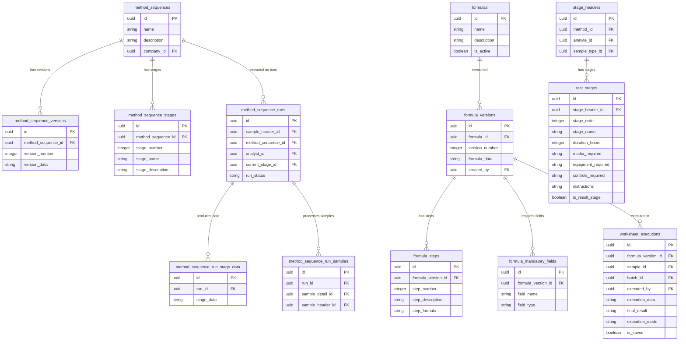

## ERD Diagram — Part C: Worksheets, Lookup Tables & Uncertainty

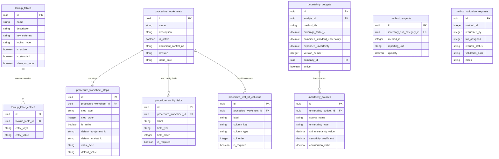

## Table Descriptions

### `labs`
Physical **laboratory sections** (e.g. Microbiology, Chemistry, Haematology). Each lab section has its own approver configuration.

### `analysis_types`
The **tests offered** by the lab. Examples: "Microbiological Analysis", "Heavy Metals by ICP-MS". The `code` is a unique identifier used in reporting.

### `analytes`
The individual **parameters measured** within a test. Examples: "E. Coli", "Lead (Pb)", "Turbidity". These appear as rows on a Certificate of Analysis.

### `analysis_methods`
The **standard procedures** for performing an analysis (e.g. ISO 9308-1:2014). Linked to analysis elements (what is measured) and required reagents.

### `method_sequences`
Multi-stage analytical workflows — for methods that require multiple days or steps (e.g. bacterial culture, where you inoculate on day 1, incubate, then read on day 3). Versions are tracked for audit compliance.

### `method_sequence_runs`
A specific **execution** of a method sequence for a particular sample. Tracks the analyst, current stage, and overall run status.

### `formulas`
Calculation rules for converting raw instrument readings into final reported values (e.g. applying a calibration curve). Versioned so older calculations remain traceable.

### `formula_steps`
Individual calculation steps within a formula version (e.g. "Step 1: subtract blank", "Step 2: divide by volume").

### `lookup_tables` / `lookup_table_entries`
Reference tables used inside formulas and worksheets. Can contain numeric ranges for qualitative interpretation (e.g. "0–10 = Absent, 10–100 = Detected") or flat key-value lookups.

### `procedure_worksheets`
Configurable **lab record forms** with version control (document control number, revision, issue date). Defines the structure of what analysts fill in.

### `standards` / `standards_analytes`
Reference standards used for QC (e.g. NIST traceable standards). Linked to the specific analytes they are used to verify.

### `uncertainty_budgets` / `uncertainty_sources`
Measurement uncertainty calculations for each analyte per method. Required for ISO 17025 accreditation. Tracks individual uncertainty sources (repeatability, calibration, etc.) and the combined expanded uncertainty.

### `test_stages`
For sequential multi-day tests: defines each stage's duration, required media/equipment/controls, and whether it is the final result-reading stage.

---

---

# 6. Results & Quality Control

## Plain-English Overview

Where the lab **captures, validates, and reports** analytical results.

- **Captured Results** are the raw records created when an analyst submits measurements for a sample.
- **Results** are the processed, validated records that feed into the Certificate of Analysis. Each result has the analyte, measured value, guide range, and reporting symbol.
- **QC Results** are measurements taken on quality-control samples (blanks, standards, spike recoveries) — they prove the instrument is performing correctly.
- **TAT (Turnaround Time) Captured** records when each result was completed so deadlines can be tracked.
- **Worksheet Formulas** capture data from structured multi-step calculation worksheets, recording every intermediate value for full traceability.

---

## ERD Diagram — Part A: Core Results

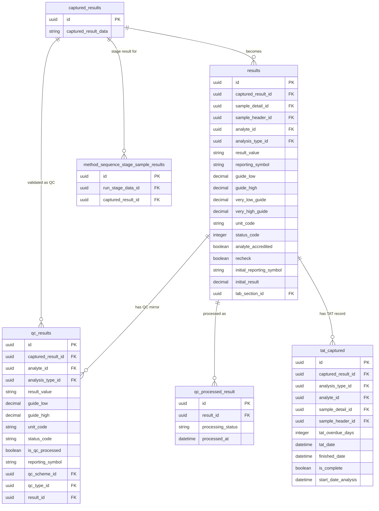

## ERD Diagram — Part B: Procedures & Worksheets

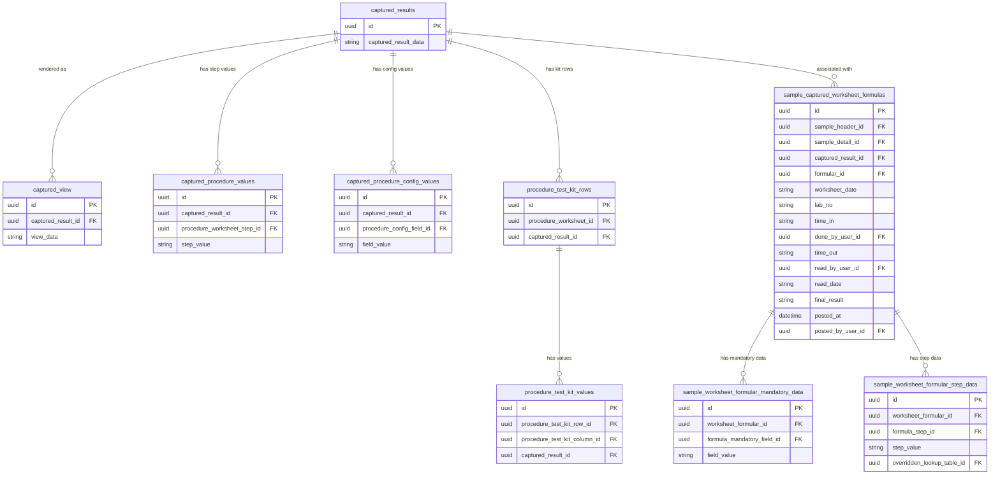

## Table Descriptions

### `captured_results`
The **root record** created when an analyst submits data for a sample. All other result tables link back here. Contains the raw capture payload.

### `results`
The **processed result record** for a single analyte on a single sample detail. Key fields:
- `result` — the measured value as reported
- `guide_low` / `guide_high` / `very_low_guide` / `very_high_guide` — reference range limits
- `reporting_symbol` — text qualifier (e.g. "<", "ND", ">")
- `status_code` — result state (pending, approved, rejected)
- `analyte_accredited` — whether the lab is accredited for this analyte/method combo
- `initial_result` / `initial_reporting_symbol` — the first captured values before any correction

### `qc_results`
Quality control measurements taken alongside real samples. Linked back to the original `result` record. Used to calculate percent recovery, z-scores, and chart control limits.

### `qc_processed_result`
Records the outcome of QC statistical processing for a result (e.g. "in control", "warning", "rejected").

### `tat_captured`
Turnround time record for each result — tracks when analysis started, when it finished, and whether the deadline was met (`tat_overdue_days`).

### `sample_captured_worksheet_formulas`
When a result is produced using a **formula worksheet** (multi-step calculation), this record stores the entire filled-in worksheet — who did it, when, and the final calculated result. It is digitally "posted" once approved.

### `sample_worksheet_formular_step_data`
Every individual step value within the formula worksheet (e.g. "weight = 2.345 g"). Provides a full audit trail of the calculation.

### `captured_procedure_values`
Step-by-step values recorded on procedure worksheets (non-formula based). Each step in the worksheet procedure maps to a value captured by the analyst.

### `method_sequence_stage_sample_results`
Links captured results back to the specific stage within a method sequence run (for multi-stage workflows).

---

---

# 7. Equipment & Maintenance

## Plain-English Overview

Tracks all **laboratory instruments and their complete lifecycle**:

- **Equipment** records store each instrument, its type, and location.
- **Calibration & Maintenance Logs** capture every service event to demonstrate the instrument was fit for use when a result was generated.
- **Equipment Evaluations** record performance assessments.
- **Disposals** manage the formal decommissioning process, including approvals and regulatory documentation.
- **Work Orders** are maintenance tasks raised when equipment needs servicing or repair.

---

## ERD Diagram

```mermaid
erDiagram
    equipment {
        uuid id PK
        string name
        string serial_number
        string asset_code
        uuid asset_type_id FK
        uuid asset_location_id FK
        uuid company_id FK
        boolean active
        date purchase_date
        date warranty_expiry
        string status
    }

    asset_types {
        uuid id PK
        string asset_code
        string descripton
        boolean is_active
    }

    asset_locations {
        uuid id PK
        string location_code
        string name
        boolean is_active
    }

    equipment_attachments {
        uuid id PK
        uuid equipment_id FK
        string attachment_url
        string title
        string file_type
    }

    equipment_daily_log_entries {
        uuid id PK
        uuid equipment_id FK
        date log_date
        text entry_text
        uuid created_by FK
    }

    equipment_evaluations {
        uuid id PK
        uuid equipment_id FK
        date evaluation_date
        text evaluation_result
        uuid evaluator_id FK
    }

    equipment_operators {
        uuid id PK
        uuid equipment_id FK
        uuid operator_id FK
        date certification_date
    }

    equipment_usage {
        uuid id PK
        uuid equipment_id FK
        string usage_type
        integer usage_quantity
        date usage_date
    }

    equipment_notification {
        uuid id PK
        uuid equipment_id FK
        string notification_type
        text notification_message
    }

    maintainance_calibration_logs {
        uuid id PK
        uuid equipment_id FK
        date maintenance_date
        string maintenance_type
        text calibration_result
    }

    parts_repaireds {
        uuid id PK
        uuid equipment_id FK
        string part_name
        date repair_date
        decimal repair_cost
    }

    verification_logs {
        uuid id PK
        date verification_date
        text procedure
        string reference_standard
        text response
        text remarks
        integer operator_id
        uuid equipment_id FK
        string maintainance_type
        uuid supplier_id FK
    }

    equipment_disposals {
        uuid id PK
        uuid equipment_id FK
        date disposal_date
        uuid disposal_reason_id FK
        string status
        string disposal_method
        text regulatory_notes
    }

    equipment_disposal_approvals {
        uuid id PK
        uuid disposal_id FK
        uuid approver_id FK
        datetime approval_date
        string approval_status
    }

    equipment_disposal_audit_logs {
        uuid id PK
        uuid disposal_id FK
        uuid user_id FK
        string action
        datetime action_date
    }

    equipment_disposal_files {
        uuid id PK
        uuid disposal_id FK
        string file_path
        string file_name
    }

    equipment_disposal_methods {
        uuid id PK
        string method
        string display_name
        text description
        longText applicable_categories
        longText regulatory_requirements
        longText required_documentation
        longText approved_vendors
        text safety_requirements
        text environmental_compliance
        boolean is_active
    }

    equipment_disposal_approval_workflows {
        uuid id PK
        string workflow_name
        text description
    }

    equipment_disposal_approval_workflow_steps {
        uuid id PK
        uuid workflow_id FK
        integer step_number
        string approver_role
    }

    work_orders {
        uuid id PK
        integer client_id
        string ticket_no
        enum routine
        string site
        enum demand_type
        enum priority
        integer assigned_resource_id
        enum current_status
        uuid service_id FK
        date due_date
        date start_date
        longText description
        integer created_from
        boolean approval_started
    }

    work_order_resources {
        uuid id PK
        uuid work_order_id FK
        string resource_id
        string name
        string email
        string phone
        integer quantity
        string type
        boolean is_external
    }

    work_order_status_histories {
        uuid id PK
        integer workorder_id
        string status
        text comments
        string created_by
    }

    workorder_edits {
        uuid id PK
        integer workorder_id
        text reason
        string created_by
        uuid created_by_id FK
    }

    workorder_personnel_schedules {
        uuid id PK
        integer personnel_id
        integer workorder_id
        datetime start
        datetime end
    }

    disposal_reasons {
        uuid id PK
        string description
    }

    services {
        uuid id PK
        string name
        integer created_by_id
        string created_by_type
    }

    equipment ||--o{ equipment_attachments : "has files"
    equipment ||--o{ equipment_daily_log_entries : "has daily logs"
    equipment ||--o{ equipment_evaluations : "evaluated via"
    equipment ||--o{ equipment_operators : "operated by"
    equipment ||--o{ equipment_usage : "usage tracked"
    equipment ||--o{ equipment_notification : "triggers notifications"
    equipment ||--o{ maintainance_calibration_logs : "maintained via"
    equipment ||--o{ parts_repaireds : "has part repairs"
    equipment ||--o{ verification_logs : "verified via"
    equipment ||--o{ equipment_disposals : "disposed via"
    equipment_disposals ||--o{ equipment_disposal_approvals : "approved by"
    equipment_disposals ||--o{ equipment_disposal_audit_logs : "audit trail"
    equipment_disposals ||--o{ equipment_disposal_files : "has files"
    equipment_disposal_approval_workflows ||--o{ equipment_disposal_approval_workflow_steps : "has steps"
    work_orders ||--o{ work_order_resources : "uses resources"
    work_orders ||--o{ work_order_status_histories : "status history"
    work_orders ||--o{ workorder_edits : "edits tracked"
    work_orders ||--o{ workorder_personnel_schedules : "staff scheduled"
```

## Table Descriptions

### `equipment`
The master record for each laboratory instrument or piece of equipment. Tracks purchase date, warranty, current status, and physical location. Each instrument has an asset code for tracking.

### `asset_types` / `asset_locations`
Reference lists for categorising equipment (e.g. "Spectrophotometer", "Centrifuge") and defining where instruments are physically kept.

### `maintainance_calibration_logs`
Every maintenance and calibration event. Critical for ISO 17025 compliance — before a result can be valid, the instrument used must have a current calibration record.

### `verification_logs`
Records intermediate verification checks (e.g. daily performance checks using reference standards). Separate from full calibration events.

### `equipment_evaluations`
Formal periodic performance evaluations of instruments, separate from calibration checks.

### `equipment_operators`
Records which personnel are **certified to operate** specific equipment and the date of their certification.

### `equipment_disposals`
The formal decommissioning workflow for instruments. Requires documented reason, disposal method, and multi-level approvals.

### `equipment_disposal_methods`
Library of approved disposal methods (e.g. "Sell to Certified Vendor", "Destroy In-House"), each with regulatory requirements and required documentation.

### `work_orders`
Maintenance tasks raised for equipment (corrective maintenance, scheduled servicing, breakdown response). Supports priority, demand type (planned/unplanned), and multi-step approval.

### `workorder_personnel_schedules`
Timetable of which technicians are assigned to which work order and when.

---

---

# 8. Inventory & Procurement

## Plain-English Overview

Manages everything the lab **buys, stores, and consumes**:

- **Inventory Categories / Sub-categories** define the catalogue of items (reagents, consumables, PPE, equipment parts).
- **Inventory Locations / Stores / Slots** model the physical storage hierarchy (building → room → shelf → slot).
- **Inventory Items** are individual received batches with batch numbers, expiry dates, and current stock levels.
- **Stock Movements** record every transaction (receive, issue, disposal) that changes stock quantity.
- **Stock Taking** is the periodic physical count process to reconcile system vs physical stock.
- **Stock Transfers** move items between locations, stores, or departments.
- **Orders** are internal purchase requests leading to received inventory.
- **Lab Sub-Categories & Solutions** manage prepared reagents and laboratory solutions with batch tracking.

---

## ERD Diagram — Part A: Locations, Categories, Stores & Items

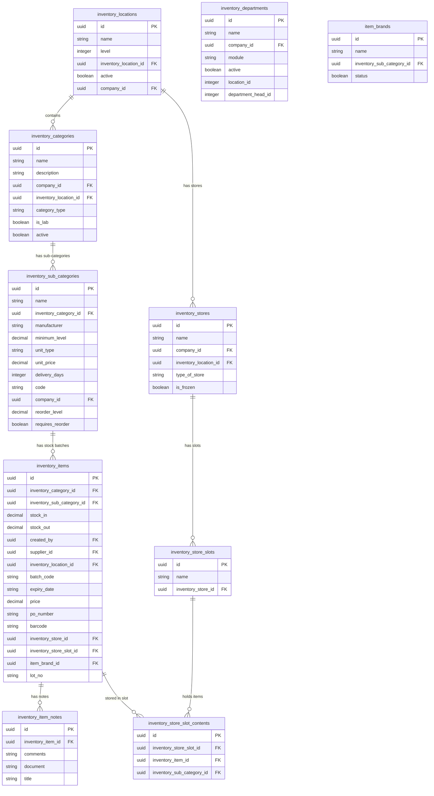

## ERD Diagram — Part B: Lab Solutions & Stock Management

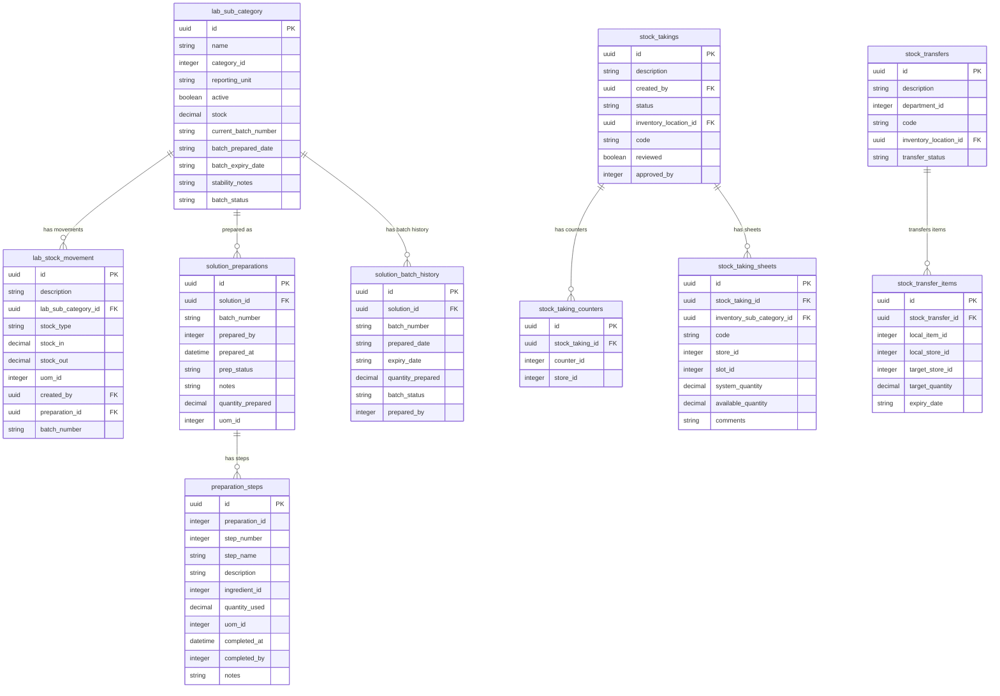

## ERD Diagram — Part C: Procurement & Purchase Requests

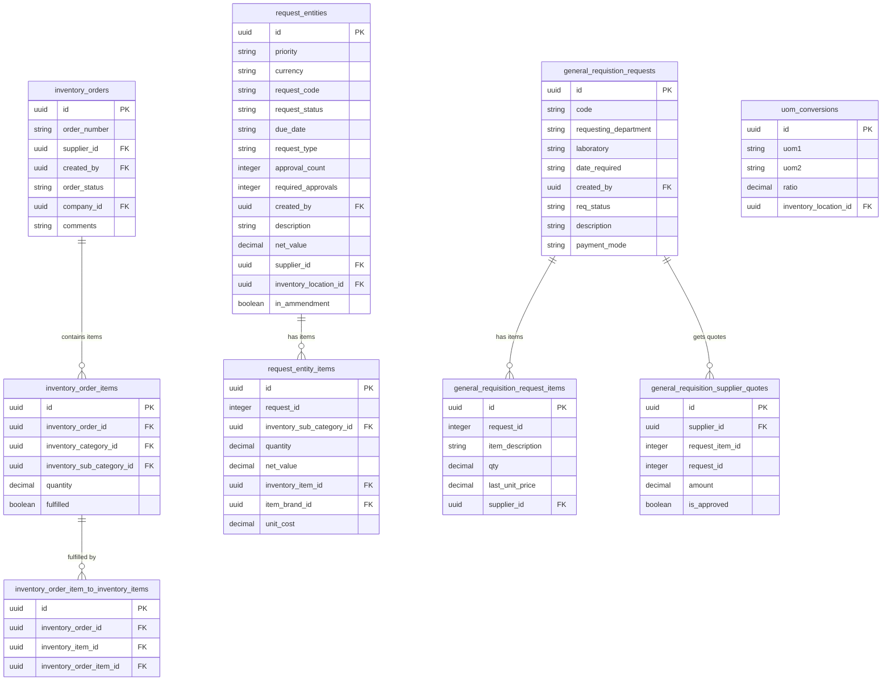

## Table Descriptions

### `inventory_locations`
Top-level physical storage location (building, campus, or site). Self-referential (`inventory_location_id`) to support nested location hierarchies.

### `inventory_categories` / `inventory_sub_categories`
Two-level catalogue of stockable items. Sub-categories carry unit pricing, minimum stock levels, lead times, and reorder thresholds. The `requires_reorder` flag triggers purchasing workflows automatically.

### `inventory_stores` / `inventory_store_slots`
Within a location, a **store** is a room or storage unit. **Slots** are specific shelves, racks, or bins within a store. Items are tracked down to the slot level.

### `inventory_items`
A **physical received batch** of a sub-category item. Each receiving event creates a new inventory item record with its own batch code, lot number, and expiry date. This enables full FEFO (First Expiry, First Out) stock management.

### `stock_takings` / `stock_taking_sheets`
The periodic **physical stock count** process. Counters record the actual physical quantity for each item/slot combination. The system compares against `system_quantity` to detect discrepancies.

### `lab_sub_category`
Reagents and solutions specifically managed in the laboratory (as opposed to general inventory). Tracks batch numbers, preparation dates, and stability notes.

### `solution_preparations` / `solution_batch_history`
When a laboratory solution is **prepared in-house** (e.g. a buffer solution), this records who prepared it, when, quantity, and stability status. The batch history tracks all preparation events over time.

### `request_entities`
A **procurement request** (the formal purchase request process). Tracks priority, budget, approval gates, and multiple amendment rounds. Supports complex multi-department procurement workflows.

### `general_requistion_requests`
Simpler, streamlined internal requisitions for day-to-day purchases.

---

---

# 9. Suppliers

## Plain-English Overview

Manages the **vendors** the lab purchases from:

- **Suppliers** — registered vendor organisations with contact info and payment terms.
- **Supplier Contacts** — named individuals at each supplier.
- **Contracts** — formal supply agreements with start/end dates.
- **RFQs / Quotes** — requests for quotation and received bids from suppliers.
- **Rating Criteria** — performance evaluation of suppliers across defined metrics.

---

## ERD Diagram

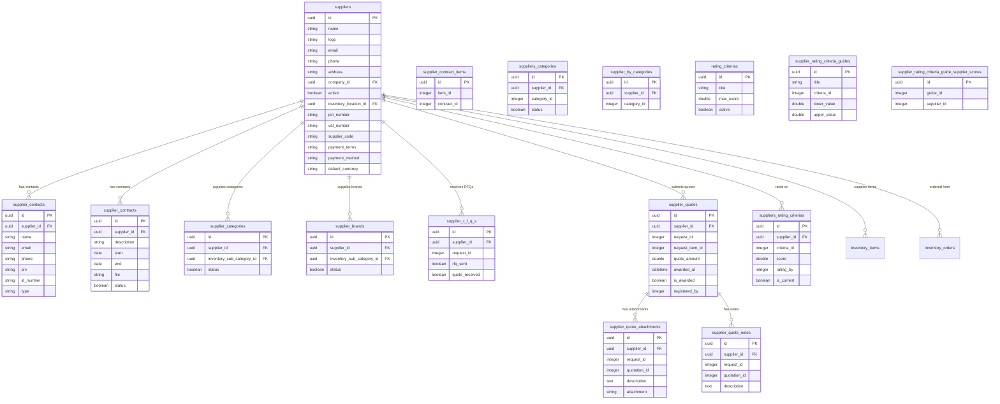

## Table Descriptions

### `suppliers`
The master vendor record. Stores commercial info including `pin_number` (tax ID), `vat_number`, `payment_terms`, and `supplier_code` for accounting integration.

### `supplier_contacts`
Named people at the supplier organisation (account managers, technical contacts, delivery coordinators).

### `supplier_contracts`
Formal supply agreements with validity period. The `file` field stores the uploaded contract document.

### `supplier_categories` / `supplier_brands`
Which sub-categories and brands each supplier is approved to supply. Used to restrict purchasing to approved vendor/product combinations.

### `supplier_r_f_q_s`
Records when an RFQ was sent to each supplier for a procurement request, and whether a quote was received back.

### `supplier_quotes`
The bid received from a supplier in response to an RFQ. `is_awarded` marks the winning bid. Used to drive the purchase order process.

### `suppliers_rating_criterias`
Supplier performance scores recorded against defined rating criteria. `is_current` identifies the most recent evaluation.

### `supplier_rating_criteria_guides`
Scoring guidance — defines what score range maps to what performance level for each criterion.

---

---

# 10. Finance & Invoicing

## Plain-English Overview

Handles the **commercial and financial** side of the lab's services:

- **Pricelists** define what each test costs for each customer or customer group.
- **Quotations** are formal price proposals sent to customers before work begins.
- **Invoices** are the billing records generated after work is completed.
- **Currencies & Conversions** support multi-currency billing for international clients.
- **Chart of Accounts** integrates with accounting systems.
- **Tax Regime** manages applicable tax rates.

---

## ERD Diagram

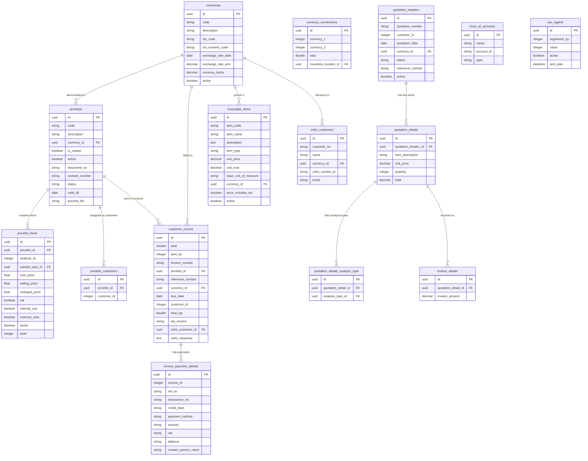

## Table Descriptions

### `currencies`
Full multi-currency support with exchange rate management. The `exchange_rate_amt` used at time of transaction is stored for historical accuracy.

### `pricelists`
A versioned, document-controlled price schedule (`document_no`, `revision_number`). Multiple pricelists can exist simultaneously — customers can be assigned different pricelists (e.g. contract pricing vs walk-in rates). The `is_master` flag identifies the default pricelist.

### `pricelist_items`
Individual test prices within a pricelist. Each item links a specific analysis and sample type to cost/selling prices, with a `vat` flag.

### `quotation_headers` / `quotation_details`
Formal price proposals sent to customers. Details break down each service line. A quotation is referenced when its lines are later invoiced.

### `customer_invoice`
The billing document sent to the customer on completion of work. Linked to pricelist for audit trail, and optionally to Zoho accounting via `zoho_customer_id`.

### `invoice_payment_details`
Records each payment received against an invoice — method, reference, amount, VAT, and outstanding balance.

### `invoicable_items`
A catalogue of billable items/services (can sync with external accounting like Zoho or SAP via `item_code`).

### `chart_of_accounts`
Financial account codes used for cost allocation and integration with accounting systems.

### `tax_regime`
Defines the applicable tax rate and its validity period.

---

---

# 11. Personnel & HR

## Plain-English Overview

Manages the **people working in the laboratory** and their competency:

- **Directorates / Departments** define the organisational structure.
- **Job Designations & Responsibilities** describe job descriptions.
- **Qualifications & Certifications** track academic and professional credentials that personnel hold.
- **Skills Matrices** define what skills are required for each role, and assess how well each person meets those requirements.
- **Training Plans** manage training needs identified from skills gaps — who needs training, what in, and when it is scheduled.
- **Working Schedules / Work Histories** track shifts and employment history.

---

## ERD Diagram

```mermaid
erDiagram
    directorates {
        uuid id PK
        string directorate_name
        text description
        uuid company_id FK
    }

    qualifications {
        uuid id PK
        string name
        string description
        boolean status
        integer module_code
    }

    role_certifications {
        uuid id PK
        integer certification_id
        uuid role_id FK
        boolean is_mandatory
        boolean status
    }

    personel_certifications {
        uuid id PK
        integer personnel_id
        uuid role_certification_id FK
        boolean status
        string certificate
        string certificate_body
        datetime certificate_date
        datetime expire_date
    }

    job_designation_responsibility {
        uuid id PK
        integer job_id
        string name
        string description
        boolean active
        integer edited_by
        integer config_id
    }

    personnel_working_schedules {
        uuid id PK
        time start_timeslot
        time end_timeslot
        string name
        string title
        string day
        string slot_type
        string duration
    }

    personnel_work_histories {
        uuid id PK
        uuid personnel_id FK
        string job_title
        date start_date
        date end_date
    }

    user_departmental_approvals {
        uuid id PK
        uuid role_id FK
        uuid user_id FK
        integer department_id
    }

    skillsmatrices {
        uuid id PK
        string name
        integer department_id
        string matrix_role_ids
        boolean status
    }

    skills_capability_matrix {
        uuid id PK
        integer matrix_id
        string name
        uuid created_by FK
    }

    skills_matrix_configurations {
        uuid id PK
        integer skills_matrix_id
        integer competence_area_id
        integer competence_type_id
        integer competence_description_id
        string name
        integer level
        boolean active
    }

    skills_matrix_detail {
        uuid id PK
        integer skill_matrix_id
        integer competency_area_id
        integer competency_type_id
        integer competency_description_id
    }

    skills_matrix_detail_role {
        uuid id PK
        integer matrix_detail_id
        uuid role_id FK
        integer proficiency_id
    }

    skills_matrix_role {
        uuid id PK
        integer skills_matrix_id
        integer job_description_id
    }

    skills_matrix_role_requirments {
        uuid id PK
        integer skills_matrix_config_id
        integer skills_matrix_id
        uuid role_id FK
        string role_name
        integer color_code
    }

    skills_capability_matrix_role {
        uuid id PK
        uuid matrix_id FK
        uuid role_id FK
    }

    skill_training_header {
        uuid id PK
        integer capability_id
        string name
        uuid created_by FK
    }

    skill_training_header_staff {
        uuid id PK
        integer capability_matrix_role_id
        integer training_header_id
    }

    skills_training_detail {
        uuid id PK
        integer training_header_id
        integer capability_detail_id
        integer skill_matrix_role_proficiency_id
        boolean require_training
    }

    skills_training_planner_header {
        uuid id PK
        string name
        integer training_need_header_id
        boolean is_complete
        uuid created_by FK
    }

    skills_training_planner_detail {
        uuid id PK
        integer training_plan_header_id
        integer training_need_detail_id
        datetime training_start_date
        datetime training_end_date
        string week_no
        string organizer_trainer
        text remark
        integer status
    }

    skill_capability_detail {
        uuid id PK
        uuid skill_id FK
        string capability_level
    }

    skill_other_training_users {
        uuid id PK
        uuid other_training_id FK
        uuid user_id FK
    }

    feedback_requests {
        uuid id PK
        uuid request_from_user_id FK
        uuid request_to_user_id FK
        text request_text
    }

    roles ||--o{ role_certifications : "requires certifications"
    role_certifications ||--o{ personel_certifications : "held by personnel"
    roles ||--o{ skills_matrix_detail_role : "mapped in skill matrix"
    roles ||--o{ skills_matrix_role_requirments : "has requirements"
    roles ||--o{ skills_capability_matrix_role : "in capability matrix"
    skillsmatrices ||--o{ skill_capability_detail : "has details"
    skill_training_header ||--o{ skills_training_detail : "has training detail"
    skill_training_header ||--o{ skill_training_header_staff : "has staff"
    skills_training_planner_header ||--o{ skills_training_planner_detail : "has planner detail"
    skills_training_detail ||--o{ skill_other_training_users : "has other users"
    users ||--o{ personnel_work_histories : "has work history"
    users ||--o{ feedback_requests : "sends/receives"
```

## Table Descriptions

### `qualifications`
Academic and professional credentials (e.g. "BSc Microbiology", "ISO 17025 Internal Auditor"). Used by both personnel (via `personel_certifications`) and sample types (via `sample_type_qualifications`).

### `role_certifications`
Defines which qualifications are required for a given role. `is_mandatory` controls whether the certification is a hard prerequisite.

### `personel_certifications`
Records the specific certification held by each individual — certificate reference, issuing body, date obtained, and expiry date.

### `skillsmatrices` / `skills_capability_matrix`
Defines the **competency framework** for each department/role. Breaks down into competency areas, types, and descriptions.

### `skills_matrix_detail_role`
Maps a role to a required proficiency level for a specific skill — the gap analysis anchor point.

### `skills_training_planner_header` / `skills_training_planner_detail`
The training calendar: schedules who attends which training, on what dates, organised by the training need identified in the skills gap analysis.

### `feedback_requests`
Peer feedback requests between users — one user asks another for performance feedback.

---

---

# 12. Quality, Compliance & Audits

## Plain-English Overview

Ensures the lab meets its **quality and regulatory obligations**:

- **Non-Conformances (NC)** are records of things that went wrong — a test deviation, a procedure breach, an equipment failure.
- **Corrective Actions (CAPA)** are the planned responses to non-conformances, with follow-up verification.
- **Root Cause Analyses** document the investigation into why a non-conformance occurred.
- **Complaints** are formal grievances from clients or staff.
- **ISO Audits** are structured internal or external quality audits with checklists, audit teams, and findings.
- **Approval Workflows** define who must sign off at each step of key business processes.

---

## ERD Diagram

```mermaid
erDiagram
    non_conformances {
        uuid id PK
        string nc_number
        date nc_date
        string description
        string category
        string status
        uuid company_id FK
        integer raised_by
        string source
    }

    nc_origins {
        uuid id PK
        string name
        string code
        text description
        boolean is_active
        uuid company_id FK
    }

    nc_statuses {
        uuid id PK
        string name
        string code
        text description
        string color_code
        integer order_index
        boolean is_active
        uuid company_id FK
    }

    corrective_actions {
        uuid id PK
        uuid nc_id FK
        text action_description
        date action_date
        string status
        integer assigned_to
        date due_date
        date completed_date
    }

    root_cause_analyses {
        uuid id PK
        uuid nc_id FK
        uuid method_id FK
        text root_cause_description
        date analysis_date
    }

    root_cause_methods {
        uuid id PK
        string name
        string code
        text description
        text template
        boolean is_active
        uuid company_id FK
    }

    verification_records {
        uuid id PK
        string verification_number
        uuid corrective_action_id FK
        date verification_date
        string verified_by
        bigint verified_by_user_id
        uuid effectiveness_result_id FK
        text verification_method
        text evidence_reviewed
        text comments
        boolean requires_reopen
        uuid closure_status_id FK
        date closure_date
    }

    verification_results {
        uuid id PK
        string name
        string code
        boolean requires_reopen
        integer next_workflow_step
        boolean is_active
        uuid company_id FK
    }

    verification_closure_statuses {
        uuid id PK
        string name
        string code
        string color_code
        boolean is_active
        uuid company_id FK
    }

    capa_action_types {
        uuid id PK
        string name
        string code
        text description
        uuid company_id FK
    }

    capa_categories {
        uuid id PK
        string name
        string code
        string action_type
        boolean is_active
        uuid company_id FK
    }

    capa_priorities {
        uuid id PK
        string name
        string code
        integer priority_level
        string color_code
        boolean is_active
        uuid company_id FK
    }

    capa_statuses {
        uuid id PK
        string name
        string code
        integer order_index
        string color_code
        boolean is_active
        uuid company_id FK
    }

    complaints {
        uuid id PK
        string complaint_number
        date complaint_date
        string status
        uuid customer_id FK
        integer raised_by
        string category
        string priority
        text description
    }

    complaint_type {
        uuid id PK
        string name
        text description
        string status
    }

    complaintsresolutions {
        uuid id PK
        uuid complaint_id FK
        text resolution_text
        uuid resolved_by FK
        datetime resolution_date
    }

    complaintnotes {
        uuid id PK
        uuid complaint_id FK
        text note_text
        uuid created_by FK
    }

    complaintattachments {
        uuid id PK
        uuid complaint_id FK
        string file_path
        string file_name
    }

    chain_of_custody_complaints {
        uuid id PK
        uuid complaint_id FK
        uuid custody_id FK
        datetime transfer_date
        uuid transferred_by FK
        uuid received_by FK
    }

    chain_of_custodies {
        uuid id PK
        string custody_number
        datetime transfer_date
        uuid transferred_by FK
        uuid received_by FK
    }

    iso_audits {
        uuid id PK
        string audit_number
        string revision_number
        uuid audit_type_id FK
        string title
        text objective
        text scope
        text criteria
        uuid checklist_id FK
        string lead_auditor_name
        bigint lead_auditor_id
        string auditee_name
        bigint auditee_department_id
        date scheduled_date
        date start_date
        date end_date
        date report_date
        uuid status_id FK
        text executive_summary
        text conclusions
        text recommendations
        uuid company_id FK
    }

    audit_checklists {
        uuid id PK
        string name
        string code
        uuid audit_type_id FK
        string iso_standard
        boolean is_active
        uuid company_id FK
    }

    audit_checklist_items {
        uuid id PK
        uuid audit_checklist_id FK
        string item_number
        string iso_clause
        text requirement
        text guidance
        text evidence_required
        boolean is_mandatory
    }

    audit_checklist_audit {
        uuid id PK
        uuid audit_id FK
        uuid audit_checklist_id FK
        integer order_index
    }

    audit_team_members {
        uuid id PK
        uuid audit_id FK
        uuid user_id FK
        uuid role_id FK
        string role_name
        text responsibilities
    }

    audit_module_findings {
        uuid id PK
        string finding_number
        uuid audit_id FK
        uuid finding_category_id FK
        string iso_clause
        text requirement
        text observation
        text objective_evidence
        uuid risk_level_id FK
        uuid responsible_user_id
        date response_due_date
        uuid status_id FK
    }

    audit_types {
        uuid id PK
        string name
        string code
        text description
        boolean is_active
        uuid company_id FK
    }

    audit_statuses {
        uuid id PK
        string name
        string code
        string color_code
        integer order_index
        integer workflow_step
        boolean is_active
        uuid company_id FK
    }

    audit_team_roles {
        uuid id PK
        string name
        string code
        text description
        boolean is_active
        uuid company_id FK
    }

    audit_workflow_approvers {
        uuid id PK
        string module
        integer workflow_step
        string role_type
        uuid user_id FK
        string iso_role
        boolean is_required
        string approval_type
        uuid company_id FK
    }

    finding_categories {
        uuid id PK
        string name
        string code
        string severity
        boolean requires_capa
        boolean is_active
        uuid company_id FK
    }

    finding_statuses {
        uuid id PK
        string name
        string code
        string color_code
        integer order_index
        boolean is_active
        uuid company_id FK
    }

    compliance_statuses {
        uuid id PK
        string name
        string code
        string color_code
        string badge_class
        integer order_index
        boolean is_active
        uuid company_id FK
    }

    approvals {
        uuid id PK
        string title
        string for
        string stage
        uuid role_id FK
        integer level
        uuid inventory_location_id FK
    }

    entity_approvals {
        uuid id PK
        string entity_type
        string entity_id
        string approval_status
        uuid approved_by FK
        datetime approval_date
        text link_key
        text token
    }

    non_conformances ||--o{ corrective_actions : "triggers"
    non_conformances ||--o{ root_cause_analyses : "investigated via"
    root_cause_analyses ||--|| root_cause_methods : "uses method"
    corrective_actions ||--o{ verification_records : "verified by"
    verification_records ||--|| verification_results : "has result"
    verification_records ||--|| verification_closure_statuses : "closed with"
    complaints ||--o{ complaintsresolutions : "resolved by"
    complaints ||--o{ complaintnotes : "has notes"
    complaints ||--o{ complaintattachments : "has attachments"
    complaints ||--o{ chain_of_custody_complaints : "chain of custody"
    iso_audits ||--o{ audit_checklist_audit : "uses checklists"
    iso_audits ||--o{ audit_team_members : "has team"
    iso_audits ||--o{ audit_module_findings : "has findings"
    audit_checklists ||--o{ audit_checklist_items : "has items"
    audit_checklists ||--o{ audit_checklist_audit : "assigned to audits"
    audit_team_roles ||--o{ audit_team_members : "assigned as"
    finding_categories ||--o{ audit_module_findings : "categorises"
    finding_statuses ||--o{ audit_module_findings : "status of"
```

## Table Descriptions

### `non_conformances`
Any **deviation from a defined standard** — a failed QC check, a sample handled incorrectly, a procedure not followed. Each NC has a unique number, source, category, and tracks its resolution status.

### `corrective_actions`
The **planned response** to a non-conformance. Assigns a responsible person, due date, and tracks completion.

### `root_cause_analyses`
The investigation into **why** the non-conformance happened. Uses a configurable `root_cause_method` (e.g. 5-Why, Fishbone/Ishikawa).

### `verification_records`
After a corrective action is implemented, verification confirms the fix actually worked. Records method, evidence reviewed, and whether the issue requires reopening.

### `complaints`
Formal complaints from clients or internal staff. Managed through the same `ticket_*` infrastructure (complaints are the underlying records for the ticket system).

### `iso_audits`
Formal audit events (internal, external, surveillance). Includes a structured record with objectives, scope, assigned team, and a formal report with conclusions and recommendations.

### `audit_checklists` / `audit_checklist_items`
Structured question sets built around ISO clauses. Each item specifies the requirement, guidance, and required evidence. Checklists are reusable across multiple audits.

### `audit_module_findings`
Specific findings raised during an audit (observations, minor non-conformances, major non-conformances, opportunities for improvement). Each finding is assigned a risk level and tracked to closure.

### `audit_workflow_approvers`
Configures which users or roles must approve each step of the audit workflow (e.g. "Lead Auditor signs off report before distribution").

---

---

# 13. Risk Management

## Plain-English Overview

Provides a **systematic framework for identifying, assessing, and treating risks** across the organisation. Follows standard risk management methodology (ISO 31000):

1. Identify the risk (source, category, business process)
2. Assess likelihood × severity = Risk Priority Number
3. Determine risk level and whether treatment is required
4. Plan and implement treatment
5. Review periodically

---

## ERD Diagram

```mermaid
erDiagram
    risks {
        uuid id PK
        string risk_number
        string risk_name
        string status
        string risk_level
        uuid company_id FK
        integer owner_id
        text description
    }

    risk_categories {
        uuid id PK
        string name
        string code
        text description
        boolean is_active
        uuid company_id FK
    }

    risk_sources {
        uuid id PK
        string name
        string code
        text description
        boolean is_active
        uuid company_id FK
    }

    risk_statuses {
        uuid id PK
        string name
        string code
        string color_code
        integer order_index
        integer workflow_step
        boolean is_active
        uuid company_id FK
    }

    risk_levels {
        uuid id PK
        string name
        string code
        integer severity_score
        string color_code
        boolean is_active
        uuid company_id FK
    }

    risk_level_thresholds {
        uuid id PK
        string risk_level
        integer min_rpn
        integer max_rpn
        string color_code
        text description
        integer order_index
        boolean is_active
        uuid company_id FK
    }

    risk_scoring_configs {
        uuid id PK
        string name
        string code
        string scoring_method
        text formula
        integer max_likelihood_score
        integer max_severity_score
        text description
        boolean is_default
        boolean is_active
        uuid company_id FK
    }

    likelihood_scales {
        uuid id PK
        string name
        string code
        integer score
        text description
        string color_code
        integer order_index
        boolean is_active
        uuid company_id FK
    }

    severity_scales {
        uuid id PK
        string name
        string code
        integer score
        text description
        string color_code
        integer order_index
        boolean is_active
        uuid company_id FK
    }

    risk_assessments {
        uuid id PK
        uuid risk_id FK
        date assessment_date
        text assessment_result
        integer likelihood_score
        integer severity_score
        integer rpn
    }

    risk_evaluations {
        uuid id PK
        uuid risk_id FK
        date evaluation_date
        text evaluation_result
    }

    risk_acceptance_criteria {
        uuid id PK
        string name
        string code
        integer threshold_rpn
        text criteria_description
        boolean requires_treatment_plan
        boolean requires_monitoring
        boolean can_skip_treatment
        boolean is_default
        boolean is_active
        uuid company_id FK
    }

    risk_treatment_plans {
        uuid id PK
        uuid risk_id FK
        text treatment_plan_description
        date plan_date
        integer assigned_to
        date due_date
        string status
    }

    risk_treatment_implementations {
        uuid id PK
        uuid treatment_plan_id FK
        date implementation_date
        string implementation_status
        text implementation_notes
    }

    risk_reviews {
        uuid id PK
        uuid risk_id FK
        date review_date
        text review_result
        uuid reviewer_id FK
    }

    risk_review_frequencies {
        uuid id PK
        string risk_level
        integer frequency_days
        string frequency_label
        text description
        boolean is_active
        uuid company_id FK
    }

    risk_process_links {
        uuid id PK
        uuid risk_id FK
        uuid process_id FK
    }

    risk_business_processes {
        uuid id PK
        string name
        text description
        uuid company_id FK
    }

    risk_attachments {
        uuid id PK
        string attachable_type
        bigint attachable_id
        string file_name
        string file_path
        string file_type
        integer file_size
        string original_name
        text description
        bigint uploaded_by
        uuid company_id FK
    }

    risk_notifications {
        uuid id PK
        string notifiable_type
        bigint notifiable_id
        string title
        text message
        bigint recipient_user_id
        boolean is_read
        boolean is_email_sent
        timestamp scheduled_for
        uuid company_id FK
    }

    risk_configuration_options {
        uuid id PK
        string option_type
        string code
        string name
        text description
        string color_code
        integer order_index
        boolean is_active
        longText metadata
        uuid company_id FK
    }

    treatment_types {
        uuid id PK
        string name
        string code
        text description
        boolean is_active
        uuid company_id FK
    }

    risks ||--o{ risk_assessments : "assessed via"
    risks ||--o{ risk_evaluations : "evaluated via"
    risks ||--o{ risk_treatment_plans : "treated by"
    risks ||--o{ risk_reviews : "reviewed via"
    risks ||--o{ risk_process_links : "linked to processes"
    risks ||--o{ risk_attachments : "has attachments"
    risk_treatment_plans ||--o{ risk_treatment_implementations : "implemented as"
    risk_business_processes ||--o{ risk_process_links : "linked to risks"
    risk_level_thresholds ||--|| risk_levels : "defines"
```

## Table Descriptions

### `risks`
The master risk record. Each risk has a unique number, description, owner, and current status/level. All downstream tables (assessments, treatments, reviews) link back here.

### `risk_scoring_configs`
Defines how Risk Priority Numbers (RPN) are calculated (likelihood × severity × other factors). Allows multiple scoring methodologies and marks one as default.

### `likelihood_scales` / `severity_scales`
Configurable rating scales (e.g. 1–5 with colour coding). Define the scoring vocabulary used in risk assessments.

### `risk_assessments`
A point-in-time assessment of a risk — captures likelihood and severity scores and the resulting RPN.

### `risk_acceptance_criteria`
Defines at what RPN level a risk can be accepted without treatment, and when treatment becomes mandatory.

### `risk_treatment_plans` / `risk_treatment_implementations`
The planned treatment and its actual implementation record. Tracks assigned owner, due date, and completion status.

### `risk_reviews`
Periodic re-assessments of a risk. The `risk_review_frequencies` table defines how often each risk level must be reviewed.

---

---

# 14. Document Management

## Plain-English Overview

A full **Document Control System** for managing procedural documents, SOPs, and records:

- Documents go through a **version-controlled approval workflow** before being published.
- **Document Types** categorise documents (SOP, Policy, Work Instruction, Form).
- **Permissions** control who can view, edit, or approve each document.
- **Expiry notifications** ensure documents are reviewed before they expire.
- **Amendments** record all changes made to a document with full audit trail.

---

## ERD Diagram

```mermaid
erDiagram
    documents {
        uuid id PK
        string document_number
        string title
        uuid document_type_id FK
        string file_path
        uuid created_by FK
        string status
        integer current_version
        date effective_date
        date expiry_date
        uuid company_id FK
    }

    document_types {
        uuid id PK
        string name
        string code
        text description
        boolean is_active
        uuid company_id FK
    }

    document_versions {
        uuid id PK
        uuid document_id FK
        integer version_number
        string file_path
        uuid created_by FK
        string change_summary
        date effective_date
    }

    document_amendments {
        uuid id PK
        uuid document_id FK
        text amendment_description
        uuid amended_by FK
        datetime amendment_date
    }

    document_permissions {
        uuid id PK
        uuid document_id FK
        uuid user_id FK
        string permission_type
    }

    document_approval_workflows {
        uuid id PK
        string name
        text description
        uuid document_type_id FK
        boolean is_active
    }

    document_approval_workflow_steps {
        uuid id PK
        uuid workflow_id FK
        integer step_number
        string approver_role
        boolean is_required
    }

    document_audit_logs {
        uuid id PK
        uuid document_id FK
        uuid user_id FK
        string action
        datetime action_date
        text notes
    }

    document_notifications {
        uuid id PK
        uuid document_id FK
        string notification_type
        datetime notification_date
        integer recipient_id
    }

    document_expiry_notification_settings {
        uuid id PK
        string notification_type
        integer days_before_expiry
        boolean is_active
        uuid company_id FK
    }

    documents ||--o{ document_versions : "has versions"
    documents ||--o{ document_amendments : "amended via"
    documents ||--o{ document_permissions : "has permissions"
    documents ||--o{ document_audit_logs : "audit trail"
    documents ||--o{ document_notifications : "triggers notifications"
    document_types ||--o{ documents : "categorises"
    document_types ||--o{ document_approval_workflows : "has workflows"
    document_approval_workflows ||--o{ document_approval_workflow_steps : "has steps"
```

## Table Descriptions

### `documents`
The master document record. The `current_version` tracks the live revision. Documents have an `effective_date` and `expiry_date` to manage review cycles.

### `document_versions`
Every revision of a document is stored as a separate version record with its own file reference and change summary. This provides a complete version history.

### `document_amendments`
Records individual amendments made between formal version upgrades (minor corrections, wording updates).

### `document_permissions`
Fine-grained access control — who can view, edit, or approve each document, separate from general role-based access.

### `document_approval_workflows`
Defines the approval process for a document type. Different document types can require different numbers of approvers.

### `document_expiry_notification_settings`
Configures how far in advance users are notified that a document is due for review (e.g. 90, 60, 30 days before expiry).

---

---

# 15. Tickets & Support

## Plain-English Overview

A **helpdesk and issue tracking system** built on top of the Complaints module:

- **Tickets** (backed by the `complaints` table) are created for any issue requiring tracking and resolution.
- **Assignments** route tickets to the right person or team.
- **Chat** allows real-time messaging on a ticket thread.
- **Change History** tracks every status transition and field update.
- **Permissions** control which users have advanced ticket management abilities.

---

## ERD Diagram

```mermaid
erDiagram
    ticket_categories {
        uuid id PK
        string name
        text description
        boolean active
    }

    ticket_priorities {
        uuid id PK
        string name
        string value
        text description
        string color
        integer order
        boolean active
    }

    ticket_statuses {
        uuid id PK
        string name
        text description
        integer workflow_value
        boolean active
        string color
        integer order
    }

    ticket_assignments {
        uuid id PK
        uuid ticket_id FK
        uuid user_id FK
        date assigned_date
        uuid assigned_by FK
        text notes
        integer tat_value
        string tat_unit
    }

    ticket_comments {
        uuid id PK
        uuid ticket_id FK
        uuid user_id FK
        text comment
        boolean is_internal
        longText mentions
        uuid parent_comment_id FK
    }

    ticket_change_history {
        uuid id PK
        uuid ticket_id FK
        uuid user_id FK
        string field_name
        text old_value
        text new_value
        enum change_type
    }

    ticket_chat {
        uuid id PK
        uuid ticket_id FK
        uuid user_id FK
        text message
        timestamp read_at
    }

    ticket_chat_attachments {
        uuid id PK
        uuid chat_message_id FK
        string file_name
        string file_path
        string file_type
        integer file_size
        string mime_type
    }

    ticket_team_chat {
        uuid id PK
        uuid ticket_id FK
        uuid user_id FK
        text message
        longText mentions
    }

    ticket_permissions {
        uuid id PK
        uuid user_id FK
        longText permissions
    }

    complaints ||--o{ ticket_assignments : "assigned via"
    complaints ||--o{ ticket_comments : "has comments"
    complaints ||--o{ ticket_change_history : "change log"
    complaints ||--o{ ticket_chat : "client chat"
    complaints ||--o{ ticket_team_chat : "team chat"
    ticket_chat ||--o{ ticket_chat_attachments : "has files"
    ticket_comments ||--o{ ticket_comments : "threaded replies"
    users ||--o{ ticket_assignments : "assigned to"
    users ||--o{ ticket_comments : "writes"
    users ||--o{ ticket_permissions : "has permissions"
```

## Table Descriptions

### `ticket_categories` / `ticket_priorities` / `ticket_statuses`
Configuration tables defining the vocabulary of the ticketing system. Priorities have colour codes and ordering. Statuses have a `workflow_value` that defines progression order.

### `ticket_assignments`
Records who a ticket is assigned to, when, and by whom. Includes a TAT (turnaround time) expectation.

### `ticket_comments`
Threaded comments on a ticket. `is_internal` separates staff-to-staff notes from client-visible responses. `parent_comment_id` enables threaded replies.

### `ticket_chat` / `ticket_team_chat`
Real-time messaging channels per ticket. `ticket_chat` is client-facing; `ticket_team_chat` is the internal team discussion.

### `ticket_change_history`
Immutable log of every field change on a ticket — tracks old and new values with the type of change (status change, reassignment, priority update).

---

---

# 16. Submission Forms

## Plain-English Overview

A **dynamic form builder** that allows the lab to create configurable submission forms for sample registration, chain-of-custody capture, and supporting documents:

- **Submission Forms** are templates of configurable fields organised into sections.
- **Form Instances** are filled-in submissions linked to specific samples.
- **Supporting Documents** are structured annexes to sample submission requests (e.g. police reports for forensic samples).
- **Audit Logs** ensure every form change is captured for compliance.

---

## ERD Diagram

```mermaid
erDiagram
    submission_forms {
        uuid id PK
        string title
        string form_code
        text description
        string status
        uuid company_id FK
    }

    submission_form_sections {
        uuid id PK
        uuid submission_form_id FK
        string title
        text description
        string section_type
        integer sort_order
    }

    submission_form_element_holders {
        uuid id PK
        uuid submission_form_section_id FK
        enum holder_type
        integer max_elements
        integer sort_order
    }

    submission_form_elements {
        uuid id PK
        uuid submission_form_element_holder_id FK
        string element_type
        string label
        string name
        text help_text
        boolean is_required
        boolean is_readonly
        text default_value
        longText validation_rules
        string mapping_table
        string mapping_field
        boolean is_mapped
        longText options
        text calculation_formula
        longText conditional_logic
        integer sort_order
    }

    submission_form_instances {
        uuid id PK
        uuid submission_form_id FK
        uuid sample_id FK
        string status
        datetime submitted_at
    }

    submission_form_instance_values {
        uuid id PK
        uuid submission_form_instance_id FK
        uuid submission_form_element_id FK
        integer array_index
        text value
        string file_path
    }

    submission_form_permissions {
        uuid id PK
        uuid submission_form_id FK
        uuid role_id FK
        uuid user_id FK
        enum permission_type
    }

    submission_form_sample_analysis_stage {
        uuid id PK
        uuid submission_form_id FK
        uuid sample_analysis_stage_id FK
    }

    submission_form_audit_log {
        uuid id PK
        uuid submission_form_instance_id FK
        uuid user_id FK
        enum action
        longText field_changes
        text notes
        string ip_address
        text user_agent
    }

    submission_form_audit_logs {
        uuid id PK
        uuid submission_form_instance_id FK
        uuid user_id FK
        string action
        longText field_changes
        text notes
        string ip_address
    }

    supporting_document_templates {
        uuid id PK
        string document_code
        string title
        string subtitle
        text description
        integer version
        boolean is_published
        boolean is_active
        uuid company_id FK
        uuid created_by FK
    }

    supporting_document_sections {
        uuid id PK
        uuid supporting_document_template_id FK
        string title
        integer sort_order
    }

    supporting_document_elements {
        uuid id PK
        uuid supporting_document_section_id FK
        string element_type
        string label
        string name
        text help_text
        boolean is_required
        json validation_rules
        json options
        json conditional_logic
        integer sort_order
    }

    supporting_document_instances {
        uuid id PK
        uuid supporting_document_template_id FK
        integer template_version
        uuid sample_submission_request_id FK
        uuid sample_header_id FK
        string status
        timestamp submitted_at
        uuid created_by FK
    }

    supporting_document_instance_values {
        uuid id PK
        uuid supporting_document_instance_id FK
        uuid supporting_document_element_id FK
        longText value
    }

    sample_submission_requests {
        uuid id PK
        string request_number
        date request_date
        integer customer_id
        string status
        text description
    }

    sample_submission_request_exhibits {
        uuid id PK
        uuid request_id FK
        string exhibit_name
        text exhibit_description
    }

    sample_submission_request_requested_analyses {
        uuid id PK
        uuid request_id FK
        uuid analysis_type_id FK
    }

    sample_submission_request_suspects {
        uuid id PK
        uuid request_id FK
        string suspect_name
        text suspect_description
    }

    submission_forms ||--o{ submission_form_sections : "has sections"
    submission_form_sections ||--o{ submission_form_element_holders : "has holders"
    submission_form_element_holders ||--o{ submission_form_elements : "has elements"
    submission_forms ||--o{ submission_form_instances : "filled as"
    submission_form_instances ||--o{ submission_form_instance_values : "has values"
    submission_form_instances ||--o{ submission_form_audit_log : "audit trail"
    submission_forms ||--o{ submission_form_permissions : "has permissions"
    supporting_document_templates ||--o{ supporting_document_sections : "has sections"
    supporting_document_sections ||--o{ supporting_document_elements : "has elements"
    supporting_document_templates ||--o{ supporting_document_instances : "instantiated as"
    supporting_document_instances ||--o{ supporting_document_instance_values : "has values"
    sample_submission_requests ||--o{ sample_submission_request_exhibits : "has exhibits"
    sample_submission_requests ||--o{ sample_submission_request_requested_analyses : "requests analyses"
    sample_submission_requests ||--o{ sample_submission_request_suspects : "has suspects"
    sample_submission_requests ||--o{ supporting_document_instances : "has supporting docs"
```

## Table Descriptions

### `submission_forms`
The **form template** — defines the structure of the submission form with sections and fields. Used by clients and lab staff to register samples. Each form is versioned via the document control system.

### `submission_form_elements`
Individual fields in the form. Supports a wide range of types (text, dropdown, date, file upload). Can be **mapped** to actual database fields (`mapping_table`, `mapping_field`) so form data directly populates sample records. Supports conditional logic (show/hide based on other field values) and calculation formulas.

### `submission_form_instances`
A completed submission. Each instance is linked to a specific sample and records the submission date and current status.

### `submission_form_instance_values`
The actual data entered — one record per field per instance. Array-indexed values support repeating field groups.

### `supporting_document_templates`
Structured annexe templates for sample submission requests (e.g. chain-of-custody form, inspection certificate). Version-controlled with publish/active flags.

### `sample_submission_requests`
Formal requests submitted by external parties (e.g. police, regulatory bodies) for sample analysis. Can include exhibits (physical evidence items) and suspect information with requested specific analyses.

---

---

# 17. Notifications & System Utilities

## Plain-English Overview

Supporting infrastructure tables that keep the platform running smoothly:

- **Calendar Events** — Lab scheduling for client visits, audits, sampling campaigns.
- **Chat / Conversations** — Internal messaging between staff.
- **Email Sent Log** — Audit trail of all outbound emails.
- **Report Formats** — Configurable Certificate of Analysis templates.
- **Certificate Templates** — Structured report templates with sections and elements.
- **Zoho Integration** — API token management for Zoho ERP sync.
- **Module Pre-Configs** — System configuration defaults per module.

---

## ERD Diagram

```mermaid
erDiagram
    calendar_events {
        uuid id PK
        string title
        text description
        date start_date
        date end_date
        integer responsible_id
        integer client_id
        string location
        uuid created_by FK
        string status
        boolean is_client_notify
        boolean is_routine
        string frequency
        boolean has_notification
        time start_time
        time end_time
    }

    calendarevents_notifications {
        uuid id PK
        integer duration
        string rate
        uuid calendar_event_id FK
        boolean active
        boolean is_sent
    }

    event_history {
        uuid id PK
        integer event_id
        longText remark
        integer action_by
        string status
    }

    conversation {
        uuid id PK
        integer from_user_id
        integer to_user_id
        uuid company_id FK
        boolean active
    }

    chat_message {
        uuid id PK
        text message
        integer from_user_id
        integer to_user_id
        uuid company_id FK
        uuid conversation_id FK
        boolean is_new
    }

    email_sents {
        bigint id PK
        string email
        string subject
        text body
    }

    report_formats {
        uuid id PK
        string report_name
        string report_code
        string results_display_type
        boolean is_active
        uuid company_id FK
    }

    report_format_details {
        uuid id PK
        uuid report_format_id FK
        string key_name
        longText text_value
    }

    report_format_sections {
        uuid id PK
        uuid report_format_id FK
        string section_name
        integer order
        boolean is_visible
        string custom_title
        longText settings
    }

    report_format_sample_analysis_stage {
        uuid id PK
        uuid format_id FK
        uuid analysis_stage_id FK
    }

    report_table_configurations {
        uuid id PK
        string name
        text configuration
        text raw_sql
        string report_module
    }

    certificate_templates {
        uuid id PK
        string name
        text description
        boolean is_active
        uuid company_id FK
    }

    certificate_template_sections {
        uuid id PK
        uuid template_id FK
        string name
        integer sort_order
    }

    certificate_template_elements {
        uuid id PK
        uuid holder_id FK
        string element_type
        string label
        string name
        longText settings
    }

    certificate_template_reports {
        uuid id PK
        uuid template_id FK
        longText report_data
    }

    zoho_api_tokens {
        uuid id PK
        string token
        datetime expiry
    }

    module_pre_configs {
        uuid id PK
        string name
        string type
        string description
        integer level
        string color
        boolean active
        string module
        uuid inventory_location_id FK
        string code
    }

    global_variables {
        uuid id PK
        string name
        text value
        string data_type
        text description
        boolean is_active
    }

    topologies {
        uuid id PK
        string name
        integer parent
        integer level
    }

    approval_workflows as approvals {
        uuid id PK
        string title
        string for
        string stage
        uuid role_id FK
        integer level
        uuid inventory_location_id FK
    }

    calendar_events ||--o{ calendarevents_notifications : "has notifications"
    calendar_events ||--o{ event_history : "has history"
    conversation ||--o{ chat_message : "contains messages"
    report_formats ||--o{ report_format_details : "has details"
    report_formats ||--o{ report_format_sections : "has sections"
    report_formats ||--o{ report_format_sample_analysis_stage : "linked to stages"
    certificate_templates ||--o{ certificate_template_sections : "has sections"
    certificate_templates ||--o{ certificate_template_reports : "generates reports"
```

## Table Descriptions

### `calendar_events`
Scheduled events on the lab calendar — client site visits, routine sampling campaigns, audit dates. Supports recurring events (`is_routine`, `frequency`) and can notify clients.

### `conversation` / `chat_message`
Internal one-to-one messaging between staff members. Messages are scoped to company and conversation thread.

### `email_sents`
Audit log of every email sent by the system (results dispatched, approval requests, notifications). Provides a record for compliance queries.

### `report_formats`
Certificate of Analysis (CoA) layout templates. Different sample types can use different report formats. Sections and details define the structure and static content.

### `certificate_templates`
Advanced configurable report templates with section/element structure — used for generating polished PDF certificates.

### `zoho_api_tokens`
API bearer tokens for the Zoho integration. Automatically refreshed before expiry.

### `module_pre_configs`
Default configuration records seeded into the system per module (e.g. default statuses, default approval stages, default categories). Allow the system to be pre-configured on setup.

### `topologies`
Hierarchical organisation tree (self-referential via `parent`). Used by various modules to organise data by geographic or functional hierarchy.

### `approvals`
Workflow approval stage definitions — what role must approve, at what stage, and in what order. Used across procurement, batch processing, sample reporting, and disposal workflows.

---

---

# Cross-Module Relationship Summary

The following table highlights which modules reference each other through foreign keys or shared concepts:

| From Module | References | Via |
|---|---|---|
| All modules | System / Auth | `company_id`, `user_id`, `role_id` |
| Sample Management | CRM | `customer_id` on sample_headers |
| Sample Management | Lab/Analysis | `analysis_type_id`, `sample_type_id` |
| Results | Sample Management | `sample_header_id`, `sample_detail_id` |
| Results | Lab/Analysis | `analyte_id`, `analysis_type_id`, `method_id` |
| Results | Equipment | Equipment used in method runs |
| Equipment | Inventory | Parts / consumables via `inventory_items` |
| Inventory | Suppliers | `supplier_id` on inventory_items, orders |
| Finance | CRM | `customer_id` on invoices and quotations |
| Finance | Sample Management / Lab | `analysis_type_id` on pricelist_items |
| Quality/NC | All | Non-conformances can reference any process |
| Audits | Quality | Findings link to NC/CAPA workflows |
| Risk | Quality | Risk levels used in audit findings |
| Documents | All | SOPs referenced by method sequences |
| HR / Skills | Roles | `role_id` drives competency requirements |
| Submission Forms | Sample Management | `sample_id` on instances |
| Submission Forms | Lab/Analysis | `analysis_type_id` on requested analyses |
| AI | All | AI acts on data from all modules |

---

*Generated from 286 migration files — [database/migrations/convert/](../database/migrations/convert/)*  
*Last updated: April 2026*
